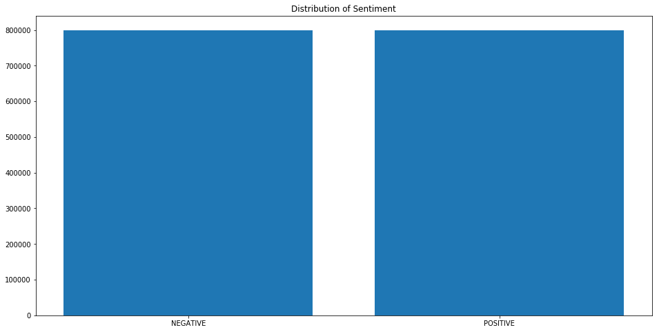
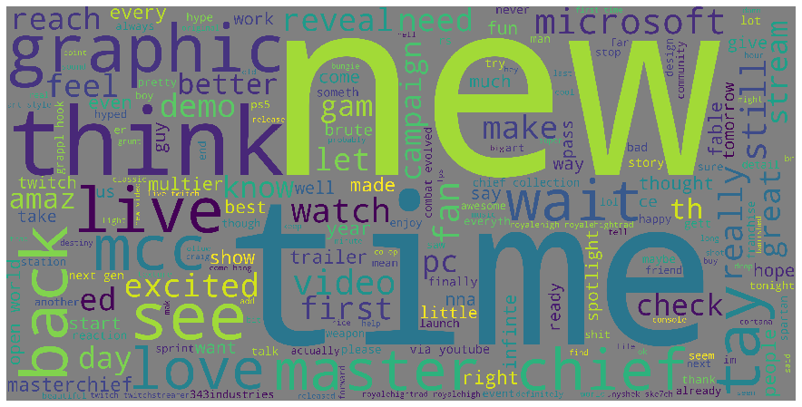
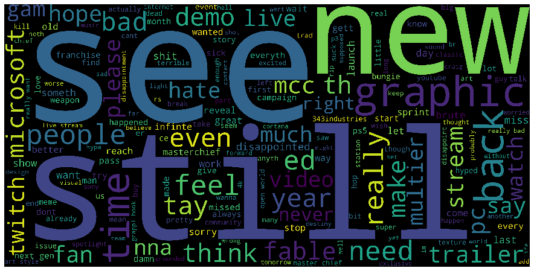
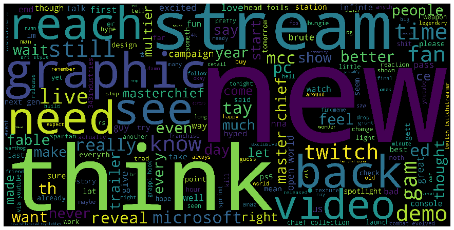
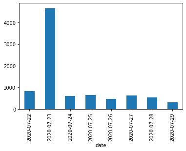
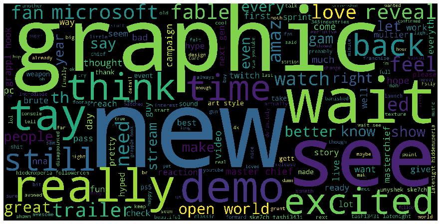
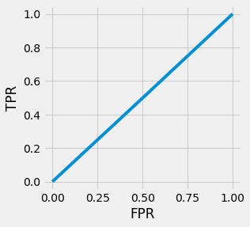
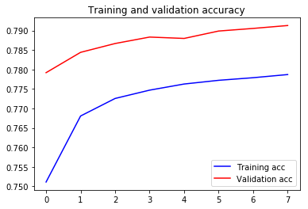
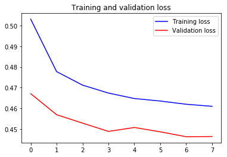
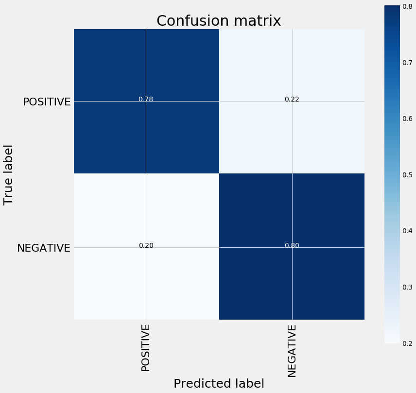

<h1>Table of Contents<span class="tocSkip"></span></h1>
<div class="toc"><ul class="toc-item"><li><span><a href="#A-Monument-to-All-Your-Data" data-toc-modified-id="A-Monument-to-All-Your-Data-1"><span class="toc-item-num">1&nbsp;&nbsp;</span>A Monument to All Your Data</a></span><ul class="toc-item"><li><span><a href="#About-the-Data" data-toc-modified-id="About-the-Data-1.1"><span class="toc-item-num">1.1&nbsp;&nbsp;</span>About the Data</a></span></li><li><span><a href="#Process" data-toc-modified-id="Process-1.2"><span class="toc-item-num">1.2&nbsp;&nbsp;</span>Process</a></span></li><li><span><a href="#Preprocess-the-dataset" data-toc-modified-id="Preprocess-the-dataset-1.3"><span class="toc-item-num">1.3&nbsp;&nbsp;</span>Preprocess the dataset</a></span></li><li><span><a href="#Train/Test-Split" data-toc-modified-id="Train/Test-Split-1.4"><span class="toc-item-num">1.4&nbsp;&nbsp;</span>Train/Test Split</a></span></li><li><span><a href="#Tokenize" data-toc-modified-id="Tokenize-1.5"><span class="toc-item-num">1.5&nbsp;&nbsp;</span>Tokenize</a></span><ul class="toc-item"><li><span><a href="#Word2Vec" data-toc-modified-id="Word2Vec-1.5.1"><span class="toc-item-num">1.5.1&nbsp;&nbsp;</span>Word2Vec</a></span></li></ul></li><li><span><a href="#Label-Encoder" data-toc-modified-id="Label-Encoder-1.6"><span class="toc-item-num">1.6&nbsp;&nbsp;</span>Label Encoder</a></span></li><li><span><a href="#EDA" data-toc-modified-id="EDA-1.7"><span class="toc-item-num">1.7&nbsp;&nbsp;</span>EDA</a></span><ul class="toc-item"><li><span><a href="#Rooster-Teeth-Exploratory" data-toc-modified-id="Rooster-Teeth-Exploratory-1.7.1"><span class="toc-item-num">1.7.1&nbsp;&nbsp;</span>Rooster Teeth Exploratory</a></span></li></ul></li><li><span><a href="#Baseline-Model" data-toc-modified-id="Baseline-Model-1.8"><span class="toc-item-num">1.8&nbsp;&nbsp;</span>Baseline Model</a></span></li><li><span><a href="#Embedding-Layer" data-toc-modified-id="Embedding-Layer-1.9"><span class="toc-item-num">1.9&nbsp;&nbsp;</span>Embedding Layer</a></span></li></ul></li><li><span><a href="#Bonus-Round" data-toc-modified-id="Bonus-Round-2"><span class="toc-item-num">2&nbsp;&nbsp;</span>Bonus Round</a></span></li></ul></div>

# A Monument to All Your Data

Business Case: Halo is legendary franchise in the entertainment world. First introduced with the original Xbox in 2001, the Halo universe has widely expanded into other mediums and spinoff games, yet the pillars of the Halo brand remain the blockbuster action shooter games starring the one and only Sierra-117. Following the debut of Halo Infinite gameplay at the recent Xbox showcase on July 23, 2020, twitter was abuzz about the new game and had a lot of opinions. 

The goal of this project is to build a sentiment model that can accurately predict the reception of Halo Infinite from a sample of tweets between July 22 and July 29, 2020. 

## About the Data

There are two data sources used for this project:

1. A kaggle Dataset with 1.6 million evaluated tweets.

https://www.kaggle.com/kazanova/sentiment140

2. Custom scraped tweets (using Twint) containing 8000+ tweets about Halo between July 22-29, 2020.


## Process

1. Import and handle data
2. Preprocess text data
3. Train/Test Split
4. Tokenize
5. Word2Vec
6. Encode
7. Baseline Model
8. Embedding Layer
9. Sequential Neural Net
10. Evaluation
11. Model Utilization
12. Conclusion
13. Bonus

As usual the first step is to load in the necessary packages into the workbook.


```python
# DataFrame
import pandas as pd

# Matplot
import matplotlib.pyplot as plt
%matplotlib inline

# Datetime
import datetime

# Scikit-learn
from sklearn.model_selection import train_test_split
from sklearn.preprocessing import LabelEncoder
from sklearn.metrics import confusion_matrix, classification_report, accuracy_score
from sklearn.manifold import TSNE
from sklearn.feature_extraction.text import TfidfVectorizer

# Keras
from keras.preprocessing.text import Tokenizer
from keras.preprocessing.sequence import pad_sequences
from keras.models import Sequential
from keras.layers import Activation, Dense, Dropout, Embedding, Flatten, Conv1D, MaxPooling1D, LSTM
from keras import utils
from keras.callbacks import ReduceLROnPlateau, EarlyStopping

# nltk
import nltk
from nltk.corpus import stopwords
from  nltk.stem import SnowballStemmer

# Word2vec
import gensim

# Utility
import re
import numpy as np
import os
from collections import Counter
import logging
import time
import pickle
import itertools

# WordCloud
from wordcloud import WordCloud, STOPWORDS

# Set log
logging.basicConfig(format='%(asctime)s : %(levelname)s : %(message)s', level=logging.INFO)

# EXPORT
KERAS_MODEL = 'model.h5'
WORD2VEC_MODEL = 'model.w2v'
TOKENIZER_MODEL = 'tokenizer.pkl'
ENCODER_MODEL = 'encoder.pkl'
```


```python
nltk.download('stopwords')
```

    [nltk_data] Downloading package stopwords to
    [nltk_data]     /Users/omarhussain/nltk_data...
    [nltk_data]   Package stopwords is already up-to-date!


    True


```python
df = pd.read_csv('training.1600000.processed.noemoticon.csv', encoding= 'ISO-8859-1', names = ['target', 
                                                                                                  'ids', 
                                                                                                  'date', 
                                                                                                  'flag', 
                                                                                                  'user', 
                                                                                                  'text'])
```


```python
df.head(5)
```


<div>
<style scoped>
    .dataframe tbody tr th:only-of-type {
        vertical-align: middle;
    }

    .dataframe tbody tr th {
        vertical-align: top;
    }

    .dataframe thead th {
        text-align: right;
    }
</style>
<table border="1" class="dataframe">
  <thead>
    <tr style="text-align: right;">
      <th></th>
      <th>target</th>
      <th>ids</th>
      <th>date</th>
      <th>flag</th>
      <th>user</th>
      <th>text</th>
    </tr>
  </thead>
  <tbody>
    <tr>
      <td>0</td>
      <td>NEGATIVE</td>
      <td>1467810369</td>
      <td>Mon Apr 06 22:19:45 PDT 2009</td>
      <td>NO_QUERY</td>
      <td>_TheSpecialOne_</td>
      <td>awww bummer shoulda got david carr third day</td>
    </tr>
    <tr>
      <td>1</td>
      <td>NEGATIVE</td>
      <td>1467810672</td>
      <td>Mon Apr 06 22:19:49 PDT 2009</td>
      <td>NO_QUERY</td>
      <td>scotthamilton</td>
      <td>upset update facebook texting might cry result...</td>
    </tr>
    <tr>
      <td>2</td>
      <td>NEGATIVE</td>
      <td>1467810917</td>
      <td>Mon Apr 06 22:19:53 PDT 2009</td>
      <td>NO_QUERY</td>
      <td>mattycus</td>
      <td>dived many times ball managed save 50 rest go ...</td>
    </tr>
    <tr>
      <td>3</td>
      <td>NEGATIVE</td>
      <td>1467811184</td>
      <td>Mon Apr 06 22:19:57 PDT 2009</td>
      <td>NO_QUERY</td>
      <td>ElleCTF</td>
      <td>whole body feels itchy like fire</td>
    </tr>
    <tr>
      <td>4</td>
      <td>NEGATIVE</td>
      <td>1467811193</td>
      <td>Mon Apr 06 22:19:57 PDT 2009</td>
      <td>NO_QUERY</td>
      <td>Karoli</td>
      <td>behaving mad see</td>
    </tr>
  </tbody>
</table>
</div>


```python
df.info()
```

    <class 'pandas.core.frame.DataFrame'>
    RangeIndex: 1600000 entries, 0 to 1599999
    Data columns (total 6 columns):
    target    1600000 non-null int64
    ids       1600000 non-null int64
    date      1600000 non-null object
    flag      1600000 non-null object
    user      1600000 non-null object
    text      1600000 non-null object
    dtypes: int64(2), object(4)
    memory usage: 73.2+ MB


```python
df.isnull().sum()
```


    target    0
    ids       0
    date      0
    flag      0
    user      0
    text      0
    dtype: int64


```python
df['target'].unique()
```


    array(['NEGATIVE', 'POSITIVE'], dtype=object)


```python
df.drop(index=0, inplace= True)
```


```python
decode_map = {0: 'NEGATIVE',2: 'NEUTRAL' 4: 'POSITIVE'}
def decode_sentiment(label):
    return decode_map[int(label)]
```


```python
%time
df.target = df.target.apply(lambda x: decode_sentiment(x))
```

    CPU times: user 2 µs, sys: 0 ns, total: 2 µs
    Wall time: 6.2 µs


```python
df.head()
```


<div>
<style scoped>
    .dataframe tbody tr th:only-of-type {
        vertical-align: middle;
    }

    .dataframe tbody tr th {
        vertical-align: top;
    }

    .dataframe thead th {
        text-align: right;
    }
</style>
<table border="1" class="dataframe">
  <thead>
    <tr style="text-align: right;">
      <th></th>
      <th>target</th>
      <th>ids</th>
      <th>date</th>
      <th>flag</th>
      <th>user</th>
      <th>text</th>
    </tr>
  </thead>
  <tbody>
    <tr>
      <td>0</td>
      <td>NEGATIVE</td>
      <td>1467810369</td>
      <td>Mon Apr 06 22:19:45 PDT 2009</td>
      <td>NO_QUERY</td>
      <td>_TheSpecialOne_</td>
      <td>@switchfoot http://twitpic.com/2y1zl - Awww, t...</td>
    </tr>
    <tr>
      <td>1</td>
      <td>NEGATIVE</td>
      <td>1467810672</td>
      <td>Mon Apr 06 22:19:49 PDT 2009</td>
      <td>NO_QUERY</td>
      <td>scotthamilton</td>
      <td>is upset that he can't update his Facebook by ...</td>
    </tr>
    <tr>
      <td>2</td>
      <td>NEGATIVE</td>
      <td>1467810917</td>
      <td>Mon Apr 06 22:19:53 PDT 2009</td>
      <td>NO_QUERY</td>
      <td>mattycus</td>
      <td>@Kenichan I dived many times for the ball. Man...</td>
    </tr>
    <tr>
      <td>3</td>
      <td>NEGATIVE</td>
      <td>1467811184</td>
      <td>Mon Apr 06 22:19:57 PDT 2009</td>
      <td>NO_QUERY</td>
      <td>ElleCTF</td>
      <td>my whole body feels itchy and like its on fire</td>
    </tr>
    <tr>
      <td>4</td>
      <td>NEGATIVE</td>
      <td>1467811193</td>
      <td>Mon Apr 06 22:19:57 PDT 2009</td>
      <td>NO_QUERY</td>
      <td>Karoli</td>
      <td>@nationwideclass no, it's not behaving at all....</td>
    </tr>
  </tbody>
</table>
</div>


```python
target_cnt = Counter(df.target)

plt.figure(figsize=(16,8))
plt.bar(target_cnt.keys(), target_cnt.values())
plt.title('Distribution of Sentiment')
```


    Text(0.5, 1.0, 'Distribution of Sentiment')





## Preprocess the dataset


```python
stop_words = stopwords.words("english")
stemmer = SnowballStemmer("english")
```


```python
def preprocess(text, stem=False):
    # Remove link,user and special characters
    text = re.sub('@\S+|https?:\S+|http?:\S|[^A-Za-z0-9]+', ' ', str(text).lower()).strip()
    tokens = []
    for token in text.split():
        if token not in stop_words:
            if stem:
                tokens.append(stemmer.stem(token))
            else:
                tokens.append(token)
    return " ".join(tokens)
```


```python
%%time
df.text = df.text.apply(lambda x: preprocess(x))
```

    CPU times: user 35.6 s, sys: 75.1 ms, total: 35.7 s
    Wall time: 35.7 s


## Train/Test Split


```python
df_train, df_test = train_test_split(df, test_size= 0.2, random_state=42)
print('Train Size:', len(df_train))
print('Test Size:', len(df_test))
```

    TRAIN size: 1280000
    TEST size: 320000


## Tokenize


```python
%time
tokenizer = Tokenizer()
tokenizer.fit_on_texts(df_train.text)

vocab_size = len(tokenizer.word_index) + 1
print("Total words", vocab_size)
```

    CPU times: user 2 µs, sys: 0 ns, total: 2 µs
    Wall time: 6.91 µs
    Total words 290419


```python
%%time
x_train = pad_sequences(tokenizer.texts_to_sequences(df_train.text), maxlen=300)
x_test = pad_sequences(tokenizer.texts_to_sequences(df_test.text), maxlen=300)
```

    CPU times: user 18.1 s, sys: 453 ms, total: 18.6 s
    Wall time: 18.6 s


### Word2Vec

Word2vec is a two-layer neural net that processes text by “vectorizing” words. Its input is a text corpus and its output is a set of vectors: feature vectors that represent words in that corpus. While Word2vec is not a deep neural network, it turns text into a numerical form that deep neural networks can understand.


```python
documents = [_text.split() for _text in df_train.text] 
```

    CPU times: user 2.27 s, sys: 174 ms, total: 2.44 s
    Wall time: 2.44 s


```python
gensim.models.word2vec.Word2Vec()
```


```python
w2v_model = gensim.models.word2vec.Word2Vec(size=300, 
                                            window=7, 
                                            min_count=10, 
                                            workers=16)
```


```python
w2v_model.build_vocab(documents)
```

    2020-07-28 15:17:48,496 : INFO : collecting all words and their counts
    2020-07-28 15:17:48,497 : INFO : PROGRESS: at sentence #0, processed 0 words, keeping 0 word types
    2020-07-28 15:17:48,516 : INFO : PROGRESS: at sentence #10000, processed 72565 words, keeping 14005 word types
    2020-07-28 15:17:48,534 : INFO : PROGRESS: at sentence #20000, processed 144393 words, keeping 21587 word types
    2020-07-28 15:17:48,556 : INFO : PROGRESS: at sentence #30000, processed 215826 words, keeping 27541 word types
    2020-07-28 15:17:48,578 : INFO : PROGRESS: at sentence #40000, processed 288271 words, keeping 32764 word types
    2020-07-28 15:17:48,599 : INFO : PROGRESS: at sentence #50000, processed 359772 words, keeping 37587 word types
    2020-07-28 15:17:48,621 : INFO : PROGRESS: at sentence #60000, processed 431431 words, keeping 42198 word types
    2020-07-28 15:17:48,646 : INFO : PROGRESS: at sentence #70000, processed 503103 words, keeping 46458 word types
    2020-07-28 15:17:48,669 : INFO : PROGRESS: at sentence #80000, processed 575709 words, keeping 50476 word types
    2020-07-28 15:17:48,691 : INFO : PROGRESS: at sentence #90000, processed 647100 words, keeping 54140 word types
    2020-07-28 15:17:48,715 : INFO : PROGRESS: at sentence #100000, processed 718681 words, keeping 57777 word types
    2020-07-28 15:17:48,737 : INFO : PROGRESS: at sentence #110000, processed 790696 words, keeping 61207 word types
    2020-07-28 15:17:48,761 : INFO : PROGRESS: at sentence #120000, processed 863134 words, keeping 64583 word types
    2020-07-28 15:17:48,784 : INFO : PROGRESS: at sentence #130000, processed 935111 words, keeping 67865 word types
    2020-07-28 15:17:48,806 : INFO : PROGRESS: at sentence #140000, processed 1006668 words, keeping 70966 word types
    2020-07-28 15:17:48,829 : INFO : PROGRESS: at sentence #150000, processed 1078512 words, keeping 74119 word types
    2020-07-28 15:17:48,852 : INFO : PROGRESS: at sentence #160000, processed 1149914 words, keeping 77187 word types
    2020-07-28 15:17:48,875 : INFO : PROGRESS: at sentence #170000, processed 1222145 words, keeping 80267 word types
    2020-07-28 15:17:48,900 : INFO : PROGRESS: at sentence #180000, processed 1294708 words, keeping 83393 word types
    2020-07-28 15:17:48,926 : INFO : PROGRESS: at sentence #190000, processed 1367608 words, keeping 86329 word types
    2020-07-28 15:17:48,957 : INFO : PROGRESS: at sentence #200000, processed 1439469 words, keeping 89103 word types
    2020-07-28 15:17:48,984 : INFO : PROGRESS: at sentence #210000, processed 1512099 words, keeping 91840 word types
    2020-07-28 15:17:49,012 : INFO : PROGRESS: at sentence #220000, processed 1584149 words, keeping 94636 word types
    2020-07-28 15:17:49,039 : INFO : PROGRESS: at sentence #230000, processed 1656354 words, keeping 97353 word types
    2020-07-28 15:17:49,063 : INFO : PROGRESS: at sentence #240000, processed 1728573 words, keeping 99975 word types
    2020-07-28 15:17:49,088 : INFO : PROGRESS: at sentence #250000, processed 1801102 words, keeping 102594 word types
    2020-07-28 15:17:49,114 : INFO : PROGRESS: at sentence #260000, processed 1873103 words, keeping 105162 word types
    2020-07-28 15:17:49,140 : INFO : PROGRESS: at sentence #270000, processed 1945245 words, keeping 107626 word types
    2020-07-28 15:17:49,163 : INFO : PROGRESS: at sentence #280000, processed 2017163 words, keeping 110141 word types
    2020-07-28 15:17:49,188 : INFO : PROGRESS: at sentence #290000, processed 2089574 words, keeping 112539 word types
    2020-07-28 15:17:49,211 : INFO : PROGRESS: at sentence #300000, processed 2160996 words, keeping 114893 word types
    2020-07-28 15:17:49,235 : INFO : PROGRESS: at sentence #310000, processed 2232913 words, keeping 117298 word types
    2020-07-28 15:17:49,259 : INFO : PROGRESS: at sentence #320000, processed 2305039 words, keeping 119693 word types
    2020-07-28 15:17:49,283 : INFO : PROGRESS: at sentence #330000, processed 2377119 words, keeping 122131 word types
    2020-07-28 15:17:49,308 : INFO : PROGRESS: at sentence #340000, processed 2449370 words, keeping 124416 word types
    2020-07-28 15:17:49,331 : INFO : PROGRESS: at sentence #350000, processed 2521564 words, keeping 126669 word types
    2020-07-28 15:17:49,356 : INFO : PROGRESS: at sentence #360000, processed 2593681 words, keeping 128912 word types
    2020-07-28 15:17:49,381 : INFO : PROGRESS: at sentence #370000, processed 2665692 words, keeping 131135 word types
    2020-07-28 15:17:49,406 : INFO : PROGRESS: at sentence #380000, processed 2737859 words, keeping 133403 word types
    2020-07-28 15:17:49,430 : INFO : PROGRESS: at sentence #390000, processed 2809848 words, keeping 135551 word types
    2020-07-28 15:17:49,456 : INFO : PROGRESS: at sentence #400000, processed 2882438 words, keeping 137742 word types
    2020-07-28 15:17:49,479 : INFO : PROGRESS: at sentence #410000, processed 2954075 words, keeping 139909 word types
    2020-07-28 15:17:49,505 : INFO : PROGRESS: at sentence #420000, processed 3026247 words, keeping 142144 word types
    2020-07-28 15:17:49,530 : INFO : PROGRESS: at sentence #430000, processed 3098659 words, keeping 144364 word types
    2020-07-28 15:17:49,555 : INFO : PROGRESS: at sentence #440000, processed 3170663 words, keeping 146439 word types
    2020-07-28 15:17:49,579 : INFO : PROGRESS: at sentence #450000, processed 3243344 words, keeping 148526 word types
    2020-07-28 15:17:49,605 : INFO : PROGRESS: at sentence #460000, processed 3315466 words, keeping 150610 word types
    2020-07-28 15:17:49,628 : INFO : PROGRESS: at sentence #470000, processed 3388295 words, keeping 152737 word types
    2020-07-28 15:17:49,652 : INFO : PROGRESS: at sentence #480000, processed 3460120 words, keeping 154757 word types
    2020-07-28 15:17:49,676 : INFO : PROGRESS: at sentence #490000, processed 3531883 words, keeping 156825 word types
    2020-07-28 15:17:49,701 : INFO : PROGRESS: at sentence #500000, processed 3604217 words, keeping 158859 word types
    2020-07-28 15:17:49,725 : INFO : PROGRESS: at sentence #510000, processed 3676427 words, keeping 160852 word types
    2020-07-28 15:17:49,752 : INFO : PROGRESS: at sentence #520000, processed 3749045 words, keeping 162863 word types
    2020-07-28 15:17:49,777 : INFO : PROGRESS: at sentence #530000, processed 3821622 words, keeping 164929 word types
    2020-07-28 15:17:49,803 : INFO : PROGRESS: at sentence #540000, processed 3893627 words, keeping 166840 word types
    2020-07-28 15:17:49,827 : INFO : PROGRESS: at sentence #550000, processed 3965477 words, keeping 168799 word types
    2020-07-28 15:17:49,853 : INFO : PROGRESS: at sentence #560000, processed 4038050 words, keeping 170802 word types
    2020-07-28 15:17:49,878 : INFO : PROGRESS: at sentence #570000, processed 4110296 words, keeping 172760 word types
    2020-07-28 15:17:49,904 : INFO : PROGRESS: at sentence #580000, processed 4182385 words, keeping 174635 word types
    2020-07-28 15:17:49,939 : INFO : PROGRESS: at sentence #590000, processed 4254632 words, keeping 176470 word types
    2020-07-28 15:17:49,966 : INFO : PROGRESS: at sentence #600000, processed 4326859 words, keeping 178350 word types
    2020-07-28 15:17:49,992 : INFO : PROGRESS: at sentence #610000, processed 4399183 words, keeping 180290 word types
    2020-07-28 15:17:50,018 : INFO : PROGRESS: at sentence #620000, processed 4471343 words, keeping 182129 word types
    2020-07-28 15:17:50,045 : INFO : PROGRESS: at sentence #630000, processed 4543286 words, keeping 184005 word types
    2020-07-28 15:17:50,072 : INFO : PROGRESS: at sentence #640000, processed 4615780 words, keeping 185835 word types
    2020-07-28 15:17:50,095 : INFO : PROGRESS: at sentence #650000, processed 4688481 words, keeping 187705 word types
    2020-07-28 15:17:50,122 : INFO : PROGRESS: at sentence #660000, processed 4760481 words, keeping 189439 word types
    2020-07-28 15:17:50,149 : INFO : PROGRESS: at sentence #670000, processed 4833024 words, keeping 191232 word types
    2020-07-28 15:17:50,175 : INFO : PROGRESS: at sentence #680000, processed 4904516 words, keeping 193177 word types
    2020-07-28 15:17:50,201 : INFO : PROGRESS: at sentence #690000, processed 4976968 words, keeping 194960 word types
    2020-07-28 15:17:50,226 : INFO : PROGRESS: at sentence #700000, processed 5049412 words, keeping 196725 word types
    2020-07-28 15:17:50,251 : INFO : PROGRESS: at sentence #710000, processed 5121976 words, keeping 198516 word types
    2020-07-28 15:17:50,276 : INFO : PROGRESS: at sentence #720000, processed 5193881 words, keeping 200325 word types
    2020-07-28 15:17:50,302 : INFO : PROGRESS: at sentence #730000, processed 5265467 words, keeping 202133 word types
    2020-07-28 15:17:50,328 : INFO : PROGRESS: at sentence #740000, processed 5337518 words, keeping 203818 word types
    2020-07-28 15:17:50,354 : INFO : PROGRESS: at sentence #750000, processed 5409321 words, keeping 205535 word types
    2020-07-28 15:17:50,381 : INFO : PROGRESS: at sentence #760000, processed 5481512 words, keeping 207282 word types
    2020-07-28 15:17:50,406 : INFO : PROGRESS: at sentence #770000, processed 5554093 words, keeping 209076 word types
    2020-07-28 15:17:50,430 : INFO : PROGRESS: at sentence #780000, processed 5625382 words, keeping 210805 word types
    2020-07-28 15:17:50,453 : INFO : PROGRESS: at sentence #790000, processed 5698066 words, keeping 212618 word types
    2020-07-28 15:17:50,475 : INFO : PROGRESS: at sentence #800000, processed 5770880 words, keeping 214374 word types
    2020-07-28 15:17:50,499 : INFO : PROGRESS: at sentence #810000, processed 5843418 words, keeping 216009 word types
    2020-07-28 15:17:50,524 : INFO : PROGRESS: at sentence #820000, processed 5915628 words, keeping 217804 word types
    2020-07-28 15:17:50,548 : INFO : PROGRESS: at sentence #830000, processed 5987499 words, keeping 219585 word types
    2020-07-28 15:17:50,572 : INFO : PROGRESS: at sentence #840000, processed 6058973 words, keeping 221344 word types
    2020-07-28 15:17:50,596 : INFO : PROGRESS: at sentence #850000, processed 6131125 words, keeping 223002 word types
    2020-07-28 15:17:50,622 : INFO : PROGRESS: at sentence #860000, processed 6202951 words, keeping 224643 word types
    2020-07-28 15:17:50,646 : INFO : PROGRESS: at sentence #870000, processed 6275461 words, keeping 226362 word types
    2020-07-28 15:17:50,669 : INFO : PROGRESS: at sentence #880000, processed 6347661 words, keeping 227986 word types
    2020-07-28 15:17:50,692 : INFO : PROGRESS: at sentence #890000, processed 6419806 words, keeping 229634 word types
    2020-07-28 15:17:50,717 : INFO : PROGRESS: at sentence #900000, processed 6491644 words, keeping 231389 word types
    2020-07-28 15:17:50,741 : INFO : PROGRESS: at sentence #910000, processed 6564022 words, keeping 233050 word types
    2020-07-28 15:17:50,764 : INFO : PROGRESS: at sentence #920000, processed 6636228 words, keeping 234686 word types
    2020-07-28 15:17:50,788 : INFO : PROGRESS: at sentence #930000, processed 6708573 words, keeping 236393 word types
    2020-07-28 15:17:50,811 : INFO : PROGRESS: at sentence #940000, processed 6779956 words, keeping 238052 word types
    2020-07-28 15:17:50,836 : INFO : PROGRESS: at sentence #950000, processed 6852599 words, keeping 239716 word types
    2020-07-28 15:17:50,860 : INFO : PROGRESS: at sentence #960000, processed 6924717 words, keeping 241354 word types
    2020-07-28 15:17:50,884 : INFO : PROGRESS: at sentence #970000, processed 6996992 words, keeping 242980 word types
    2020-07-28 15:17:50,908 : INFO : PROGRESS: at sentence #980000, processed 7068402 words, keeping 244646 word types
    2020-07-28 15:17:50,933 : INFO : PROGRESS: at sentence #990000, processed 7140346 words, keeping 246186 word types
    2020-07-28 15:17:50,958 : INFO : PROGRESS: at sentence #1000000, processed 7211757 words, keeping 247726 word types
    2020-07-28 15:17:50,979 : INFO : PROGRESS: at sentence #1010000, processed 7283267 words, keeping 249288 word types
    2020-07-28 15:17:51,004 : INFO : PROGRESS: at sentence #1020000, processed 7355299 words, keeping 250860 word types
    2020-07-28 15:17:51,025 : INFO : PROGRESS: at sentence #1030000, processed 7426918 words, keeping 252366 word types
    2020-07-28 15:17:51,048 : INFO : PROGRESS: at sentence #1040000, processed 7498815 words, keeping 253930 word types
    2020-07-28 15:17:51,071 : INFO : PROGRESS: at sentence #1050000, processed 7570499 words, keeping 255471 word types
    2020-07-28 15:17:51,096 : INFO : PROGRESS: at sentence #1060000, processed 7643251 words, keeping 257035 word types
    2020-07-28 15:17:51,121 : INFO : PROGRESS: at sentence #1070000, processed 7714721 words, keeping 258509 word types
    2020-07-28 15:17:51,141 : INFO : PROGRESS: at sentence #1080000, processed 7787371 words, keeping 260071 word types
    2020-07-28 15:17:51,162 : INFO : PROGRESS: at sentence #1090000, processed 7859336 words, keeping 261683 word types
    2020-07-28 15:17:51,181 : INFO : PROGRESS: at sentence #1100000, processed 7932029 words, keeping 263278 word types
    2020-07-28 15:17:51,199 : INFO : PROGRESS: at sentence #1110000, processed 8004146 words, keeping 264800 word types
    2020-07-28 15:17:51,217 : INFO : PROGRESS: at sentence #1120000, processed 8075880 words, keeping 266309 word types
    2020-07-28 15:17:51,234 : INFO : PROGRESS: at sentence #1130000, processed 8148163 words, keeping 267826 word types
    2020-07-28 15:17:51,251 : INFO : PROGRESS: at sentence #1140000, processed 8220487 words, keeping 269391 word types
    2020-07-28 15:17:51,269 : INFO : PROGRESS: at sentence #1150000, processed 8292498 words, keeping 270894 word types
    2020-07-28 15:17:51,286 : INFO : PROGRESS: at sentence #1160000, processed 8363838 words, keeping 272400 word types
    2020-07-28 15:17:51,304 : INFO : PROGRESS: at sentence #1170000, processed 8435510 words, keeping 273970 word types
    2020-07-28 15:17:51,322 : INFO : PROGRESS: at sentence #1180000, processed 8507795 words, keeping 275521 word types
    2020-07-28 15:17:51,340 : INFO : PROGRESS: at sentence #1190000, processed 8579080 words, keeping 277007 word types
    2020-07-28 15:17:51,357 : INFO : PROGRESS: at sentence #1200000, processed 8650606 words, keeping 278457 word types
    2020-07-28 15:17:51,376 : INFO : PROGRESS: at sentence #1210000, processed 8721893 words, keeping 279959 word types
    2020-07-28 15:17:51,393 : INFO : PROGRESS: at sentence #1220000, processed 8793795 words, keeping 281427 word types
    2020-07-28 15:17:51,410 : INFO : PROGRESS: at sentence #1230000, processed 8865726 words, keeping 282981 word types
    2020-07-28 15:17:51,429 : INFO : PROGRESS: at sentence #1240000, processed 8938173 words, keeping 284542 word types
    2020-07-28 15:17:51,446 : INFO : PROGRESS: at sentence #1250000, processed 9010842 words, keeping 286064 word types
    2020-07-28 15:17:51,465 : INFO : PROGRESS: at sentence #1260000, processed 9083261 words, keeping 287521 word types
    2020-07-28 15:17:51,482 : INFO : PROGRESS: at sentence #1270000, processed 9155616 words, keeping 288987 word types
    2020-07-28 15:17:51,501 : INFO : collected 290418 word types from a corpus of 9227204 raw words and 1280000 sentences
    2020-07-28 15:17:51,502 : INFO : Loading a fresh vocabulary
    2020-07-28 15:17:51,634 : INFO : effective_min_count=10 retains 30369 unique words (10% of original 290418, drops 260049)
    2020-07-28 15:17:51,635 : INFO : effective_min_count=10 leaves 8780739 word corpus (95% of original 9227204, drops 446465)
    2020-07-28 15:17:51,712 : INFO : deleting the raw counts dictionary of 290418 items
    2020-07-28 15:17:51,718 : INFO : sample=0.001 downsamples 45 most-common words
    2020-07-28 15:17:51,718 : INFO : downsampling leaves estimated 8222658 word corpus (93.6% of prior 8780739)
    2020-07-28 15:17:51,792 : INFO : estimated required memory for 30369 words and 300 dimensions: 88070100 bytes
    2020-07-28 15:17:51,793 : INFO : resetting layer weights


```python
words = w2v_model.wv.vocab.keys()
vocab_size = len(words)
print('Vocabulary Size', vocab_size)
```

    Vocabulary Size 30369


```python
%%time
w2v_model.train(documents, total_examples=len(documents), epochs=32)
```

    2020-07-28 15:17:56,580 : INFO : training model with 16 workers on 30369 vocabulary and 300 features, using sg=0 hs=0 sample=0.001 negative=5 window=7
    2020-07-28 15:17:57,602 : INFO : EPOCH 1 - PROGRESS: at 18.11% examples, 1476110 words/s, in_qsize 31, out_qsize 0
    2020-07-28 15:17:58,613 : INFO : EPOCH 1 - PROGRESS: at 35.86% examples, 1460369 words/s, in_qsize 28, out_qsize 3
    2020-07-28 15:17:59,619 : INFO : EPOCH 1 - PROGRESS: at 55.75% examples, 1516361 words/s, in_qsize 32, out_qsize 0
    2020-07-28 15:18:00,629 : INFO : EPOCH 1 - PROGRESS: at 75.35% examples, 1536617 words/s, in_qsize 30, out_qsize 1
    2020-07-28 15:18:01,637 : INFO : EPOCH 1 - PROGRESS: at 95.77% examples, 1561347 words/s, in_qsize 30, out_qsize 1
    2020-07-28 15:18:01,774 : INFO : worker thread finished; awaiting finish of 15 more threads
    2020-07-28 15:18:01,776 : INFO : worker thread finished; awaiting finish of 14 more threads
    2020-07-28 15:18:01,788 : INFO : worker thread finished; awaiting finish of 13 more threads
    2020-07-28 15:18:01,802 : INFO : worker thread finished; awaiting finish of 12 more threads
    2020-07-28 15:18:01,804 : INFO : worker thread finished; awaiting finish of 11 more threads
    2020-07-28 15:18:01,808 : INFO : worker thread finished; awaiting finish of 10 more threads
    2020-07-28 15:18:01,809 : INFO : worker thread finished; awaiting finish of 9 more threads
    2020-07-28 15:18:01,809 : INFO : worker thread finished; awaiting finish of 8 more threads
    2020-07-28 15:18:01,810 : INFO : worker thread finished; awaiting finish of 7 more threads
    2020-07-28 15:18:01,811 : INFO : worker thread finished; awaiting finish of 6 more threads
    2020-07-28 15:18:01,811 : INFO : worker thread finished; awaiting finish of 5 more threads
    2020-07-28 15:18:01,820 : INFO : worker thread finished; awaiting finish of 4 more threads
    2020-07-28 15:18:01,828 : INFO : worker thread finished; awaiting finish of 3 more threads
    2020-07-28 15:18:01,831 : INFO : worker thread finished; awaiting finish of 2 more threads
    2020-07-28 15:18:01,832 : INFO : worker thread finished; awaiting finish of 1 more threads
    2020-07-28 15:18:01,833 : INFO : worker thread finished; awaiting finish of 0 more threads
    2020-07-28 15:18:01,834 : INFO : EPOCH - 1 : training on 9227204 raw words (8222381 effective words) took 5.2s, 1569202 effective words/s
    2020-07-28 15:18:02,849 : INFO : EPOCH 2 - PROGRESS: at 18.54% examples, 1518742 words/s, in_qsize 31, out_qsize 0
    2020-07-28 15:18:03,864 : INFO : EPOCH 2 - PROGRESS: at 37.05% examples, 1510186 words/s, in_qsize 31, out_qsize 0
    2020-07-28 15:18:04,865 : INFO : EPOCH 2 - PROGRESS: at 54.03% examples, 1472667 words/s, in_qsize 31, out_qsize 0
    2020-07-28 15:18:05,867 : INFO : EPOCH 2 - PROGRESS: at 72.64% examples, 1487123 words/s, in_qsize 30, out_qsize 1
    2020-07-28 15:18:06,884 : INFO : EPOCH 2 - PROGRESS: at 92.39% examples, 1508581 words/s, in_qsize 30, out_qsize 1
    2020-07-28 15:18:07,201 : INFO : worker thread finished; awaiting finish of 15 more threads
    2020-07-28 15:18:07,208 : INFO : worker thread finished; awaiting finish of 14 more threads
    2020-07-28 15:18:07,211 : INFO : worker thread finished; awaiting finish of 13 more threads
    2020-07-28 15:18:07,212 : INFO : worker thread finished; awaiting finish of 12 more threads
    2020-07-28 15:18:07,212 : INFO : worker thread finished; awaiting finish of 11 more threads
    2020-07-28 15:18:07,213 : INFO : worker thread finished; awaiting finish of 10 more threads
    2020-07-28 15:18:07,214 : INFO : worker thread finished; awaiting finish of 9 more threads
    2020-07-28 15:18:07,214 : INFO : worker thread finished; awaiting finish of 8 more threads
    2020-07-28 15:18:07,214 : INFO : worker thread finished; awaiting finish of 7 more threads
    2020-07-28 15:18:07,215 : INFO : worker thread finished; awaiting finish of 6 more threads
    2020-07-28 15:18:07,215 : INFO : worker thread finished; awaiting finish of 5 more threads
    2020-07-28 15:18:07,216 : INFO : worker thread finished; awaiting finish of 4 more threads
    2020-07-28 15:18:07,227 : INFO : worker thread finished; awaiting finish of 3 more threads
    2020-07-28 15:18:07,229 : INFO : worker thread finished; awaiting finish of 2 more threads
    2020-07-28 15:18:07,230 : INFO : worker thread finished; awaiting finish of 1 more threads
    2020-07-28 15:18:07,231 : INFO : worker thread finished; awaiting finish of 0 more threads
    2020-07-28 15:18:07,232 : INFO : EPOCH - 2 : training on 9227204 raw words (8223021 effective words) took 5.4s, 1527039 effective words/s
    2020-07-28 15:18:08,246 : INFO : EPOCH 3 - PROGRESS: at 19.08% examples, 1563452 words/s, in_qsize 31, out_qsize 0
    2020-07-28 15:18:09,257 : INFO : EPOCH 3 - PROGRESS: at 37.16% examples, 1517298 words/s, in_qsize 26, out_qsize 6
    2020-07-28 15:18:10,264 : INFO : EPOCH 3 - PROGRESS: at 55.21% examples, 1504133 words/s, in_qsize 31, out_qsize 0
    2020-07-28 15:18:11,265 : INFO : EPOCH 3 - PROGRESS: at 74.17% examples, 1517234 words/s, in_qsize 31, out_qsize 0
    2020-07-28 15:18:12,282 : INFO : EPOCH 3 - PROGRESS: at 94.24% examples, 1538089 words/s, in_qsize 31, out_qsize 0
    2020-07-28 15:18:12,472 : INFO : worker thread finished; awaiting finish of 15 more threads
    2020-07-28 15:18:12,485 : INFO : worker thread finished; awaiting finish of 14 more threads
    2020-07-28 15:18:12,488 : INFO : worker thread finished; awaiting finish of 13 more threads
    2020-07-28 15:18:12,512 : INFO : worker thread finished; awaiting finish of 12 more threads
    2020-07-28 15:18:12,516 : INFO : worker thread finished; awaiting finish of 11 more threads
    2020-07-28 15:18:12,518 : INFO : worker thread finished; awaiting finish of 10 more threads
    2020-07-28 15:18:12,519 : INFO : worker thread finished; awaiting finish of 9 more threads
    2020-07-28 15:18:12,520 : INFO : worker thread finished; awaiting finish of 8 more threads
    2020-07-28 15:18:12,521 : INFO : worker thread finished; awaiting finish of 7 more threads
    2020-07-28 15:18:12,522 : INFO : worker thread finished; awaiting finish of 6 more threads
    2020-07-28 15:18:12,524 : INFO : worker thread finished; awaiting finish of 5 more threads
    2020-07-28 15:18:12,535 : INFO : worker thread finished; awaiting finish of 4 more threads
    2020-07-28 15:18:12,538 : INFO : worker thread finished; awaiting finish of 3 more threads
    2020-07-28 15:18:12,540 : INFO : worker thread finished; awaiting finish of 2 more threads
    2020-07-28 15:18:12,541 : INFO : worker thread finished; awaiting finish of 1 more threads
    2020-07-28 15:18:12,543 : INFO : worker thread finished; awaiting finish of 0 more threads
    2020-07-28 15:18:12,544 : INFO : EPOCH - 3 : training on 9227204 raw words (8222974 effective words) took 5.3s, 1551386 effective words/s
    2020-07-28 15:18:13,572 : INFO : EPOCH 4 - PROGRESS: at 17.46% examples, 1414999 words/s, in_qsize 31, out_qsize 0
    2020-07-28 15:18:14,581 : INFO : EPOCH 4 - PROGRESS: at 36.08% examples, 1466454 words/s, in_qsize 31, out_qsize 0
    2020-07-28 15:18:15,587 : INFO : EPOCH 4 - PROGRESS: at 51.43% examples, 1397143 words/s, in_qsize 27, out_qsize 4
    2020-07-28 15:18:16,592 : INFO : EPOCH 4 - PROGRESS: at 69.83% examples, 1424450 words/s, in_qsize 31, out_qsize 0
    2020-07-28 15:18:17,594 : INFO : EPOCH 4 - PROGRESS: at 90.00% examples, 1470122 words/s, in_qsize 31, out_qsize 0
    2020-07-28 15:18:18,014 : INFO : worker thread finished; awaiting finish of 15 more threads
    2020-07-28 15:18:18,016 : INFO : worker thread finished; awaiting finish of 14 more threads
    2020-07-28 15:18:18,020 : INFO : worker thread finished; awaiting finish of 13 more threads
    2020-07-28 15:18:18,033 : INFO : worker thread finished; awaiting finish of 12 more threads
    2020-07-28 15:18:18,052 : INFO : worker thread finished; awaiting finish of 11 more threads
    2020-07-28 15:18:18,054 : INFO : worker thread finished; awaiting finish of 10 more threads
    2020-07-28 15:18:18,057 : INFO : worker thread finished; awaiting finish of 9 more threads
    2020-07-28 15:18:18,058 : INFO : worker thread finished; awaiting finish of 8 more threads
    2020-07-28 15:18:18,059 : INFO : worker thread finished; awaiting finish of 7 more threads
    2020-07-28 15:18:18,059 : INFO : worker thread finished; awaiting finish of 6 more threads
    2020-07-28 15:18:18,060 : INFO : worker thread finished; awaiting finish of 5 more threads
    2020-07-28 15:18:18,076 : INFO : worker thread finished; awaiting finish of 4 more threads
    2020-07-28 15:18:18,078 : INFO : worker thread finished; awaiting finish of 3 more threads
    2020-07-28 15:18:18,079 : INFO : worker thread finished; awaiting finish of 2 more threads
    2020-07-28 15:18:18,082 : INFO : worker thread finished; awaiting finish of 1 more threads
    2020-07-28 15:18:18,082 : INFO : worker thread finished; awaiting finish of 0 more threads
    2020-07-28 15:18:18,083 : INFO : EPOCH - 4 : training on 9227204 raw words (8222154 effective words) took 5.5s, 1488376 effective words/s
    2020-07-28 15:18:19,101 : INFO : EPOCH 5 - PROGRESS: at 18.65% examples, 1526157 words/s, in_qsize 31, out_qsize 0
    2020-07-28 15:18:20,109 : INFO : EPOCH 5 - PROGRESS: at 37.05% examples, 1514278 words/s, in_qsize 31, out_qsize 0
    2020-07-28 15:18:21,113 : INFO : EPOCH 5 - PROGRESS: at 54.78% examples, 1494875 words/s, in_qsize 31, out_qsize 0
    2020-07-28 15:18:22,120 : INFO : EPOCH 5 - PROGRESS: at 74.15% examples, 1517064 words/s, in_qsize 30, out_qsize 1
    2020-07-28 15:18:23,120 : INFO : EPOCH 5 - PROGRESS: at 93.93% examples, 1537611 words/s, in_qsize 31, out_qsize 0
    2020-07-28 15:18:23,336 : INFO : worker thread finished; awaiting finish of 15 more threads
    2020-07-28 15:18:23,345 : INFO : worker thread finished; awaiting finish of 14 more threads
    2020-07-28 15:18:23,353 : INFO : worker thread finished; awaiting finish of 13 more threads
    2020-07-28 15:18:23,375 : INFO : worker thread finished; awaiting finish of 12 more threads
    2020-07-28 15:18:23,384 : INFO : worker thread finished; awaiting finish of 11 more threads
    2020-07-28 15:18:23,388 : INFO : worker thread finished; awaiting finish of 10 more threads
    2020-07-28 15:18:23,391 : INFO : worker thread finished; awaiting finish of 9 more threads
    2020-07-28 15:18:23,392 : INFO : worker thread finished; awaiting finish of 8 more threads
    2020-07-28 15:18:23,393 : INFO : worker thread finished; awaiting finish of 7 more threads
    2020-07-28 15:18:23,394 : INFO : worker thread finished; awaiting finish of 6 more threads
    2020-07-28 15:18:23,395 : INFO : worker thread finished; awaiting finish of 5 more threads
    2020-07-28 15:18:23,403 : INFO : worker thread finished; awaiting finish of 4 more threads
    2020-07-28 15:18:23,411 : INFO : worker thread finished; awaiting finish of 3 more threads
    2020-07-28 15:18:23,414 : INFO : worker thread finished; awaiting finish of 2 more threads
    2020-07-28 15:18:23,415 : INFO : worker thread finished; awaiting finish of 1 more threads
    2020-07-28 15:18:23,416 : INFO : worker thread finished; awaiting finish of 0 more threads
    2020-07-28 15:18:23,416 : INFO : EPOCH - 5 : training on 9227204 raw words (8223059 effective words) took 5.3s, 1545991 effective words/s
    2020-07-28 15:18:24,451 : INFO : EPOCH 6 - PROGRESS: at 17.68% examples, 1423014 words/s, in_qsize 30, out_qsize 1
    2020-07-28 15:18:25,464 : INFO : EPOCH 6 - PROGRESS: at 35.65% examples, 1441324 words/s, in_qsize 29, out_qsize 2
    2020-07-28 15:18:26,480 : INFO : EPOCH 6 - PROGRESS: at 55.86% examples, 1507601 words/s, in_qsize 31, out_qsize 0
    2020-07-28 15:18:27,504 : INFO : EPOCH 6 - PROGRESS: at 75.46% examples, 1524257 words/s, in_qsize 31, out_qsize 0
    2020-07-28 15:18:28,509 : INFO : EPOCH 6 - PROGRESS: at 92.83% examples, 1503228 words/s, in_qsize 30, out_qsize 1
    2020-07-28 15:18:28,791 : INFO : worker thread finished; awaiting finish of 15 more threads
    2020-07-28 15:18:28,803 : INFO : worker thread finished; awaiting finish of 14 more threads
    2020-07-28 15:18:28,807 : INFO : worker thread finished; awaiting finish of 13 more threads
    2020-07-28 15:18:28,809 : INFO : worker thread finished; awaiting finish of 12 more threads
    2020-07-28 15:18:28,811 : INFO : worker thread finished; awaiting finish of 11 more threads
    2020-07-28 15:18:28,812 : INFO : worker thread finished; awaiting finish of 10 more threads
    2020-07-28 15:18:28,813 : INFO : worker thread finished; awaiting finish of 9 more threads
    2020-07-28 15:18:28,814 : INFO : worker thread finished; awaiting finish of 8 more threads
    2020-07-28 15:18:28,817 : INFO : worker thread finished; awaiting finish of 7 more threads
    2020-07-28 15:18:28,819 : INFO : worker thread finished; awaiting finish of 6 more threads
    2020-07-28 15:18:28,829 : INFO : worker thread finished; awaiting finish of 5 more threads
    2020-07-28 15:18:28,831 : INFO : worker thread finished; awaiting finish of 4 more threads
    2020-07-28 15:18:28,832 : INFO : worker thread finished; awaiting finish of 3 more threads
    2020-07-28 15:18:28,834 : INFO : worker thread finished; awaiting finish of 2 more threads
    2020-07-28 15:18:28,835 : INFO : worker thread finished; awaiting finish of 1 more threads
    2020-07-28 15:18:28,837 : INFO : worker thread finished; awaiting finish of 0 more threads
    2020-07-28 15:18:28,837 : INFO : EPOCH - 6 : training on 9227204 raw words (8222369 effective words) took 5.4s, 1520836 effective words/s
    2020-07-28 15:18:29,852 : INFO : EPOCH 7 - PROGRESS: at 18.00% examples, 1476562 words/s, in_qsize 32, out_qsize 0
    2020-07-28 15:18:30,853 : INFO : EPOCH 7 - PROGRESS: at 35.75% examples, 1468168 words/s, in_qsize 30, out_qsize 1
    2020-07-28 15:18:31,860 : INFO : EPOCH 7 - PROGRESS: at 51.43% examples, 1406246 words/s, in_qsize 30, out_qsize 2
    2020-07-28 15:18:32,865 : INFO : EPOCH 7 - PROGRESS: at 70.05% examples, 1436124 words/s, in_qsize 30, out_qsize 1
    2020-07-28 15:18:33,869 : INFO : EPOCH 7 - PROGRESS: at 90.54% examples, 1484093 words/s, in_qsize 32, out_qsize 0
    2020-07-28 15:18:34,293 : INFO : worker thread finished; awaiting finish of 15 more threads
    2020-07-28 15:18:34,298 : INFO : worker thread finished; awaiting finish of 14 more threads
    2020-07-28 15:18:34,303 : INFO : worker thread finished; awaiting finish of 13 more threads
    2020-07-28 15:18:34,305 : INFO : worker thread finished; awaiting finish of 12 more threads
    2020-07-28 15:18:34,326 : INFO : worker thread finished; awaiting finish of 11 more threads
    2020-07-28 15:18:34,330 : INFO : worker thread finished; awaiting finish of 10 more threads
    2020-07-28 15:18:34,331 : INFO : worker thread finished; awaiting finish of 9 more threads
    2020-07-28 15:18:34,331 : INFO : worker thread finished; awaiting finish of 8 more threads
    2020-07-28 15:18:34,332 : INFO : worker thread finished; awaiting finish of 7 more threads
    2020-07-28 15:18:34,333 : INFO : worker thread finished; awaiting finish of 6 more threads
    2020-07-28 15:18:34,334 : INFO : worker thread finished; awaiting finish of 5 more threads
    2020-07-28 15:18:34,335 : INFO : worker thread finished; awaiting finish of 4 more threads
    2020-07-28 15:18:34,335 : INFO : worker thread finished; awaiting finish of 3 more threads
    2020-07-28 15:18:34,350 : INFO : worker thread finished; awaiting finish of 2 more threads
    2020-07-28 15:18:34,351 : INFO : worker thread finished; awaiting finish of 1 more threads
    2020-07-28 15:18:34,353 : INFO : worker thread finished; awaiting finish of 0 more threads
    2020-07-28 15:18:34,353 : INFO : EPOCH - 7 : training on 9227204 raw words (8223172 effective words) took 5.5s, 1494437 effective words/s
    2020-07-28 15:18:35,372 : INFO : EPOCH 8 - PROGRESS: at 17.68% examples, 1442371 words/s, in_qsize 30, out_qsize 1
    2020-07-28 15:18:36,378 : INFO : EPOCH 8 - PROGRESS: at 36.51% examples, 1492038 words/s, in_qsize 32, out_qsize 0
    2020-07-28 15:18:37,387 : INFO : EPOCH 8 - PROGRESS: at 56.51% examples, 1539515 words/s, in_qsize 31, out_qsize 0
    2020-07-28 15:18:38,393 : INFO : EPOCH 8 - PROGRESS: at 75.03% examples, 1532899 words/s, in_qsize 31, out_qsize 0
    2020-07-28 15:18:39,425 : INFO : EPOCH 8 - PROGRESS: at 94.03% examples, 1528343 words/s, in_qsize 28, out_qsize 3
    2020-07-28 15:18:39,641 : INFO : worker thread finished; awaiting finish of 15 more threads
    2020-07-28 15:18:39,646 : INFO : worker thread finished; awaiting finish of 14 more threads
    2020-07-28 15:18:39,656 : INFO : worker thread finished; awaiting finish of 13 more threads
    2020-07-28 15:18:39,673 : INFO : worker thread finished; awaiting finish of 12 more threads
    2020-07-28 15:18:39,687 : INFO : worker thread finished; awaiting finish of 11 more threads
    2020-07-28 15:18:39,690 : INFO : worker thread finished; awaiting finish of 10 more threads
    2020-07-28 15:18:39,692 : INFO : worker thread finished; awaiting finish of 9 more threads
    2020-07-28 15:18:39,693 : INFO : worker thread finished; awaiting finish of 8 more threads
    2020-07-28 15:18:39,694 : INFO : worker thread finished; awaiting finish of 7 more threads
    2020-07-28 15:18:39,695 : INFO : worker thread finished; awaiting finish of 6 more threads
    2020-07-28 15:18:39,696 : INFO : worker thread finished; awaiting finish of 5 more threads
    2020-07-28 15:18:39,710 : INFO : worker thread finished; awaiting finish of 4 more threads
    2020-07-28 15:18:39,713 : INFO : worker thread finished; awaiting finish of 3 more threads
    2020-07-28 15:18:39,715 : INFO : worker thread finished; awaiting finish of 2 more threads
    2020-07-28 15:18:39,716 : INFO : worker thread finished; awaiting finish of 1 more threads
    2020-07-28 15:18:39,717 : INFO : worker thread finished; awaiting finish of 0 more threads
    2020-07-28 15:18:39,717 : INFO : EPOCH - 8 : training on 9227204 raw words (8222924 effective words) took 5.4s, 1536507 effective words/s
    2020-07-28 15:18:40,733 : INFO : EPOCH 9 - PROGRESS: at 19.08% examples, 1563542 words/s, in_qsize 31, out_qsize 0
    2020-07-28 15:18:41,735 : INFO : EPOCH 9 - PROGRESS: at 38.46% examples, 1578395 words/s, in_qsize 31, out_qsize 0
    2020-07-28 15:18:42,736 : INFO : EPOCH 9 - PROGRESS: at 58.36% examples, 1598136 words/s, in_qsize 31, out_qsize 0
    2020-07-28 15:18:43,736 : INFO : EPOCH 9 - PROGRESS: at 76.11% examples, 1563777 words/s, in_qsize 31, out_qsize 0
    2020-07-28 15:18:44,747 : INFO : EPOCH 9 - PROGRESS: at 95.34% examples, 1562784 words/s, in_qsize 24, out_qsize 7
    2020-07-28 15:18:44,871 : INFO : worker thread finished; awaiting finish of 15 more threads
    2020-07-28 15:18:44,874 : INFO : worker thread finished; awaiting finish of 14 more threads
    2020-07-28 15:18:44,875 : INFO : worker thread finished; awaiting finish of 13 more threads
    2020-07-28 15:18:44,887 : INFO : worker thread finished; awaiting finish of 12 more threads
    2020-07-28 15:18:44,900 : INFO : worker thread finished; awaiting finish of 11 more threads
    2020-07-28 15:18:44,904 : INFO : worker thread finished; awaiting finish of 10 more threads
    2020-07-28 15:18:44,905 : INFO : worker thread finished; awaiting finish of 9 more threads
    2020-07-28 15:18:44,906 : INFO : worker thread finished; awaiting finish of 8 more threads
    2020-07-28 15:18:44,906 : INFO : worker thread finished; awaiting finish of 7 more threads
    2020-07-28 15:18:44,907 : INFO : worker thread finished; awaiting finish of 6 more threads
    2020-07-28 15:18:44,908 : INFO : worker thread finished; awaiting finish of 5 more threads
    2020-07-28 15:18:44,913 : INFO : worker thread finished; awaiting finish of 4 more threads
    2020-07-28 15:18:44,925 : INFO : worker thread finished; awaiting finish of 3 more threads
    2020-07-28 15:18:44,926 : INFO : worker thread finished; awaiting finish of 2 more threads
    2020-07-28 15:18:44,928 : INFO : worker thread finished; awaiting finish of 1 more threads
    2020-07-28 15:18:44,929 : INFO : worker thread finished; awaiting finish of 0 more threads
    2020-07-28 15:18:44,929 : INFO : EPOCH - 9 : training on 9227204 raw words (8223302 effective words) took 5.2s, 1581790 effective words/s
    2020-07-28 15:18:45,958 : INFO : EPOCH 10 - PROGRESS: at 15.84% examples, 1280727 words/s, in_qsize 29, out_qsize 3
    2020-07-28 15:18:46,966 : INFO : EPOCH 10 - PROGRESS: at 34.57% examples, 1404555 words/s, in_qsize 31, out_qsize 0
    2020-07-28 15:18:47,970 : INFO : EPOCH 10 - PROGRESS: at 52.29% examples, 1421530 words/s, in_qsize 31, out_qsize 0
    2020-07-28 15:18:48,970 : INFO : EPOCH 10 - PROGRESS: at 72.00% examples, 1471010 words/s, in_qsize 31, out_qsize 0
    2020-07-28 15:18:49,971 : INFO : EPOCH 10 - PROGRESS: at 90.98% examples, 1488292 words/s, in_qsize 32, out_qsize 0
    2020-07-28 15:18:50,390 : INFO : worker thread finished; awaiting finish of 15 more threads
    2020-07-28 15:18:50,404 : INFO : worker thread finished; awaiting finish of 14 more threads
    2020-07-28 15:18:50,407 : INFO : worker thread finished; awaiting finish of 13 more threads
    2020-07-28 15:18:50,410 : INFO : worker thread finished; awaiting finish of 12 more threads
    2020-07-28 15:18:50,413 : INFO : worker thread finished; awaiting finish of 11 more threads
    2020-07-28 15:18:50,415 : INFO : worker thread finished; awaiting finish of 10 more threads
    2020-07-28 15:18:50,415 : INFO : worker thread finished; awaiting finish of 9 more threads
    2020-07-28 15:18:50,416 : INFO : worker thread finished; awaiting finish of 8 more threads
    2020-07-28 15:18:50,418 : INFO : worker thread finished; awaiting finish of 7 more threads
    2020-07-28 15:18:50,419 : INFO : worker thread finished; awaiting finish of 6 more threads
    2020-07-28 15:18:50,419 : INFO : worker thread finished; awaiting finish of 5 more threads
    2020-07-28 15:18:50,431 : INFO : worker thread finished; awaiting finish of 4 more threads
    2020-07-28 15:18:50,433 : INFO : worker thread finished; awaiting finish of 3 more threads
    2020-07-28 15:18:50,435 : INFO : worker thread finished; awaiting finish of 2 more threads
    2020-07-28 15:18:50,437 : INFO : worker thread finished; awaiting finish of 1 more threads
    2020-07-28 15:18:50,438 : INFO : worker thread finished; awaiting finish of 0 more threads
    2020-07-28 15:18:50,439 : INFO : EPOCH - 10 : training on 9227204 raw words (8223333 effective words) took 5.5s, 1496183 effective words/s
    2020-07-28 15:18:51,465 : INFO : EPOCH 11 - PROGRESS: at 17.03% examples, 1380526 words/s, in_qsize 32, out_qsize 0
    2020-07-28 15:18:52,468 : INFO : EPOCH 11 - PROGRESS: at 35.10% examples, 1431668 words/s, in_qsize 32, out_qsize 0
    2020-07-28 15:18:53,499 : INFO : EPOCH 11 - PROGRESS: at 54.67% examples, 1476274 words/s, in_qsize 31, out_qsize 0
    2020-07-28 15:18:54,510 : INFO : EPOCH 11 - PROGRESS: at 72.21% examples, 1464052 words/s, in_qsize 31, out_qsize 0
    2020-07-28 15:18:55,516 : INFO : EPOCH 11 - PROGRESS: at 89.45% examples, 1452922 words/s, in_qsize 31, out_qsize 0
    2020-07-28 15:18:56,059 : INFO : worker thread finished; awaiting finish of 15 more threads
    2020-07-28 15:18:56,069 : INFO : worker thread finished; awaiting finish of 14 more threads
    2020-07-28 15:18:56,075 : INFO : worker thread finished; awaiting finish of 13 more threads
    2020-07-28 15:18:56,083 : INFO : worker thread finished; awaiting finish of 12 more threads
    2020-07-28 15:18:56,093 : INFO : worker thread finished; awaiting finish of 11 more threads
    2020-07-28 15:18:56,097 : INFO : worker thread finished; awaiting finish of 10 more threads
    2020-07-28 15:18:56,099 : INFO : worker thread finished; awaiting finish of 9 more threads
    2020-07-28 15:18:56,101 : INFO : worker thread finished; awaiting finish of 8 more threads
    2020-07-28 15:18:56,103 : INFO : worker thread finished; awaiting finish of 7 more threads
    2020-07-28 15:18:56,105 : INFO : worker thread finished; awaiting finish of 6 more threads
    2020-07-28 15:18:56,107 : INFO : worker thread finished; awaiting finish of 5 more threads
    2020-07-28 15:18:56,113 : INFO : worker thread finished; awaiting finish of 4 more threads
    2020-07-28 15:18:56,114 : INFO : worker thread finished; awaiting finish of 3 more threads
    2020-07-28 15:18:56,115 : INFO : worker thread finished; awaiting finish of 2 more threads
    2020-07-28 15:18:56,123 : INFO : worker thread finished; awaiting finish of 1 more threads
    2020-07-28 15:18:56,124 : INFO : worker thread finished; awaiting finish of 0 more threads
    2020-07-28 15:18:56,125 : INFO : EPOCH - 11 : training on 9227204 raw words (8222076 effective words) took 5.7s, 1449338 effective words/s
    2020-07-28 15:18:57,188 : INFO : EPOCH 12 - PROGRESS: at 15.84% examples, 1239036 words/s, in_qsize 26, out_qsize 6
    2020-07-28 15:18:58,200 : INFO : EPOCH 12 - PROGRESS: at 30.46% examples, 1214267 words/s, in_qsize 31, out_qsize 0
    2020-07-28 15:18:59,214 : INFO : EPOCH 12 - PROGRESS: at 47.53% examples, 1271559 words/s, in_qsize 31, out_qsize 0
    2020-07-28 15:19:00,215 : INFO : EPOCH 12 - PROGRESS: at 64.08% examples, 1293665 words/s, in_qsize 29, out_qsize 2
    2020-07-28 15:19:01,216 : INFO : EPOCH 12 - PROGRESS: at 83.50% examples, 1352761 words/s, in_qsize 30, out_qsize 1
    2020-07-28 15:19:01,923 : INFO : worker thread finished; awaiting finish of 15 more threads
    2020-07-28 15:19:01,949 : INFO : worker thread finished; awaiting finish of 14 more threads
    2020-07-28 15:19:01,961 : INFO : worker thread finished; awaiting finish of 13 more threads
    2020-07-28 15:19:01,965 : INFO : worker thread finished; awaiting finish of 12 more threads
    2020-07-28 15:19:01,966 : INFO : worker thread finished; awaiting finish of 11 more threads
    2020-07-28 15:19:01,967 : INFO : worker thread finished; awaiting finish of 10 more threads
    2020-07-28 15:19:01,968 : INFO : worker thread finished; awaiting finish of 9 more threads
    2020-07-28 15:19:01,969 : INFO : worker thread finished; awaiting finish of 8 more threads
    2020-07-28 15:19:01,970 : INFO : worker thread finished; awaiting finish of 7 more threads
    2020-07-28 15:19:01,970 : INFO : worker thread finished; awaiting finish of 6 more threads
    2020-07-28 15:19:01,971 : INFO : worker thread finished; awaiting finish of 5 more threads
    2020-07-28 15:19:01,978 : INFO : worker thread finished; awaiting finish of 4 more threads
    2020-07-28 15:19:01,985 : INFO : worker thread finished; awaiting finish of 3 more threads
    2020-07-28 15:19:01,988 : INFO : worker thread finished; awaiting finish of 2 more threads
    2020-07-28 15:19:01,988 : INFO : worker thread finished; awaiting finish of 1 more threads
    2020-07-28 15:19:01,989 : INFO : worker thread finished; awaiting finish of 0 more threads
    2020-07-28 15:19:01,990 : INFO : EPOCH - 12 : training on 9227204 raw words (8222314 effective words) took 5.9s, 1405199 effective words/s
    2020-07-28 15:19:03,011 : INFO : EPOCH 13 - PROGRESS: at 15.52% examples, 1264328 words/s, in_qsize 28, out_qsize 3
    2020-07-28 15:19:04,021 : INFO : EPOCH 13 - PROGRESS: at 30.35% examples, 1236779 words/s, in_qsize 31, out_qsize 0
    2020-07-28 15:19:05,025 : INFO : EPOCH 13 - PROGRESS: at 47.54% examples, 1294223 words/s, in_qsize 32, out_qsize 0
    2020-07-28 15:19:06,058 : INFO : EPOCH 13 - PROGRESS: at 61.71% examples, 1252753 words/s, in_qsize 31, out_qsize 0
    2020-07-28 15:19:07,078 : INFO : EPOCH 13 - PROGRESS: at 77.09% examples, 1249869 words/s, in_qsize 31, out_qsize 0
    2020-07-28 15:19:08,081 : INFO : EPOCH 13 - PROGRESS: at 94.03% examples, 1272316 words/s, in_qsize 31, out_qsize 0
    2020-07-28 15:19:08,291 : INFO : worker thread finished; awaiting finish of 15 more threads
    2020-07-28 15:19:08,298 : INFO : worker thread finished; awaiting finish of 14 more threads
    2020-07-28 15:19:08,328 : INFO : worker thread finished; awaiting finish of 13 more threads
    2020-07-28 15:19:08,330 : INFO : worker thread finished; awaiting finish of 12 more threads
    2020-07-28 15:19:08,338 : INFO : worker thread finished; awaiting finish of 11 more threads
    2020-07-28 15:19:08,341 : INFO : worker thread finished; awaiting finish of 10 more threads
    2020-07-28 15:19:08,343 : INFO : worker thread finished; awaiting finish of 9 more threads
    2020-07-28 15:19:08,344 : INFO : worker thread finished; awaiting finish of 8 more threads
    2020-07-28 15:19:08,345 : INFO : worker thread finished; awaiting finish of 7 more threads
    2020-07-28 15:19:08,346 : INFO : worker thread finished; awaiting finish of 6 more threads
    2020-07-28 15:19:08,356 : INFO : worker thread finished; awaiting finish of 5 more threads
    2020-07-28 15:19:08,357 : INFO : worker thread finished; awaiting finish of 4 more threads
    2020-07-28 15:19:08,363 : INFO : worker thread finished; awaiting finish of 3 more threads
    2020-07-28 15:19:08,364 : INFO : worker thread finished; awaiting finish of 2 more threads
    2020-07-28 15:19:08,365 : INFO : worker thread finished; awaiting finish of 1 more threads
    2020-07-28 15:19:08,368 : INFO : worker thread finished; awaiting finish of 0 more threads
    2020-07-28 15:19:08,369 : INFO : EPOCH - 13 : training on 9227204 raw words (8222937 effective words) took 6.4s, 1291945 effective words/s
    2020-07-28 15:19:09,403 : INFO : EPOCH 14 - PROGRESS: at 19.30% examples, 1553599 words/s, in_qsize 31, out_qsize 0
    2020-07-28 15:19:10,414 : INFO : EPOCH 14 - PROGRESS: at 39.43% examples, 1595703 words/s, in_qsize 32, out_qsize 0
    2020-07-28 15:19:11,419 : INFO : EPOCH 14 - PROGRESS: at 59.34% examples, 1607483 words/s, in_qsize 31, out_qsize 0
    2020-07-28 15:19:12,426 : INFO : EPOCH 14 - PROGRESS: at 79.59% examples, 1619104 words/s, in_qsize 31, out_qsize 0
    2020-07-28 15:19:13,355 : INFO : worker thread finished; awaiting finish of 15 more threads
    2020-07-28 15:19:13,358 : INFO : worker thread finished; awaiting finish of 14 more threads
    2020-07-28 15:19:13,370 : INFO : worker thread finished; awaiting finish of 13 more threads
    2020-07-28 15:19:13,377 : INFO : worker thread finished; awaiting finish of 12 more threads
    2020-07-28 15:19:13,382 : INFO : worker thread finished; awaiting finish of 11 more threads
    2020-07-28 15:19:13,383 : INFO : worker thread finished; awaiting finish of 10 more threads
    2020-07-28 15:19:13,384 : INFO : worker thread finished; awaiting finish of 9 more threads
    2020-07-28 15:19:13,385 : INFO : worker thread finished; awaiting finish of 8 more threads
    2020-07-28 15:19:13,386 : INFO : worker thread finished; awaiting finish of 7 more threads
    2020-07-28 15:19:13,393 : INFO : worker thread finished; awaiting finish of 6 more threads
    2020-07-28 15:19:13,394 : INFO : worker thread finished; awaiting finish of 5 more threads
    2020-07-28 15:19:13,396 : INFO : worker thread finished; awaiting finish of 4 more threads
    2020-07-28 15:19:13,402 : INFO : worker thread finished; awaiting finish of 3 more threads
    2020-07-28 15:19:13,404 : INFO : worker thread finished; awaiting finish of 2 more threads
    2020-07-28 15:19:13,405 : INFO : worker thread finished; awaiting finish of 1 more threads
    2020-07-28 15:19:13,407 : INFO : worker thread finished; awaiting finish of 0 more threads
    2020-07-28 15:19:13,408 : INFO : EPOCH - 14 : training on 9227204 raw words (8222726 effective words) took 5.0s, 1636203 effective words/s
    2020-07-28 15:19:14,424 : INFO : EPOCH 15 - PROGRESS: at 19.19% examples, 1570723 words/s, in_qsize 32, out_qsize 0
    2020-07-28 15:19:15,439 : INFO : EPOCH 15 - PROGRESS: at 39.33% examples, 1602291 words/s, in_qsize 31, out_qsize 0
    2020-07-28 15:19:16,444 : INFO : EPOCH 15 - PROGRESS: at 59.44% examples, 1617694 words/s, in_qsize 32, out_qsize 0
    2020-07-28 15:19:17,445 : INFO : EPOCH 15 - PROGRESS: at 79.49% examples, 1624968 words/s, in_qsize 32, out_qsize 0
    2020-07-28 15:19:18,386 : INFO : worker thread finished; awaiting finish of 15 more threads
    2020-07-28 15:19:18,388 : INFO : worker thread finished; awaiting finish of 14 more threads
    2020-07-28 15:19:18,390 : INFO : worker thread finished; awaiting finish of 13 more threads
    2020-07-28 15:19:18,399 : INFO : worker thread finished; awaiting finish of 12 more threads
    2020-07-28 15:19:18,400 : INFO : worker thread finished; awaiting finish of 11 more threads
    2020-07-28 15:19:18,400 : INFO : worker thread finished; awaiting finish of 10 more threads
    2020-07-28 15:19:18,401 : INFO : worker thread finished; awaiting finish of 9 more threads
    2020-07-28 15:19:18,402 : INFO : worker thread finished; awaiting finish of 8 more threads
    2020-07-28 15:19:18,403 : INFO : worker thread finished; awaiting finish of 7 more threads
    2020-07-28 15:19:18,403 : INFO : worker thread finished; awaiting finish of 6 more threads
    2020-07-28 15:19:18,404 : INFO : worker thread finished; awaiting finish of 5 more threads
    2020-07-28 15:19:18,408 : INFO : worker thread finished; awaiting finish of 4 more threads
    2020-07-28 15:19:18,410 : INFO : worker thread finished; awaiting finish of 3 more threads
    2020-07-28 15:19:18,412 : INFO : worker thread finished; awaiting finish of 2 more threads
    2020-07-28 15:19:18,413 : INFO : worker thread finished; awaiting finish of 1 more threads
    2020-07-28 15:19:18,420 : INFO : worker thread finished; awaiting finish of 0 more threads
    2020-07-28 15:19:18,420 : INFO : EPOCH - 15 : training on 9227204 raw words (8222296 effective words) took 5.0s, 1644682 effective words/s
    2020-07-28 15:19:19,440 : INFO : EPOCH 16 - PROGRESS: at 19.30% examples, 1572952 words/s, in_qsize 31, out_qsize 0
    2020-07-28 15:19:20,450 : INFO : EPOCH 16 - PROGRESS: at 39.33% examples, 1602826 words/s, in_qsize 31, out_qsize 2
    2020-07-28 15:19:21,474 : INFO : EPOCH 16 - PROGRESS: at 59.55% examples, 1610494 words/s, in_qsize 30, out_qsize 1
    2020-07-28 15:19:22,477 : INFO : EPOCH 16 - PROGRESS: at 75.89% examples, 1543790 words/s, in_qsize 30, out_qsize 1
    2020-07-28 15:19:23,478 : INFO : EPOCH 16 - PROGRESS: at 89.45% examples, 1458011 words/s, in_qsize 31, out_qsize 0
    2020-07-28 15:19:24,084 : INFO : worker thread finished; awaiting finish of 15 more threads
    2020-07-28 15:19:24,096 : INFO : worker thread finished; awaiting finish of 14 more threads
    2020-07-28 15:19:24,100 : INFO : worker thread finished; awaiting finish of 13 more threads
    2020-07-28 15:19:24,123 : INFO : worker thread finished; awaiting finish of 12 more threads
    2020-07-28 15:19:24,127 : INFO : worker thread finished; awaiting finish of 11 more threads
    2020-07-28 15:19:24,131 : INFO : worker thread finished; awaiting finish of 10 more threads
    2020-07-28 15:19:24,132 : INFO : worker thread finished; awaiting finish of 9 more threads
    2020-07-28 15:19:24,133 : INFO : worker thread finished; awaiting finish of 8 more threads
    2020-07-28 15:19:24,134 : INFO : worker thread finished; awaiting finish of 7 more threads
    2020-07-28 15:19:24,134 : INFO : worker thread finished; awaiting finish of 6 more threads
    2020-07-28 15:19:24,136 : INFO : worker thread finished; awaiting finish of 5 more threads
    2020-07-28 15:19:24,136 : INFO : worker thread finished; awaiting finish of 4 more threads
    2020-07-28 15:19:24,143 : INFO : worker thread finished; awaiting finish of 3 more threads
    2020-07-28 15:19:24,152 : INFO : worker thread finished; awaiting finish of 2 more threads
    2020-07-28 15:19:24,154 : INFO : worker thread finished; awaiting finish of 1 more threads
    2020-07-28 15:19:24,156 : INFO : worker thread finished; awaiting finish of 0 more threads
    2020-07-28 15:19:24,157 : INFO : EPOCH - 16 : training on 9227204 raw words (8221733 effective words) took 5.7s, 1436274 effective words/s
    2020-07-28 15:19:25,196 : INFO : EPOCH 17 - PROGRESS: at 14.11% examples, 1129086 words/s, in_qsize 31, out_qsize 0
    2020-07-28 15:19:26,215 : INFO : EPOCH 17 - PROGRESS: at 31.10% examples, 1250630 words/s, in_qsize 31, out_qsize 0
    2020-07-28 15:19:27,219 : INFO : EPOCH 17 - PROGRESS: at 49.38% examples, 1332073 words/s, in_qsize 30, out_qsize 1
    2020-07-28 15:19:28,225 : INFO : EPOCH 17 - PROGRESS: at 65.83% examples, 1335811 words/s, in_qsize 31, out_qsize 0
    2020-07-28 15:19:29,233 : INFO : EPOCH 17 - PROGRESS: at 81.88% examples, 1330166 words/s, in_qsize 31, out_qsize 0
    2020-07-28 15:19:30,180 : INFO : worker thread finished; awaiting finish of 15 more threads
    2020-07-28 15:19:30,218 : INFO : worker thread finished; awaiting finish of 14 more threads
    2020-07-28 15:19:30,230 : INFO : worker thread finished; awaiting finish of 13 more threads
    2020-07-28 15:19:30,236 : INFO : EPOCH 17 - PROGRESS: at 98.80% examples, 1339279 words/s, in_qsize 8, out_qsize 9
    2020-07-28 15:19:30,241 : INFO : worker thread finished; awaiting finish of 12 more threads
    2020-07-28 15:19:30,242 : INFO : worker thread finished; awaiting finish of 11 more threads
    2020-07-28 15:19:30,242 : INFO : worker thread finished; awaiting finish of 10 more threads
    2020-07-28 15:19:30,243 : INFO : worker thread finished; awaiting finish of 9 more threads
    2020-07-28 15:19:30,244 : INFO : worker thread finished; awaiting finish of 8 more threads
    2020-07-28 15:19:30,245 : INFO : worker thread finished; awaiting finish of 7 more threads
    2020-07-28 15:19:30,262 : INFO : worker thread finished; awaiting finish of 6 more threads
    2020-07-28 15:19:30,263 : INFO : worker thread finished; awaiting finish of 5 more threads
    2020-07-28 15:19:30,265 : INFO : worker thread finished; awaiting finish of 4 more threads
    2020-07-28 15:19:30,266 : INFO : worker thread finished; awaiting finish of 3 more threads
    2020-07-28 15:19:30,268 : INFO : worker thread finished; awaiting finish of 2 more threads
    2020-07-28 15:19:30,269 : INFO : worker thread finished; awaiting finish of 1 more threads
    2020-07-28 15:19:30,270 : INFO : worker thread finished; awaiting finish of 0 more threads
    2020-07-28 15:19:30,271 : INFO : EPOCH - 17 : training on 9227204 raw words (8222328 effective words) took 6.1s, 1347792 effective words/s
    2020-07-28 15:19:31,289 : INFO : EPOCH 18 - PROGRESS: at 14.54% examples, 1188508 words/s, in_qsize 31, out_qsize 0
    2020-07-28 15:19:32,303 : INFO : EPOCH 18 - PROGRESS: at 31.32% examples, 1275839 words/s, in_qsize 31, out_qsize 0
    2020-07-28 15:19:33,326 : INFO : EPOCH 18 - PROGRESS: at 47.75% examples, 1292216 words/s, in_qsize 30, out_qsize 1
    2020-07-28 15:19:34,338 : INFO : EPOCH 18 - PROGRESS: at 65.61% examples, 1332165 words/s, in_qsize 30, out_qsize 2
    2020-07-28 15:19:35,345 : INFO : EPOCH 18 - PROGRESS: at 82.85% examples, 1347055 words/s, in_qsize 32, out_qsize 0
    2020-07-28 15:19:36,247 : INFO : worker thread finished; awaiting finish of 15 more threads
    2020-07-28 15:19:36,250 : INFO : worker thread finished; awaiting finish of 14 more threads
    2020-07-28 15:19:36,252 : INFO : worker thread finished; awaiting finish of 13 more threads
    2020-07-28 15:19:36,272 : INFO : worker thread finished; awaiting finish of 12 more threads
    2020-07-28 15:19:36,278 : INFO : worker thread finished; awaiting finish of 11 more threads
    2020-07-28 15:19:36,280 : INFO : worker thread finished; awaiting finish of 10 more threads
    2020-07-28 15:19:36,281 : INFO : worker thread finished; awaiting finish of 9 more threads
    2020-07-28 15:19:36,282 : INFO : worker thread finished; awaiting finish of 8 more threads
    2020-07-28 15:19:36,283 : INFO : worker thread finished; awaiting finish of 7 more threads
    2020-07-28 15:19:36,284 : INFO : worker thread finished; awaiting finish of 6 more threads
    2020-07-28 15:19:36,284 : INFO : worker thread finished; awaiting finish of 5 more threads
    2020-07-28 15:19:36,285 : INFO : worker thread finished; awaiting finish of 4 more threads
    2020-07-28 15:19:36,285 : INFO : worker thread finished; awaiting finish of 3 more threads
    2020-07-28 15:19:36,299 : INFO : worker thread finished; awaiting finish of 2 more threads
    2020-07-28 15:19:36,300 : INFO : worker thread finished; awaiting finish of 1 more threads
    2020-07-28 15:19:36,302 : INFO : worker thread finished; awaiting finish of 0 more threads
    2020-07-28 15:19:36,303 : INFO : EPOCH - 18 : training on 9227204 raw words (8223409 effective words) took 6.0s, 1366455 effective words/s
    2020-07-28 15:19:37,329 : INFO : EPOCH 19 - PROGRESS: at 16.38% examples, 1325926 words/s, in_qsize 27, out_qsize 4
    2020-07-28 15:19:38,332 : INFO : EPOCH 19 - PROGRESS: at 34.57% examples, 1408571 words/s, in_qsize 31, out_qsize 0
    2020-07-28 15:19:39,332 : INFO : EPOCH 19 - PROGRESS: at 52.62% examples, 1434767 words/s, in_qsize 30, out_qsize 1
    2020-07-28 15:19:40,344 : INFO : EPOCH 19 - PROGRESS: at 71.13% examples, 1452523 words/s, in_qsize 31, out_qsize 0
    2020-07-28 15:19:41,350 : INFO : EPOCH 19 - PROGRESS: at 88.91% examples, 1452277 words/s, in_qsize 31, out_qsize 0
    2020-07-28 15:19:41,858 : INFO : worker thread finished; awaiting finish of 15 more threads
    2020-07-28 15:19:41,863 : INFO : worker thread finished; awaiting finish of 14 more threads
    2020-07-28 15:19:41,867 : INFO : worker thread finished; awaiting finish of 13 more threads
    2020-07-28 15:19:41,897 : INFO : worker thread finished; awaiting finish of 12 more threads
    2020-07-28 15:19:41,900 : INFO : worker thread finished; awaiting finish of 11 more threads
    2020-07-28 15:19:41,905 : INFO : worker thread finished; awaiting finish of 10 more threads
    2020-07-28 15:19:41,907 : INFO : worker thread finished; awaiting finish of 9 more threads
    2020-07-28 15:19:41,908 : INFO : worker thread finished; awaiting finish of 8 more threads
    2020-07-28 15:19:41,908 : INFO : worker thread finished; awaiting finish of 7 more threads
    2020-07-28 15:19:41,910 : INFO : worker thread finished; awaiting finish of 6 more threads
    2020-07-28 15:19:41,910 : INFO : worker thread finished; awaiting finish of 5 more threads
    2020-07-28 15:19:41,911 : INFO : worker thread finished; awaiting finish of 4 more threads
    2020-07-28 15:19:41,925 : INFO : worker thread finished; awaiting finish of 3 more threads
    2020-07-28 15:19:41,926 : INFO : worker thread finished; awaiting finish of 2 more threads
    2020-07-28 15:19:41,928 : INFO : worker thread finished; awaiting finish of 1 more threads
    2020-07-28 15:19:41,928 : INFO : worker thread finished; awaiting finish of 0 more threads
    2020-07-28 15:19:41,929 : INFO : EPOCH - 19 : training on 9227204 raw words (8222693 effective words) took 5.6s, 1464507 effective words/s
    2020-07-28 15:19:42,947 : INFO : EPOCH 20 - PROGRESS: at 16.38% examples, 1338731 words/s, in_qsize 31, out_qsize 0
    2020-07-28 15:19:43,948 : INFO : EPOCH 20 - PROGRESS: at 34.56% examples, 1416510 words/s, in_qsize 31, out_qsize 0
    2020-07-28 15:19:44,952 : INFO : EPOCH 20 - PROGRESS: at 53.05% examples, 1450052 words/s, in_qsize 31, out_qsize 0
    2020-07-28 15:19:45,962 : INFO : EPOCH 20 - PROGRESS: at 73.19% examples, 1498261 words/s, in_qsize 31, out_qsize 0
    2020-07-28 15:19:46,971 : INFO : EPOCH 20 - PROGRESS: at 93.15% examples, 1523533 words/s, in_qsize 32, out_qsize 1
    2020-07-28 15:19:47,212 : INFO : worker thread finished; awaiting finish of 15 more threads
    2020-07-28 15:19:47,227 : INFO : worker thread finished; awaiting finish of 14 more threads
    2020-07-28 15:19:47,232 : INFO : worker thread finished; awaiting finish of 13 more threads
    2020-07-28 15:19:47,240 : INFO : worker thread finished; awaiting finish of 12 more threads
    2020-07-28 15:19:47,250 : INFO : worker thread finished; awaiting finish of 11 more threads
    2020-07-28 15:19:47,253 : INFO : worker thread finished; awaiting finish of 10 more threads
    2020-07-28 15:19:47,255 : INFO : worker thread finished; awaiting finish of 9 more threads
    2020-07-28 15:19:47,257 : INFO : worker thread finished; awaiting finish of 8 more threads
    2020-07-28 15:19:47,258 : INFO : worker thread finished; awaiting finish of 7 more threads
    2020-07-28 15:19:47,260 : INFO : worker thread finished; awaiting finish of 6 more threads
    2020-07-28 15:19:47,261 : INFO : worker thread finished; awaiting finish of 5 more threads
    2020-07-28 15:19:47,267 : INFO : worker thread finished; awaiting finish of 4 more threads
    2020-07-28 15:19:47,270 : INFO : worker thread finished; awaiting finish of 3 more threads
    2020-07-28 15:19:47,271 : INFO : worker thread finished; awaiting finish of 2 more threads
    2020-07-28 15:19:47,276 : INFO : worker thread finished; awaiting finish of 1 more threads
    2020-07-28 15:19:47,279 : INFO : worker thread finished; awaiting finish of 0 more threads
    2020-07-28 15:19:47,279 : INFO : EPOCH - 20 : training on 9227204 raw words (8223117 effective words) took 5.3s, 1540783 effective words/s
    2020-07-28 15:19:48,293 : INFO : EPOCH 21 - PROGRESS: at 18.76% examples, 1539124 words/s, in_qsize 31, out_qsize 0
    2020-07-28 15:19:49,297 : INFO : EPOCH 21 - PROGRESS: at 35.97% examples, 1475041 words/s, in_qsize 32, out_qsize 0
    2020-07-28 15:19:50,300 : INFO : EPOCH 21 - PROGRESS: at 54.13% examples, 1481376 words/s, in_qsize 32, out_qsize 1
    2020-07-28 15:19:51,300 : INFO : EPOCH 21 - PROGRESS: at 73.30% examples, 1505032 words/s, in_qsize 31, out_qsize 0
    2020-07-28 15:19:52,300 : INFO : EPOCH 21 - PROGRESS: at 92.94% examples, 1526314 words/s, in_qsize 32, out_qsize 0
    2020-07-28 15:19:52,581 : INFO : worker thread finished; awaiting finish of 15 more threads
    2020-07-28 15:19:52,584 : INFO : worker thread finished; awaiting finish of 14 more threads
    2020-07-28 15:19:52,591 : INFO : worker thread finished; awaiting finish of 13 more threads
    2020-07-28 15:19:52,600 : INFO : worker thread finished; awaiting finish of 12 more threads
    2020-07-28 15:19:52,616 : INFO : worker thread finished; awaiting finish of 11 more threads
    2020-07-28 15:19:52,618 : INFO : worker thread finished; awaiting finish of 10 more threads
    2020-07-28 15:19:52,619 : INFO : worker thread finished; awaiting finish of 9 more threads
    2020-07-28 15:19:52,620 : INFO : worker thread finished; awaiting finish of 8 more threads
    2020-07-28 15:19:52,621 : INFO : worker thread finished; awaiting finish of 7 more threads
    2020-07-28 15:19:52,622 : INFO : worker thread finished; awaiting finish of 6 more threads
    2020-07-28 15:19:52,622 : INFO : worker thread finished; awaiting finish of 5 more threads
    2020-07-28 15:19:52,623 : INFO : worker thread finished; awaiting finish of 4 more threads
    2020-07-28 15:19:52,627 : INFO : worker thread finished; awaiting finish of 3 more threads
    2020-07-28 15:19:52,638 : INFO : worker thread finished; awaiting finish of 2 more threads
    2020-07-28 15:19:52,640 : INFO : worker thread finished; awaiting finish of 1 more threads
    2020-07-28 15:19:52,642 : INFO : worker thread finished; awaiting finish of 0 more threads
    2020-07-28 15:19:52,643 : INFO : EPOCH - 21 : training on 9227204 raw words (8224378 effective words) took 5.4s, 1537117 effective words/s
    2020-07-28 15:19:53,657 : INFO : EPOCH 22 - PROGRESS: at 18.97% examples, 1557288 words/s, in_qsize 32, out_qsize 0
    2020-07-28 15:19:54,659 : INFO : EPOCH 22 - PROGRESS: at 36.94% examples, 1517113 words/s, in_qsize 29, out_qsize 2
    2020-07-28 15:19:55,675 : INFO : EPOCH 22 - PROGRESS: at 56.08% examples, 1528843 words/s, in_qsize 32, out_qsize 1
    2020-07-28 15:19:56,678 : INFO : EPOCH 22 - PROGRESS: at 74.91% examples, 1532945 words/s, in_qsize 30, out_qsize 1
    2020-07-28 15:19:57,706 : INFO : EPOCH 22 - PROGRESS: at 92.39% examples, 1504927 words/s, in_qsize 26, out_qsize 5
    2020-07-28 15:19:58,011 : INFO : worker thread finished; awaiting finish of 15 more threads
    2020-07-28 15:19:58,019 : INFO : worker thread finished; awaiting finish of 14 more threads
    2020-07-28 15:19:58,021 : INFO : worker thread finished; awaiting finish of 13 more threads
    2020-07-28 15:19:58,040 : INFO : worker thread finished; awaiting finish of 12 more threads
    2020-07-28 15:19:58,046 : INFO : worker thread finished; awaiting finish of 11 more threads
    2020-07-28 15:19:58,048 : INFO : worker thread finished; awaiting finish of 10 more threads
    2020-07-28 15:19:58,049 : INFO : worker thread finished; awaiting finish of 9 more threads
    2020-07-28 15:19:58,050 : INFO : worker thread finished; awaiting finish of 8 more threads
    2020-07-28 15:19:58,051 : INFO : worker thread finished; awaiting finish of 7 more threads
    2020-07-28 15:19:58,051 : INFO : worker thread finished; awaiting finish of 6 more threads
    2020-07-28 15:19:58,052 : INFO : worker thread finished; awaiting finish of 5 more threads
    2020-07-28 15:19:58,052 : INFO : worker thread finished; awaiting finish of 4 more threads
    2020-07-28 15:19:58,053 : INFO : worker thread finished; awaiting finish of 3 more threads
    2020-07-28 15:19:58,065 : INFO : worker thread finished; awaiting finish of 2 more threads
    2020-07-28 15:19:58,067 : INFO : worker thread finished; awaiting finish of 1 more threads
    2020-07-28 15:19:58,069 : INFO : worker thread finished; awaiting finish of 0 more threads
    2020-07-28 15:19:58,069 : INFO : EPOCH - 22 : training on 9227204 raw words (8223186 effective words) took 5.4s, 1519176 effective words/s
    2020-07-28 15:19:59,082 : INFO : EPOCH 23 - PROGRESS: at 17.24% examples, 1415577 words/s, in_qsize 32, out_qsize 2
    2020-07-28 15:20:00,085 : INFO : EPOCH 23 - PROGRESS: at 35.21% examples, 1444917 words/s, in_qsize 31, out_qsize 0
    2020-07-28 15:20:01,091 : INFO : EPOCH 23 - PROGRESS: at 54.03% examples, 1477403 words/s, in_qsize 32, out_qsize 3
    2020-07-28 15:20:02,091 : INFO : EPOCH 23 - PROGRESS: at 73.19% examples, 1501938 words/s, in_qsize 30, out_qsize 1
    2020-07-28 15:20:03,098 : INFO : EPOCH 23 - PROGRESS: at 92.61% examples, 1518218 words/s, in_qsize 29, out_qsize 2
    2020-07-28 15:20:03,432 : INFO : worker thread finished; awaiting finish of 15 more threads
    2020-07-28 15:20:03,472 : INFO : worker thread finished; awaiting finish of 14 more threads
    2020-07-28 15:20:03,485 : INFO : worker thread finished; awaiting finish of 13 more threads
    2020-07-28 15:20:03,488 : INFO : worker thread finished; awaiting finish of 12 more threads
    2020-07-28 15:20:03,493 : INFO : worker thread finished; awaiting finish of 11 more threads
    2020-07-28 15:20:03,494 : INFO : worker thread finished; awaiting finish of 10 more threads
    2020-07-28 15:20:03,495 : INFO : worker thread finished; awaiting finish of 9 more threads
    2020-07-28 15:20:03,496 : INFO : worker thread finished; awaiting finish of 8 more threads
    2020-07-28 15:20:03,497 : INFO : worker thread finished; awaiting finish of 7 more threads
    2020-07-28 15:20:03,498 : INFO : worker thread finished; awaiting finish of 6 more threads
    2020-07-28 15:20:03,513 : INFO : worker thread finished; awaiting finish of 5 more threads
    2020-07-28 15:20:03,514 : INFO : worker thread finished; awaiting finish of 4 more threads
    2020-07-28 15:20:03,516 : INFO : worker thread finished; awaiting finish of 3 more threads
    2020-07-28 15:20:03,518 : INFO : worker thread finished; awaiting finish of 2 more threads
    2020-07-28 15:20:03,519 : INFO : worker thread finished; awaiting finish of 1 more threads
    2020-07-28 15:20:03,520 : INFO : worker thread finished; awaiting finish of 0 more threads
    2020-07-28 15:20:03,521 : INFO : EPOCH - 23 : training on 9227204 raw words (8222129 effective words) took 5.4s, 1511767 effective words/s
    2020-07-28 15:20:04,543 : INFO : EPOCH 24 - PROGRESS: at 17.24% examples, 1405355 words/s, in_qsize 30, out_qsize 1
    2020-07-28 15:20:05,545 : INFO : EPOCH 24 - PROGRESS: at 34.67% examples, 1418232 words/s, in_qsize 29, out_qsize 2
    2020-07-28 15:20:06,575 : INFO : EPOCH 24 - PROGRESS: at 53.70% examples, 1453771 words/s, in_qsize 31, out_qsize 0
    2020-07-28 15:20:07,575 : INFO : EPOCH 24 - PROGRESS: at 73.83% examples, 1503955 words/s, in_qsize 31, out_qsize 0
    2020-07-28 15:20:08,578 : INFO : EPOCH 24 - PROGRESS: at 93.27% examples, 1520873 words/s, in_qsize 30, out_qsize 1
    2020-07-28 15:20:08,839 : INFO : worker thread finished; awaiting finish of 15 more threads
    2020-07-28 15:20:08,850 : INFO : worker thread finished; awaiting finish of 14 more threads
    2020-07-28 15:20:08,858 : INFO : worker thread finished; awaiting finish of 13 more threads
    2020-07-28 15:20:08,862 : INFO : worker thread finished; awaiting finish of 12 more threads
    2020-07-28 15:20:08,864 : INFO : worker thread finished; awaiting finish of 11 more threads
    2020-07-28 15:20:08,865 : INFO : worker thread finished; awaiting finish of 10 more threads
    2020-07-28 15:20:08,865 : INFO : worker thread finished; awaiting finish of 9 more threads
    2020-07-28 15:20:08,866 : INFO : worker thread finished; awaiting finish of 8 more threads
    2020-07-28 15:20:08,867 : INFO : worker thread finished; awaiting finish of 7 more threads
    2020-07-28 15:20:08,868 : INFO : worker thread finished; awaiting finish of 6 more threads
    2020-07-28 15:20:08,874 : INFO : worker thread finished; awaiting finish of 5 more threads
    2020-07-28 15:20:08,875 : INFO : worker thread finished; awaiting finish of 4 more threads
    2020-07-28 15:20:08,877 : INFO : worker thread finished; awaiting finish of 3 more threads
    2020-07-28 15:20:08,884 : INFO : worker thread finished; awaiting finish of 2 more threads
    2020-07-28 15:20:08,885 : INFO : worker thread finished; awaiting finish of 1 more threads
    2020-07-28 15:20:08,885 : INFO : worker thread finished; awaiting finish of 0 more threads
    2020-07-28 15:20:08,886 : INFO : EPOCH - 24 : training on 9227204 raw words (8223245 effective words) took 5.4s, 1536855 effective words/s
    2020-07-28 15:20:09,919 : INFO : EPOCH 25 - PROGRESS: at 19.29% examples, 1554780 words/s, in_qsize 32, out_qsize 0
    2020-07-28 15:20:10,928 : INFO : EPOCH 25 - PROGRESS: at 39.43% examples, 1597870 words/s, in_qsize 31, out_qsize 0
    2020-07-28 15:20:11,943 : INFO : EPOCH 25 - PROGRESS: at 58.58% examples, 1583423 words/s, in_qsize 31, out_qsize 0
    2020-07-28 15:20:12,948 : INFO : EPOCH 25 - PROGRESS: at 78.40% examples, 1592952 words/s, in_qsize 31, out_qsize 0
    2020-07-28 15:20:13,956 : INFO : EPOCH 25 - PROGRESS: at 94.47% examples, 1536101 words/s, in_qsize 30, out_qsize 1
    2020-07-28 15:20:14,165 : INFO : worker thread finished; awaiting finish of 15 more threads
    2020-07-28 15:20:14,175 : INFO : worker thread finished; awaiting finish of 14 more threads
    2020-07-28 15:20:14,176 : INFO : worker thread finished; awaiting finish of 13 more threads
    2020-07-28 15:20:14,180 : INFO : worker thread finished; awaiting finish of 12 more threads
    2020-07-28 15:20:14,196 : INFO : worker thread finished; awaiting finish of 11 more threads
    2020-07-28 15:20:14,197 : INFO : worker thread finished; awaiting finish of 10 more threads
    2020-07-28 15:20:14,198 : INFO : worker thread finished; awaiting finish of 9 more threads
    2020-07-28 15:20:14,199 : INFO : worker thread finished; awaiting finish of 8 more threads
    2020-07-28 15:20:14,200 : INFO : worker thread finished; awaiting finish of 7 more threads
    2020-07-28 15:20:14,208 : INFO : worker thread finished; awaiting finish of 6 more threads
    2020-07-28 15:20:14,209 : INFO : worker thread finished; awaiting finish of 5 more threads
    2020-07-28 15:20:14,211 : INFO : worker thread finished; awaiting finish of 4 more threads
    2020-07-28 15:20:14,211 : INFO : worker thread finished; awaiting finish of 3 more threads
    2020-07-28 15:20:14,212 : INFO : worker thread finished; awaiting finish of 2 more threads
    2020-07-28 15:20:14,221 : INFO : worker thread finished; awaiting finish of 1 more threads
    2020-07-28 15:20:14,224 : INFO : worker thread finished; awaiting finish of 0 more threads
    2020-07-28 15:20:14,224 : INFO : EPOCH - 25 : training on 9227204 raw words (8223498 effective words) took 5.3s, 1544169 effective words/s
    2020-07-28 15:20:15,249 : INFO : EPOCH 26 - PROGRESS: at 16.37% examples, 1332289 words/s, in_qsize 31, out_qsize 0
    2020-07-28 15:20:16,261 : INFO : EPOCH 26 - PROGRESS: at 34.67% examples, 1409933 words/s, in_qsize 32, out_qsize 0
    2020-07-28 15:20:17,268 : INFO : EPOCH 26 - PROGRESS: at 54.45% examples, 1479437 words/s, in_qsize 32, out_qsize 1
    2020-07-28 15:20:18,270 : INFO : EPOCH 26 - PROGRESS: at 73.94% examples, 1509373 words/s, in_qsize 31, out_qsize 1
    2020-07-28 15:20:19,286 : INFO : EPOCH 26 - PROGRESS: at 91.09% examples, 1484386 words/s, in_qsize 31, out_qsize 0
    2020-07-28 15:20:19,716 : INFO : worker thread finished; awaiting finish of 15 more threads
    2020-07-28 15:20:19,723 : INFO : worker thread finished; awaiting finish of 14 more threads
    2020-07-28 15:20:19,732 : INFO : worker thread finished; awaiting finish of 13 more threads
    2020-07-28 15:20:19,736 : INFO : worker thread finished; awaiting finish of 12 more threads
    2020-07-28 15:20:19,737 : INFO : worker thread finished; awaiting finish of 11 more threads
    2020-07-28 15:20:19,738 : INFO : worker thread finished; awaiting finish of 10 more threads
    2020-07-28 15:20:19,738 : INFO : worker thread finished; awaiting finish of 9 more threads
    2020-07-28 15:20:19,739 : INFO : worker thread finished; awaiting finish of 8 more threads
    2020-07-28 15:20:19,741 : INFO : worker thread finished; awaiting finish of 7 more threads
    2020-07-28 15:20:19,749 : INFO : worker thread finished; awaiting finish of 6 more threads
    2020-07-28 15:20:19,756 : INFO : worker thread finished; awaiting finish of 5 more threads
    2020-07-28 15:20:19,757 : INFO : worker thread finished; awaiting finish of 4 more threads
    2020-07-28 15:20:19,758 : INFO : worker thread finished; awaiting finish of 3 more threads
    2020-07-28 15:20:19,759 : INFO : worker thread finished; awaiting finish of 2 more threads
    2020-07-28 15:20:19,760 : INFO : worker thread finished; awaiting finish of 1 more threads
    2020-07-28 15:20:19,762 : INFO : worker thread finished; awaiting finish of 0 more threads
    2020-07-28 15:20:19,763 : INFO : EPOCH - 26 : training on 9227204 raw words (8222678 effective words) took 5.5s, 1488623 effective words/s
    2020-07-28 15:20:20,778 : INFO : EPOCH 27 - PROGRESS: at 15.73% examples, 1289970 words/s, in_qsize 26, out_qsize 5
    2020-07-28 15:20:21,788 : INFO : EPOCH 27 - PROGRESS: at 34.57% examples, 1412533 words/s, in_qsize 32, out_qsize 0
    2020-07-28 15:20:22,800 : INFO : EPOCH 27 - PROGRESS: at 53.38% examples, 1452795 words/s, in_qsize 30, out_qsize 1
    2020-07-28 15:20:23,807 : INFO : EPOCH 27 - PROGRESS: at 70.70% examples, 1443204 words/s, in_qsize 32, out_qsize 0
    2020-07-28 15:20:24,817 : INFO : EPOCH 27 - PROGRESS: at 89.67% examples, 1463345 words/s, in_qsize 32, out_qsize 0
    2020-07-28 15:20:25,252 : INFO : worker thread finished; awaiting finish of 15 more threads
    2020-07-28 15:20:25,266 : INFO : worker thread finished; awaiting finish of 14 more threads
    2020-07-28 15:20:25,286 : INFO : worker thread finished; awaiting finish of 13 more threads
    2020-07-28 15:20:25,293 : INFO : worker thread finished; awaiting finish of 12 more threads
    2020-07-28 15:20:25,302 : INFO : worker thread finished; awaiting finish of 11 more threads
    2020-07-28 15:20:25,304 : INFO : worker thread finished; awaiting finish of 10 more threads
    2020-07-28 15:20:25,306 : INFO : worker thread finished; awaiting finish of 9 more threads
    2020-07-28 15:20:25,307 : INFO : worker thread finished; awaiting finish of 8 more threads
    2020-07-28 15:20:25,307 : INFO : worker thread finished; awaiting finish of 7 more threads
    2020-07-28 15:20:25,308 : INFO : worker thread finished; awaiting finish of 6 more threads
    2020-07-28 15:20:25,309 : INFO : worker thread finished; awaiting finish of 5 more threads
    2020-07-28 15:20:25,318 : INFO : worker thread finished; awaiting finish of 4 more threads
    2020-07-28 15:20:25,320 : INFO : worker thread finished; awaiting finish of 3 more threads
    2020-07-28 15:20:25,325 : INFO : worker thread finished; awaiting finish of 2 more threads
    2020-07-28 15:20:25,326 : INFO : worker thread finished; awaiting finish of 1 more threads
    2020-07-28 15:20:25,328 : INFO : worker thread finished; awaiting finish of 0 more threads
    2020-07-28 15:20:25,329 : INFO : EPOCH - 27 : training on 9227204 raw words (8223140 effective words) took 5.6s, 1480974 effective words/s
    2020-07-28 15:20:26,350 : INFO : EPOCH 28 - PROGRESS: at 18.22% examples, 1484272 words/s, in_qsize 32, out_qsize 0
    2020-07-28 15:20:27,356 : INFO : EPOCH 28 - PROGRESS: at 37.59% examples, 1534948 words/s, in_qsize 29, out_qsize 2
    2020-07-28 15:20:28,358 : INFO : EPOCH 28 - PROGRESS: at 56.73% examples, 1547987 words/s, in_qsize 32, out_qsize 0
    2020-07-28 15:20:29,365 : INFO : EPOCH 28 - PROGRESS: at 76.11% examples, 1557125 words/s, in_qsize 32, out_qsize 0
    2020-07-28 15:20:30,368 : INFO : EPOCH 28 - PROGRESS: at 95.77% examples, 1566959 words/s, in_qsize 29, out_qsize 2
    2020-07-28 15:20:30,498 : INFO : worker thread finished; awaiting finish of 15 more threads
    2020-07-28 15:20:30,508 : INFO : worker thread finished; awaiting finish of 14 more threads
    2020-07-28 15:20:30,511 : INFO : worker thread finished; awaiting finish of 13 more threads
    2020-07-28 15:20:30,529 : INFO : worker thread finished; awaiting finish of 12 more threads
    2020-07-28 15:20:30,534 : INFO : worker thread finished; awaiting finish of 11 more threads
    2020-07-28 15:20:30,535 : INFO : worker thread finished; awaiting finish of 10 more threads
    2020-07-28 15:20:30,536 : INFO : worker thread finished; awaiting finish of 9 more threads
    2020-07-28 15:20:30,537 : INFO : worker thread finished; awaiting finish of 8 more threads
    2020-07-28 15:20:30,538 : INFO : worker thread finished; awaiting finish of 7 more threads
    2020-07-28 15:20:30,539 : INFO : worker thread finished; awaiting finish of 6 more threads
    2020-07-28 15:20:30,540 : INFO : worker thread finished; awaiting finish of 5 more threads
    2020-07-28 15:20:30,540 : INFO : worker thread finished; awaiting finish of 4 more threads
    2020-07-28 15:20:30,545 : INFO : worker thread finished; awaiting finish of 3 more threads
    2020-07-28 15:20:30,555 : INFO : worker thread finished; awaiting finish of 2 more threads
    2020-07-28 15:20:30,556 : INFO : worker thread finished; awaiting finish of 1 more threads
    2020-07-28 15:20:30,558 : INFO : worker thread finished; awaiting finish of 0 more threads
    2020-07-28 15:20:30,558 : INFO : EPOCH - 28 : training on 9227204 raw words (8224178 effective words) took 5.2s, 1576685 effective words/s
    2020-07-28 15:20:31,575 : INFO : EPOCH 29 - PROGRESS: at 12.82% examples, 1047049 words/s, in_qsize 31, out_qsize 0
    2020-07-28 15:20:32,590 : INFO : EPOCH 29 - PROGRESS: at 27.10% examples, 1103257 words/s, in_qsize 32, out_qsize 5
    2020-07-28 15:20:33,602 : INFO : EPOCH 29 - PROGRESS: at 42.89% examples, 1163698 words/s, in_qsize 31, out_qsize 0
    2020-07-28 15:20:34,614 : INFO : EPOCH 29 - PROGRESS: at 61.71% examples, 1256303 words/s, in_qsize 32, out_qsize 1
    2020-07-28 15:20:35,641 : INFO : EPOCH 29 - PROGRESS: at 81.77% examples, 1326690 words/s, in_qsize 29, out_qsize 2
    2020-07-28 15:20:36,461 : INFO : worker thread finished; awaiting finish of 15 more threads
    2020-07-28 15:20:36,472 : INFO : worker thread finished; awaiting finish of 14 more threads
    2020-07-28 15:20:36,480 : INFO : worker thread finished; awaiting finish of 13 more threads
    2020-07-28 15:20:36,485 : INFO : worker thread finished; awaiting finish of 12 more threads
    2020-07-28 15:20:36,486 : INFO : worker thread finished; awaiting finish of 11 more threads
    2020-07-28 15:20:36,487 : INFO : worker thread finished; awaiting finish of 10 more threads
    2020-07-28 15:20:36,488 : INFO : worker thread finished; awaiting finish of 9 more threads
    2020-07-28 15:20:36,488 : INFO : worker thread finished; awaiting finish of 8 more threads
    2020-07-28 15:20:36,490 : INFO : worker thread finished; awaiting finish of 7 more threads
    2020-07-28 15:20:36,490 : INFO : worker thread finished; awaiting finish of 6 more threads
    2020-07-28 15:20:36,496 : INFO : worker thread finished; awaiting finish of 5 more threads
    2020-07-28 15:20:36,497 : INFO : worker thread finished; awaiting finish of 4 more threads
    2020-07-28 15:20:36,499 : INFO : worker thread finished; awaiting finish of 3 more threads
    2020-07-28 15:20:36,505 : INFO : worker thread finished; awaiting finish of 2 more threads
    2020-07-28 15:20:36,507 : INFO : worker thread finished; awaiting finish of 1 more threads
    2020-07-28 15:20:36,510 : INFO : worker thread finished; awaiting finish of 0 more threads
    2020-07-28 15:20:36,511 : INFO : EPOCH - 29 : training on 9227204 raw words (8223324 effective words) took 5.9s, 1384445 effective words/s
    2020-07-28 15:20:37,529 : INFO : EPOCH 30 - PROGRESS: at 18.97% examples, 1551379 words/s, in_qsize 31, out_qsize 0
    2020-07-28 15:20:38,535 : INFO : EPOCH 30 - PROGRESS: at 38.68% examples, 1580974 words/s, in_qsize 31, out_qsize 0
    2020-07-28 15:20:39,536 : INFO : EPOCH 30 - PROGRESS: at 58.25% examples, 1590896 words/s, in_qsize 30, out_qsize 1
    2020-07-28 15:20:40,541 : INFO : EPOCH 30 - PROGRESS: at 77.85% examples, 1594292 words/s, in_qsize 29, out_qsize 2
    2020-07-28 15:20:41,562 : INFO : EPOCH 30 - PROGRESS: at 98.36% examples, 1605280 words/s, in_qsize 15, out_qsize 2
    2020-07-28 15:20:41,565 : INFO : worker thread finished; awaiting finish of 15 more threads
    2020-07-28 15:20:41,601 : INFO : worker thread finished; awaiting finish of 14 more threads
    2020-07-28 15:20:41,604 : INFO : worker thread finished; awaiting finish of 13 more threads
    2020-07-28 15:20:41,607 : INFO : worker thread finished; awaiting finish of 12 more threads
    2020-07-28 15:20:41,607 : INFO : worker thread finished; awaiting finish of 11 more threads
    2020-07-28 15:20:41,608 : INFO : worker thread finished; awaiting finish of 10 more threads
    2020-07-28 15:20:41,609 : INFO : worker thread finished; awaiting finish of 9 more threads
    2020-07-28 15:20:41,609 : INFO : worker thread finished; awaiting finish of 8 more threads
    2020-07-28 15:20:41,610 : INFO : worker thread finished; awaiting finish of 7 more threads
    2020-07-28 15:20:41,610 : INFO : worker thread finished; awaiting finish of 6 more threads
    2020-07-28 15:20:41,611 : INFO : worker thread finished; awaiting finish of 5 more threads
    2020-07-28 15:20:41,611 : INFO : worker thread finished; awaiting finish of 4 more threads
    2020-07-28 15:20:41,612 : INFO : worker thread finished; awaiting finish of 3 more threads
    2020-07-28 15:20:41,613 : INFO : worker thread finished; awaiting finish of 2 more threads
    2020-07-28 15:20:41,625 : INFO : worker thread finished; awaiting finish of 1 more threads
    2020-07-28 15:20:41,627 : INFO : worker thread finished; awaiting finish of 0 more threads
    2020-07-28 15:20:41,627 : INFO : EPOCH - 30 : training on 9227204 raw words (8222320 effective words) took 5.1s, 1611050 effective words/s
    2020-07-28 15:20:42,645 : INFO : EPOCH 31 - PROGRESS: at 18.97% examples, 1551375 words/s, in_qsize 32, out_qsize 1
    2020-07-28 15:20:43,646 : INFO : EPOCH 31 - PROGRESS: at 38.14% examples, 1563664 words/s, in_qsize 31, out_qsize 0
    2020-07-28 15:20:44,669 : INFO : EPOCH 31 - PROGRESS: at 57.27% examples, 1556320 words/s, in_qsize 30, out_qsize 1
    2020-07-28 15:20:45,684 : INFO : EPOCH 31 - PROGRESS: at 77.85% examples, 1584169 words/s, in_qsize 32, out_qsize 1
    2020-07-28 15:20:46,688 : INFO : EPOCH 31 - PROGRESS: at 97.71% examples, 1591835 words/s, in_qsize 22, out_qsize 0
    2020-07-28 15:20:46,736 : INFO : worker thread finished; awaiting finish of 15 more threads
    2020-07-28 15:20:46,739 : INFO : worker thread finished; awaiting finish of 14 more threads
    2020-07-28 15:20:46,749 : INFO : worker thread finished; awaiting finish of 13 more threads
    2020-07-28 15:20:46,763 : INFO : worker thread finished; awaiting finish of 12 more threads
    2020-07-28 15:20:46,767 : INFO : worker thread finished; awaiting finish of 11 more threads
    2020-07-28 15:20:46,769 : INFO : worker thread finished; awaiting finish of 10 more threads
    2020-07-28 15:20:46,770 : INFO : worker thread finished; awaiting finish of 9 more threads
    2020-07-28 15:20:46,771 : INFO : worker thread finished; awaiting finish of 8 more threads
    2020-07-28 15:20:46,772 : INFO : worker thread finished; awaiting finish of 7 more threads
    2020-07-28 15:20:46,774 : INFO : worker thread finished; awaiting finish of 6 more threads
    2020-07-28 15:20:46,778 : INFO : worker thread finished; awaiting finish of 5 more threads
    2020-07-28 15:20:46,780 : INFO : worker thread finished; awaiting finish of 4 more threads
    2020-07-28 15:20:46,791 : INFO : worker thread finished; awaiting finish of 3 more threads
    2020-07-28 15:20:46,792 : INFO : worker thread finished; awaiting finish of 2 more threads
    2020-07-28 15:20:46,793 : INFO : worker thread finished; awaiting finish of 1 more threads
    2020-07-28 15:20:46,793 : INFO : worker thread finished; awaiting finish of 0 more threads
    2020-07-28 15:20:46,794 : INFO : EPOCH - 31 : training on 9227204 raw words (8222670 effective words) took 5.2s, 1595583 effective words/s
    2020-07-28 15:20:47,825 : INFO : EPOCH 32 - PROGRESS: at 18.86% examples, 1523227 words/s, in_qsize 30, out_qsize 1
    2020-07-28 15:20:48,836 : INFO : EPOCH 32 - PROGRESS: at 38.68% examples, 1567945 words/s, in_qsize 32, out_qsize 0
    2020-07-28 15:20:49,850 : INFO : EPOCH 32 - PROGRESS: at 57.81% examples, 1563611 words/s, in_qsize 29, out_qsize 3
    2020-07-28 15:20:50,852 : INFO : EPOCH 32 - PROGRESS: at 77.09% examples, 1568389 words/s, in_qsize 31, out_qsize 0
    2020-07-28 15:20:51,868 : INFO : EPOCH 32 - PROGRESS: at 97.18% examples, 1578968 words/s, in_qsize 27, out_qsize 0
    2020-07-28 15:20:51,940 : INFO : worker thread finished; awaiting finish of 15 more threads
    2020-07-28 15:20:51,941 : INFO : worker thread finished; awaiting finish of 14 more threads
    2020-07-28 15:20:51,976 : INFO : worker thread finished; awaiting finish of 13 more threads
    2020-07-28 15:20:51,987 : INFO : worker thread finished; awaiting finish of 12 more threads
    2020-07-28 15:20:51,990 : INFO : worker thread finished; awaiting finish of 11 more threads
    2020-07-28 15:20:51,994 : INFO : worker thread finished; awaiting finish of 10 more threads
    2020-07-28 15:20:51,996 : INFO : worker thread finished; awaiting finish of 9 more threads
    2020-07-28 15:20:51,996 : INFO : worker thread finished; awaiting finish of 8 more threads
    2020-07-28 15:20:51,997 : INFO : worker thread finished; awaiting finish of 7 more threads
    2020-07-28 15:20:51,999 : INFO : worker thread finished; awaiting finish of 6 more threads
    2020-07-28 15:20:52,014 : INFO : worker thread finished; awaiting finish of 5 more threads
    2020-07-28 15:20:52,017 : INFO : worker thread finished; awaiting finish of 4 more threads
    2020-07-28 15:20:52,019 : INFO : worker thread finished; awaiting finish of 3 more threads
    2020-07-28 15:20:52,020 : INFO : worker thread finished; awaiting finish of 2 more threads
    2020-07-28 15:20:52,021 : INFO : worker thread finished; awaiting finish of 1 more threads
    2020-07-28 15:20:52,022 : INFO : worker thread finished; awaiting finish of 0 more threads
    2020-07-28 15:20:52,023 : INFO : EPOCH - 32 : training on 9227204 raw words (8223517 effective words) took 5.2s, 1576787 effective words/s
    2020-07-28 15:20:52,023 : INFO : training on a 295270528 raw words (263132581 effective words) took 175.4s, 1499830 effective words/s


    CPU times: user 13min 33s, sys: 3.91 s, total: 13min 37s
    Wall time: 2min 55s


    (263132581, 295270528)


```python
w2v_model.most_similar('halo')
```

    /Users/ellis/anaconda3/lib/python3.7/site-packages/ipykernel_launcher.py:1: DeprecationWarning: Call to deprecated `most_similar` (Method will be removed in 4.0.0, use self.wv.most_similar() instead).
      """Entry point for launching an IPython kernel.


    [('fallout', 0.5006712675094604),
     ('odst', 0.47402986884117126),
     ('playstation', 0.44195127487182617),
     ('diablo', 0.41696423292160034),
     ('bioshock', 0.40825143456459045),
     ('l4d2', 0.3995174765586853),
     ('starcraft', 0.3836352229118347),
     ('3oh', 0.3791135549545288),
     ('rockband', 0.3720516562461853),
     ('sims', 0.36959683895111084)]


```python
w2v_model.most_similar('livestream')
```

    /Users/ellis/anaconda3/lib/python3.7/site-packages/ipykernel_launcher.py:1: DeprecationWarning: Call to deprecated `most_similar` (Method will be removed in 4.0.0, use self.wv.most_similar() instead).
      """Entry point for launching an IPython kernel.


    [('broadcast', 0.40872207283973694),
     ('streaming', 0.4063020348548889),
     ('ign', 0.405301958322525),
     ('cnn', 0.40511471033096313),
     ('iplayer', 0.4040786921977997),
     ('preciso', 0.39394378662109375),
     ('picnik', 0.3910572826862335),
     ('stream', 0.38495999574661255),
     ('espn', 0.37402355670928955),
     ('gremlins', 0.3705165982246399)]


## Label Encoder


```python
labels = df_train.target.unique().tolist()
labels
```


    ['POSITIVE', 'NEGATIVE']


```python
encoder = LabelEncoder()
encoder.fit(df_train.target.tolist())

y_train = encoder.transform(df_train.target.tolist())
y_test = encoder.transform(df_test.target.tolist())

y_train = y_train.reshape(-1,1)
y_test = y_test.reshape(-1,1)

print("y_train",y_train.shape)
print("y_test",y_test.shape)
```

    y_train (1280000, 1)
    y_test (320000, 1)


## EDA

Here we will be using word clouds to get an idea of the most popular words that are being using involving this Halo.


```python
df1=pd.read_csv('predictions (1).csv')
```


```python
df1.head()
```


<div>
<style scoped>
    .dataframe tbody tr th:only-of-type {
        vertical-align: middle;
    }

    .dataframe tbody tr th {
        vertical-align: top;
    }

    .dataframe thead th {
        text-align: right;
    }
</style>
<table border="1" class="dataframe">
  <thead>
    <tr style="text-align: right;">
      <th></th>
      <th>Unnamed: 0</th>
      <th>Unnamed: 0.1</th>
      <th>id</th>
      <th>username</th>
      <th>text</th>
      <th>date</th>
      <th>predict</th>
    </tr>
  </thead>
  <tbody>
    <tr>
      <th>0</th>
      <td>0</td>
      <td>0</td>
      <td>1288528587910512640</td>
      <td>stu_fx</td>
      <td>phase 2 pewpew halo vfx blender pic twitter co...</td>
      <td>2020-07-29 13:35:29 EDT</td>
      <td>POSITIVE</td>
    </tr>
    <tr>
      <th>1</th>
      <td>1</td>
      <td>1</td>
      <td>1288527953513545729</td>
      <td>shovel_spades</td>
      <td>chief wait arbiter us megaconstrux halo pic tw...</td>
      <td>2020-07-29 13:32:58 EDT</td>
      <td>POSITIVE</td>
    </tr>
    <tr>
      <th>2</th>
      <td>2</td>
      <td>2</td>
      <td>1288526847114764289</td>
      <td>sutrosidetalk</td>
      <td>episode 56 applepodcasts go xboxgamesshowcase ...</td>
      <td>2020-07-29 13:28:34 EDT</td>
      <td>POSITIVE</td>
    </tr>
    <tr>
      <th>3</th>
      <td>3</td>
      <td>3</td>
      <td>1288526695847399424</td>
      <td>notamuggle11</td>
      <td>get halo infinite ok graphics texture problems...</td>
      <td>2020-07-29 13:27:58 EDT</td>
      <td>NEUTRAL</td>
    </tr>
    <tr>
      <th>4</th>
      <td>4</td>
      <td>4</td>
      <td>1288526522781970433</td>
      <td>ryno_666</td>
      <td>noticed lot similarities previous helmets past...</td>
      <td>2020-07-29 13:27:17 EDT</td>
      <td>POSITIVE</td>
    </tr>
  </tbody>
</table>
</div>


```python
df1.drop({'Unnamed: 0', 'Unnamed: 0.1', 'id'}, axis=1, inplace=True)
```


```python
df1['text'] = df1['text'].str.replace(r'halo', '')
df1['text'] = df1['text'].str.replace(r'infinite', '')
df1['text'] = df1['text'].str.replace(r'twitter', '')
df1['text'] = df1['text'].str.replace(r'pic', '')
df1['text'] = df1['text'].str.replace(r'game', '')
df1['text'] = df1['text'].str.replace(r'xbox', '')
df1['text'] = df1['text'].str.replace(r'play', '')
df1['text'] = df1['text'].str.replace(r'look', '')
df1['text'] = df1['text'].str.replace(r'showcase', '')
df1['text'] = df1['text'].str.replace(r'series', '')
df1['text'] = df1['text'].str.replace(r'ing', '')
df1['text'] = df1['text'].str.replace(r'fuck', '')
df1['text'] = df1['text'].str.replace(r'one', '')
df1['text'] = df1['text'].str.replace(r'go', '')
df1['text'] = df1['text'].str.replace(r'good', '')
df1['text'] = df1['text'].str.replace(r'od', '')
```


```python
#Overall Top Words
df1['text'] = df1['text'].fillna("").astype('str')
title_corpus = ' '.join(df1['text'])
title_wordcloud = WordCloud(stopwords=STOPWORDS, background_color='gray', height=2000, width=4000).generate(title_corpus)
```


```python
plt.figure(figsize=(16,8))
plt.imshow(title_wordcloud)
plt.axis('off')
plt.show()
```





```python
negative = df1[df1.predict == 'NEGATIVE']
```


```python
negative.head()
```


<div>
<style scoped>
    .dataframe tbody tr th:only-of-type {
        vertical-align: middle;
    }

    .dataframe tbody tr th {
        vertical-align: top;
    }

    .dataframe thead th {
        text-align: right;
    }
</style>
<table border="1" class="dataframe">
  <thead>
    <tr style="text-align: right;">
      <th></th>
      <th>username</th>
      <th>text</th>
      <th>date</th>
      <th>predict</th>
    </tr>
  </thead>
  <tbody>
    <tr>
      <th>15</th>
      <td>xademu2</td>
      <td>brutes throw suicide grunts like     com sxrc5...</td>
      <td>2020-07-29 13:01:23 EDT</td>
      <td>NEGATIVE</td>
    </tr>
    <tr>
      <th>28</th>
      <td>lucckyduck</td>
      <td>would love see  xbsx  show power lets  let rip...</td>
      <td>2020-07-29 15:09:18 EDT</td>
      <td>NEGATIVE</td>
    </tr>
    <tr>
      <th>40</th>
      <td>l0rdshacks</td>
      <td>dead space 0 fun sfm sfm deadspace  spotlight ...</td>
      <td>2020-07-29 14:50:22 EDT</td>
      <td>NEGATIVE</td>
    </tr>
    <tr>
      <th>55</th>
      <td>cernersandals</td>
      <td>biggest issues w mcc pc add friends absolute n...</td>
      <td>2020-07-29 14:18:53 EDT</td>
      <td>NEGATIVE</td>
    </tr>
    <tr>
      <th>68</th>
      <td>lucckyduck</td>
      <td>would love see  xbsx  show power lets  let rip...</td>
      <td>2020-07-29 15:09:18 EDT</td>
      <td>NEGATIVE</td>
    </tr>
  </tbody>
</table>
</div>


```python
# Overall Negative words
negative['text'] = negative['text'].fillna("").astype('str')
title_corpus = ' '.join(negative['text'])
title_wordcloud = WordCloud(stopwords=STOPWORDS, background_color='black', height=2000, width=4000).generate(title_corpus)
```

    /opt/anaconda3/envs/learn-env/lib/python3.6/site-packages/ipykernel_launcher.py:1: SettingWithCopyWarning: 
    A value is trying to be set on a copy of a slice from a DataFrame.
    Try using .loc[row_indexer,col_indexer] = value instead
    
    See the caveats in the documentation: https://pandas.pydata.org/pandas-docs/stable/user_guide/indexing.html#returning-a-view-versus-a-copy
      """Entry point for launching an IPython kernel.


```python
plt.figure(figsize=(16,8))
plt.imshow(title_wordcloud)
plt.axis('off')
plt.show()
```





```python
neutral = df1[df1.predict == 'NEUTRAL']
```


```python
#Overall Neutral words
neutral['text'] = neutral['text'].fillna("").astype('str')
title_corpus = ' '.join(neutral['text'])
title_wordcloud = WordCloud(stopwords=STOPWORDS, background_color='black', height=2000, width=4000).generate(title_corpus)
```

    /opt/anaconda3/envs/learn-env/lib/python3.6/site-packages/ipykernel_launcher.py:1: SettingWithCopyWarning: 
    A value is trying to be set on a copy of a slice from a DataFrame.
    Try using .loc[row_indexer,col_indexer] = value instead
    
    See the caveats in the documentation: https://pandas.pydata.org/pandas-docs/stable/user_guide/indexing.html#returning-a-view-versus-a-copy
      """Entry point for launching an IPython kernel.


```python
plt.figure(figsize=(16,8))
plt.imshow(title_wordcloud)
plt.axis('off')
plt.show()
```





```python
df1['date'] = pd.to_datetime(df1['date']).dt.date
df1
```


<div>
<style scoped>
    .dataframe tbody tr th:only-of-type {
        vertical-align: middle;
    }

    .dataframe tbody tr th {
        vertical-align: top;
    }

    .dataframe thead th {
        text-align: right;
    }
</style>
<table border="1" class="dataframe">
  <thead>
    <tr style="text-align: right;">
      <th></th>
      <th>username</th>
      <th>text</th>
      <th>date</th>
      <th>predict</th>
    </tr>
  </thead>
  <tbody>
    <tr>
      <th>0</th>
      <td>stu_fx</td>
      <td>phase 2 pewpew  vfx blender   com tznbulx9ty</td>
      <td>2020-07-29</td>
      <td>POSITIVE</td>
    </tr>
    <tr>
      <th>1</th>
      <td>shovel_spades</td>
      <td>chief wait arbiter us megaconstrux    com vf0l...</td>
      <td>2020-07-29</td>
      <td>POSITIVE</td>
    </tr>
    <tr>
      <th>2</th>
      <td>sutrosidetalk</td>
      <td>epise 56 applepcasts  s joined orandomue pcast...</td>
      <td>2020-07-29</td>
      <td>POSITIVE</td>
    </tr>
    <tr>
      <th>3</th>
      <td>notamuggle11</td>
      <td>get   ok graphics texture problems next gen st...</td>
      <td>2020-07-29</td>
      <td>NEUTRAL</td>
    </tr>
    <tr>
      <th>4</th>
      <td>ryno_666</td>
      <td>noticed lot similarities previous helmets past...</td>
      <td>2020-07-29</td>
      <td>POSITIVE</td>
    </tr>
    <tr>
      <th>...</th>
      <td>...</td>
      <td>...</td>
      <td>...</td>
      <td>...</td>
    </tr>
    <tr>
      <th>12444</th>
      <td>jason_b_b</td>
      <td>first couple seconds master chief stepp pelic...</td>
      <td>2020-07-23</td>
      <td>NEUTRAL</td>
    </tr>
    <tr>
      <th>12445</th>
      <td>ravendeluxe906</td>
      <td></td>
      <td>2020-07-23</td>
      <td>POSITIVE</td>
    </tr>
    <tr>
      <th>12446</th>
      <td>masterchiefin21</td>
      <td>art design   com et8i6grm72</td>
      <td>2020-07-23</td>
      <td>POSITIVE</td>
    </tr>
    <tr>
      <th>12447</th>
      <td>artimusgg</td>
      <td>really excited saw like mash  metroid dig pilo...</td>
      <td>2020-07-23</td>
      <td>POSITIVE</td>
    </tr>
    <tr>
      <th>12448</th>
      <td>darkcloud25</td>
      <td>dedicated rt block  x baby  rt pop happen  vel...</td>
      <td>2020-07-23</td>
      <td>POSITIVE</td>
    </tr>
  </tbody>
</table>
<p>12449 rows × 4 columns</p>
</div>


```python
df1.groupby('date')['text'].nunique().plot(kind='bar')
```


    <matplotlib.axes._subplots.AxesSubplot at 0x13fa6e358>





```python
july23=df1[df1["date"] == datetime.date(2020, 7, 23)]
```


```python
njuly23=df1[df1["date"] != datetime.date(2020, 7, 23)]
```


```python
july23.head()
```


<div>
<style scoped>
    .dataframe tbody tr th:only-of-type {
        vertical-align: middle;
    }

    .dataframe tbody tr th {
        vertical-align: top;
    }

    .dataframe thead th {
        text-align: right;
    }
</style>
<table border="1" class="dataframe">
  <thead>
    <tr style="text-align: right;">
      <th></th>
      <th>username</th>
      <th>text</th>
      <th>date</th>
      <th>predict</th>
    </tr>
  </thead>
  <tbody>
    <tr>
      <th>6460</th>
      <td>n0sebleedyt</td>
      <td>people conplain  visuals  graphic  gamr would...</td>
      <td>2020-07-23</td>
      <td>NEUTRAL</td>
    </tr>
    <tr>
      <th>6461</th>
      <td>grandnoble</td>
      <td>confirmed grunt launcher lol  happens twice   ...</td>
      <td>2020-07-23</td>
      <td>POSITIVE</td>
    </tr>
    <tr>
      <th>6462</th>
      <td>wellsman101</td>
      <td>come chill lets talk   twitchaffiliate  twitch...</td>
      <td>2020-07-23</td>
      <td>POSITIVE</td>
    </tr>
    <tr>
      <th>6463</th>
      <td>sgu1d26</td>
      <td>bruh new  s like ass</td>
      <td>2020-07-23</td>
      <td>POSITIVE</td>
    </tr>
    <tr>
      <th>6464</th>
      <td>nova1990</td>
      <td>hope wake able   pc darn bug worst  mcc</td>
      <td>2020-07-23</td>
      <td>NEGATIVE</td>
    </tr>
  </tbody>
</table>
</div>


```python
# Tweets made on showcase day
july23['text'] = july23['text'].fillna("").astype('str')
title_corpus = ' '.join(july23['text'])
title_wordcloud = WordCloud(stopwords=STOPWORDS, background_color='black', height=2000, width=4000).generate(title_corpus)
```

    /opt/anaconda3/envs/learn-env/lib/python3.6/site-packages/ipykernel_launcher.py:1: SettingWithCopyWarning: 
    A value is trying to be set on a copy of a slice from a DataFrame.
    Try using .loc[row_indexer,col_indexer] = value instead
    
    See the caveats in the documentation: https://pandas.pydata.org/pandas-docs/stable/user_guide/indexing.html#returning-a-view-versus-a-copy
      """Entry point for launching an IPython kernel.


```python
plt.figure(figsize=(16,8))
plt.imshow(title_wordcloud)
plt.axis('off')
plt.show()
```





```python
njuly23.head()
```


<div>
<style scoped>
    .dataframe tbody tr th:only-of-type {
        vertical-align: middle;
    }

    .dataframe tbody tr th {
        vertical-align: top;
    }

    .dataframe thead th {
        text-align: right;
    }
</style>
<table border="1" class="dataframe">
  <thead>
    <tr style="text-align: right;">
      <th></th>
      <th>username</th>
      <th>text</th>
      <th>date</th>
      <th>predict</th>
    </tr>
  </thead>
  <tbody>
    <tr>
      <th>0</th>
      <td>stu_fx</td>
      <td>phase 2 pewpew  vfx blender   com tznbulx9ty</td>
      <td>2020-07-29</td>
      <td>POSITIVE</td>
    </tr>
    <tr>
      <th>1</th>
      <td>shovel_spades</td>
      <td>chief wait arbiter us megaconstrux    com vf0l...</td>
      <td>2020-07-29</td>
      <td>POSITIVE</td>
    </tr>
    <tr>
      <th>2</th>
      <td>sutrosidetalk</td>
      <td>epise 56 applepcasts  s joined orandomue pcast...</td>
      <td>2020-07-29</td>
      <td>POSITIVE</td>
    </tr>
    <tr>
      <th>3</th>
      <td>notamuggle11</td>
      <td>get   ok graphics texture problems next gen st...</td>
      <td>2020-07-29</td>
      <td>NEUTRAL</td>
    </tr>
    <tr>
      <th>4</th>
      <td>ryno_666</td>
      <td>noticed lot similarities previous helmets past...</td>
      <td>2020-07-29</td>
      <td>POSITIVE</td>
    </tr>
  </tbody>
</table>
</div>


```python
#Tweets made not on showcase day involving Halo Infinite
njuly23['text'] = njuly23['text'].fillna("").astype('str')
title_corpus = ' '.join(njuly23['text'])
title_wordcloud = WordCloud(stopwords=STOPWORDS, background_color='black', height=2000, width=4000).generate(title_corpus)
```

    /opt/anaconda3/envs/learn-env/lib/python3.6/site-packages/ipykernel_launcher.py:1: SettingWithCopyWarning: 
    A value is trying to be set on a copy of a slice from a DataFrame.
    Try using .loc[row_indexer,col_indexer] = value instead
    
    See the caveats in the documentation: https://pandas.pydata.org/pandas-docs/stable/user_guide/indexing.html#returning-a-view-versus-a-copy
      """Entry point for launching an IPython kernel.


```python
plt.figure(figsize=(16,8))
plt.imshow(title_wordcloud)
plt.axis('off')
plt.show()
```


### Rooster Teeth Exploratory


```python
# Created to see how Rooster Teeth, 
#a production company that got their launch from halo machinima
```


```python
rt = df1[df1['text'].str.contains('rts', na=False)]
```


```python
rt.head()
```


<div>
<style scoped>
    .dataframe tbody tr th:only-of-type {
        vertical-align: middle;
    }

    .dataframe tbody tr th {
        vertical-align: top;
    }

    .dataframe thead th {
        text-align: right;
    }
</style>
<table border="1" class="dataframe">
  <thead>
    <tr style="text-align: right;">
      <th></th>
      <th>username</th>
      <th>text</th>
      <th>date</th>
      <th>predict</th>
    </tr>
  </thead>
  <tbody>
    <tr>
      <th>5</th>
      <td>itsgingerbilly</td>
      <td>3 followers away al supportsmallstreamers twit...</td>
      <td>2020-07-29</td>
      <td>POSITIVE</td>
    </tr>
    <tr>
      <th>19</th>
      <td>itsgingerbilly</td>
      <td>live 5   mcc matchmak 5 follows away al 50 let...</td>
      <td>2020-07-29</td>
      <td>POSITIVE</td>
    </tr>
    <tr>
      <th>26</th>
      <td>pixipodcast</td>
      <td>brand new pcast check pixi vs shart went thoug...</td>
      <td>2020-07-29</td>
      <td>POSITIVE</td>
    </tr>
    <tr>
      <th>33</th>
      <td>ranger1wa</td>
      <td>minutes kick 12 hour birthday stream    mcc pu...</td>
      <td>2020-07-29</td>
      <td>POSITIVE</td>
    </tr>
    <tr>
      <th>41</th>
      <td>itsgingerbilly</td>
      <td>3 matchmak live twitch 2 follows away al 50 ...</td>
      <td>2020-07-29</td>
      <td>POSITIVE</td>
    </tr>
  </tbody>
</table>
</div>


```python
rt['text'] = rt['text'].fillna("").astype('str')
title_corpus = ' '.join(rt['text'])
title_wordcloud = WordCloud(stopwords=STOPWORDS, background_color='black', height=2000, width=4000).generate(title_corpus)
```

    /opt/anaconda3/envs/learn-env/lib/python3.6/site-packages/ipykernel_launcher.py:1: SettingWithCopyWarning: 
    A value is trying to be set on a copy of a slice from a DataFrame.
    Try using .loc[row_indexer,col_indexer] = value instead
    
    See the caveats in the documentation: https://pandas.pydata.org/pandas-docs/stable/user_guide/indexing.html#returning-a-view-versus-a-copy
      """Entry point for launching an IPython kernel.


```python
plt.figure(figsize=(16,8))
plt.imshow(title_wordcloud)
plt.axis('off')
plt.show()
```


```python

```

## Baseline Model


```python
from sklearn.dummy import DummyClassifier
from sklearn.metrics import accuracy_score, f1_score, recall_score
dummy = DummyClassifier(strategy='stratified').fit(x_train, y_train)
dummy_pred = dummy.predict(x_test)
```


```python
def judge_model(model, name, plot=False):
    print(name)
    print('-'*20)
    
    print('Training Performance')
    print('-> Acc:', accuracy_score(y_train, model.predict(x_train)) )
    print('-> AUC:', roc_auc_score(y_train, model.predict_proba(x_train)[:, 1] ))
    
    print('Testing Performance')
    print('-> Acc:', accuracy_score(y_train, model.predict(x_train)) )
    print('-> AUC:', roc_auc_score(y_test, model.predict_proba(x_test)[:, 1] ))
    print()
    
    if plot:
        fpr, tpr, thres = roc_curve(y_test, model.predict_proba(x_test)[:, 1])
        graph.figure(figsize=(4, 4))
        graph.plot(fpr, tpr, label='Test')
        graph.xlabel('FPR')
        graph.ylabel('TPR')
        graph.show()
```


```python
judge_model(dummy, dummy, plot=True)
```

    DummyClassifier(strategy='stratified')
    --------------------
    Training Performance
    -> Acc: 0.50017265625
    -> AUC: 0.49949309000540226
    Testing Performance
    -> Acc: 0.50045078125
    -> AUC: 0.5005059388100996
    





## Embedding Layer


```python
embedding_matrix = np.zeros((vocab_size, 300))
for word, i in tokenizer.word_index.items():
  if word in w2v_model.wv:
    embedding_matrix[i] = w2v_model.wv[word]
print(embedding_matrix.shape)
```

    (290419, 300)


```python
embedding_layer = Embedding(vocab_size, 
                            300, 
                            weights=[embedding_matrix], 
                            input_length=300, 
                            trainable=False)
```


```python
model = Sequential()
model.add(embedding_layer)
model.add(Dropout(0.5))
model.add(LSTM(100, dropout=0.2, recurrent_dropout=0.2))
model.add(Dense(1, activation='sigmoid'))

model.summary()
```

    Model: "sequential"
    _________________________________________________________________
    Layer (type)                 Output Shape              Param #   
    =================================================================
    embedding_1 (Embedding)      (None, 300, 300)          87125700  
    _________________________________________________________________
    dropout (Dropout)            (None, 300, 300)          0         
    _________________________________________________________________
    lstm (LSTM)                  (None, 100)               160400    
    _________________________________________________________________
    dense (Dense)                (None, 1)                 101       
    =================================================================
    Total params: 87,286,201
    Trainable params: 160,501
    Non-trainable params: 87,125,700
    _________________________________________________________________


```python
model.compile(loss='binary_crossentropy',
              optimizer="adam",
              metrics=['accuracy'])
```


```python
callbacks = [ ReduceLROnPlateau(monitor='val_loss', patience=5, cooldown=0),
              EarlyStopping(monitor='val_accuracy', min_delta=1e-4, patience=5)]
```


```python
%%time
history = model.fit(x_train, y_train,
                    batch_size= 1024,
                    epochs=8,
                    validation_split=0.1,
                    verbose=1,
                    callbacks=callbacks)
```

    Epoch 1/8
    1125/1125 [==============================] - ETA: 0s - loss: 0.5031 - accuracy: 0.7511WARNING:tensorflow:Early stopping conditioned on metric `val_acc` which is not available. Available metrics are: loss,accuracy,val_loss,val_accuracy,lr


    2020-07-28 16:27:54,035 : WARNING : Early stopping conditioned on metric `val_acc` which is not available. Available metrics are: loss,accuracy,val_loss,val_accuracy,lr


    1125/1125 [==============================] - 3291s 3s/step - loss: 0.5031 - accuracy: 0.7511 - val_loss: 0.4671 - val_accuracy: 0.7792 - lr: 0.0010
    Epoch 2/8
    1125/1125 [==============================] - ETA: 0s - loss: 0.4778 - accuracy: 0.7681WARNING:tensorflow:Early stopping conditioned on metric `val_acc` which is not available. Available metrics are: loss,accuracy,val_loss,val_accuracy,lr


    2020-07-28 17:22:40,324 : WARNING : Early stopping conditioned on metric `val_acc` which is not available. Available metrics are: loss,accuracy,val_loss,val_accuracy,lr


    1125/1125 [==============================] - 3283s 3s/step - loss: 0.4778 - accuracy: 0.7681 - val_loss: 0.4569 - val_accuracy: 0.7844 - lr: 0.0010
    Epoch 3/8
    1125/1125 [==============================] - ETA: 0s - loss: 0.4712 - accuracy: 0.7726WARNING:tensorflow:Early stopping conditioned on metric `val_acc` which is not available. Available metrics are: loss,accuracy,val_loss,val_accuracy,lr


    2020-07-28 18:17:25,530 : WARNING : Early stopping conditioned on metric `val_acc` which is not available. Available metrics are: loss,accuracy,val_loss,val_accuracy,lr


    1125/1125 [==============================] - 3282s 3s/step - loss: 0.4712 - accuracy: 0.7726 - val_loss: 0.4529 - val_accuracy: 0.7867 - lr: 0.0010
    Epoch 4/8
    1125/1125 [==============================] - ETA: 0s - loss: 0.4674 - accuracy: 0.7747WARNING:tensorflow:Early stopping conditioned on metric `val_acc` which is not available. Available metrics are: loss,accuracy,val_loss,val_accuracy,lr


    2020-07-28 19:12:00,199 : WARNING : Early stopping conditioned on metric `val_acc` which is not available. Available metrics are: loss,accuracy,val_loss,val_accuracy,lr


    1125/1125 [==============================] - 3272s 3s/step - loss: 0.4674 - accuracy: 0.7747 - val_loss: 0.4488 - val_accuracy: 0.7883 - lr: 0.0010
    Epoch 5/8
    1125/1125 [==============================] - ETA: 0s - loss: 0.4647 - accuracy: 0.7763WARNING:tensorflow:Early stopping conditioned on metric `val_acc` which is not available. Available metrics are: loss,accuracy,val_loss,val_accuracy,lr


    2020-07-28 20:07:22,463 : WARNING : Early stopping conditioned on metric `val_acc` which is not available. Available metrics are: loss,accuracy,val_loss,val_accuracy,lr


    1125/1125 [==============================] - 3319s 3s/step - loss: 0.4647 - accuracy: 0.7763 - val_loss: 0.4507 - val_accuracy: 0.7880 - lr: 0.0010
    Epoch 6/8
    1125/1125 [==============================] - ETA: 0s - loss: 0.4635 - accuracy: 0.7772WARNING:tensorflow:Early stopping conditioned on metric `val_acc` which is not available. Available metrics are: loss,accuracy,val_loss,val_accuracy,lr


    2020-07-28 21:02:09,607 : WARNING : Early stopping conditioned on metric `val_acc` which is not available. Available metrics are: loss,accuracy,val_loss,val_accuracy,lr


    1125/1125 [==============================] - 3284s 3s/step - loss: 0.4635 - accuracy: 0.7772 - val_loss: 0.4486 - val_accuracy: 0.7899 - lr: 0.0010
    Epoch 7/8
    1125/1125 [==============================] - ETA: 0s - loss: 0.4620 - accuracy: 0.7779WARNING:tensorflow:Early stopping conditioned on metric `val_acc` which is not available. Available metrics are: loss,accuracy,val_loss,val_accuracy,lr


    2020-07-28 21:56:45,745 : WARNING : Early stopping conditioned on metric `val_acc` which is not available. Available metrics are: loss,accuracy,val_loss,val_accuracy,lr


    1125/1125 [==============================] - 3273s 3s/step - loss: 0.4620 - accuracy: 0.7779 - val_loss: 0.4463 - val_accuracy: 0.7905 - lr: 0.0010
    Epoch 8/8
    1125/1125 [==============================] - ETA: 0s - loss: 0.4610 - accuracy: 0.7787WARNING:tensorflow:Early stopping conditioned on metric `val_acc` which is not available. Available metrics are: loss,accuracy,val_loss,val_accuracy,lr


    2020-07-28 22:51:25,898 : WARNING : Early stopping conditioned on metric `val_acc` which is not available. Available metrics are: loss,accuracy,val_loss,val_accuracy,lr


    1125/1125 [==============================] - 3277s 3s/step - loss: 0.4610 - accuracy: 0.7787 - val_loss: 0.4464 - val_accuracy: 0.7913 - lr: 0.0010
    CPU times: user 2d 13min 32s, sys: 1d 13h 28min 41s, total: 3d 13h 42min 14s
    Wall time: 7h 18min 29s


```python
%%time
score = model.evaluate(x_test, y_test, batch_size=1024)
print()
print("ACCURACY:",score[1])
print("LOSS:",score[0])
```

    313/313 [==============================] - 215s 686ms/step - loss: 0.4455 - accuracy: 0.7912
    
    ACCURACY: 0.7911843657493591
    LOSS: 0.4454956650733948
    CPU times: user 19min 26s, sys: 14min 45s, total: 34min 12s
    Wall time: 3min 35s


```python
model.save(KERAS_MODEL)
w2v_model.save(WORD2VEC_MODEL)
pickle.dump(tokenizer, open(TOKENIZER_MODEL, "wb"), protocol=0)
pickle.dump(encoder, open(ENCODER_MODEL, "wb"), protocol=0)
```

    2020-07-28 22:56:48,355 : INFO : saving Word2Vec object under model.w2v, separately None
    2020-07-28 22:56:48,360 : INFO : not storing attribute vectors_norm
    2020-07-28 22:56:48,360 : INFO : not storing attribute cum_table
    2020-07-28 22:56:49,479 : INFO : saved model.w2v


```python
acc = history.history['accuracy']
val_acc = history.history['val_accuracy']
loss = history.history['loss']
val_loss = history.history['val_loss']
 
epochs = range(len(acc))
 
plt.plot(epochs, acc, 'b', label='Training acc')
plt.plot(epochs, val_acc, 'r', label='Validation acc')
plt.title('Training and validation accuracy')
plt.legend()
 
plt.figure()
 
plt.plot(epochs, loss, 'b', label='Training loss')
plt.plot(epochs, val_loss, 'r', label='Validation loss')
plt.title('Training and validation loss')
plt.legend()
 
plt.show()
```








```python
SENTIMENT_THRESHOLDS = (0.4, 0.7)

```


```python
def decode_sentiment(score, include_neutral=True):
    if include_neutral:        
        label = 'NEUTRAL'
        if score <= SENTIMENT_THRESHOLDS[0]:
            label = 'NEGATIVE'
        elif score >= SENTIMENT_THRESHOLDS[1]:
            label = 'POSITIVE'

        return label
    else:
        return 'NEGATIVE' if score < 0.5 else 'POSITIVE'
```


```python
def predict(text, include_neutral=True):
    start_at = time.time()
    # Tokenize text
    x_test = pad_sequences(tokenizer.texts_to_sequences([text]), maxlen=300)
    # Predict
    score = model.predict([x_test])[0]
    # Decode sentiment
    label = decode_sentiment(score, include_neutral=include_neutral)

    return {"label": label, "score": float(score),
       "elapsed_time": time.time()-start_at}  
```


```python
def pred(text, include_neutral=True):
    start_at = time.time()
    # Tokenize text
    x_test = pad_sequences(tokenizer.texts_to_sequences([text]), maxlen=300)
    # Predict
    score = model.predict([x_test])[0]
    # Decode sentiment
    label = decode_sentiment(score, include_neutral=include_neutral)

    return label 
```


```python
predict('halo')
```


    {'label': 'POSITIVE',
     'score': 0.7038811445236206,
     'elapsed_time': 0.05259275436401367}


```python
predict('Halo Infinite looks awesome')
```


    {'label': 'POSITIVE',
     'score': 0.9751156568527222,
     'elapsed_time': 0.049160003662109375}


```python
predict('Halo 5 was the worst iteration of the franchise')
```


    {'label': 'NEGATIVE',
     'score': 0.02658303827047348,
     'elapsed_time': 0.055711984634399414}


```python
predict('hell no')
```


    {'label': 'NEGATIVE',
     'score': 0.367274671792984,
     'elapsed_time': 0.049696922302246094}


```python
predict('hell yes')
```


    {'label': 'POSITIVE',
     'score': 0.8316201567649841,
     'elapsed_time': 0.061515092849731445}


```python
predict('I am a monument to all your sins')
```


    {'label': 'NEUTRAL',
     'score': 0.6382704973220825,
     'elapsed_time': 0.055806875228881836}


```python
predict('set a fire in your heart spartan')
```


    {'label': 'POSITIVE',
     'score': 0.8019468784332275,
     'elapsed_time': 0.05218791961669922}


```python

```


```python
%%time
y_pred_1d = []
y_test_1d = list(df_test.target)
scores = model.predict(x_test, verbose=1, batch_size=8000)
y_pred_1d = [decode_sentiment(score, include_neutral=False) for score in scores]
```

    40/40 [==============================] - 195s 5s/step
    CPU times: user 23min 18s, sys: 9min 44s, total: 33min 2s
    Wall time: 3min 25s


```python
def plot_confusion_matrix(cm, classes,
                          title='Confusion matrix',
                          cmap=plt.cm.Blues):
    """
    This function prints and plots the confusion matrix.
    Normalization can be applied by setting `normalize=True`.
    """

    cm = cm.astype('float') / cm.sum(axis=1)[:, np.newaxis]

    plt.imshow(cm, interpolation='nearest', cmap=cmap)
    plt.title(title, fontsize=30)
    plt.colorbar()
    tick_marks = np.arange(len(classes))
    plt.xticks(tick_marks, classes, rotation=90, fontsize=22)
    plt.yticks(tick_marks, classes, fontsize=22)

    fmt = '.2f'
    thresh = cm.max() / 2.
    for i, j in itertools.product(range(cm.shape[0]), range(cm.shape[1])):
        plt.text(j, i, format(cm[i, j], fmt),
                 horizontalalignment="center",
                 color="white" if cm[i, j] > thresh else "black")

    plt.ylabel('True label', fontsize=25)
    plt.xlabel('Predicted label', fontsize=25)
```


```python
%%time

cnf_matrix = confusion_matrix(y_test_1d, y_pred_1d)
plt.figure(figsize=(12,12))
plot_confusion_matrix(cnf_matrix, classes=df_train.target.unique(), title="Confusion matrix")
plt.show()

```





    CPU times: user 5.51 s, sys: 169 ms, total: 5.68 s
    Wall time: 953 ms


```python
print(classification_report(y_test_1d, y_pred_1d))
```

                  precision    recall  f1-score   support
    
        NEGATIVE       0.80      0.78      0.79    159494
        POSITIVE       0.79      0.80      0.79    160506
    
        accuracy                           0.79    320000
       macro avg       0.79      0.79      0.79    320000
    weighted avg       0.79      0.79      0.79    320000
    


```python
accuracy_score(y_test_1d, y_pred_1d)
```


    0.791184375


```python
from tqdm import tqdm
```


```python
halo_tweets = pd.read_csv('halo_tweets_processed')
```


```python
halo_tweets.drop_duplicates(subset=['text'], inplace = True)
```


```python
halo_tweets.info()
```

    <class 'pandas.core.frame.DataFrame'>
    Int64Index: 8653 entries, 0 to 12448
    Data columns (total 6 columns):
    Unnamed: 0    8653 non-null int64
    id            8653 non-null int64
    username      8653 non-null object
    text          8653 non-null object
    date          8653 non-null object
    predict       8653 non-null object
    dtypes: int64(2), object(4)
    memory usage: 473.2+ KB


```python
from tqdm import tqdm
tqdm.pandas()
halo_tweets['predict'] = halo_tweets.text.progress_apply(lambda x: pred(x))
```

    /Users/ellis/anaconda3/lib/python3.7/site-packages/tqdm/std.py:668: FutureWarning: The Panel class is removed from pandas. Accessing it from the top-level namespace will also be removed in the next version
      from pandas import Panel
    100%|██████████| 8653/8653 [06:03<00:00, 23.82it/s]


```python
halo_tweets.columns
```


    Index(['Unnamed: 0', 'id', 'username', 'text', 'date', 'predict'], dtype='object')


```python
halo_tweets.drop(['Unnamed: 0'], axis=1, inplace=True)
```


```python
halo_tweets.head()
```


<div>
<style scoped>
    .dataframe tbody tr th:only-of-type {
        vertical-align: middle;
    }

    .dataframe tbody tr th {
        vertical-align: top;
    }

    .dataframe thead th {
        text-align: right;
    }
</style>
<table border="1" class="dataframe">
  <thead>
    <tr style="text-align: right;">
      <th></th>
      <th>id</th>
      <th>username</th>
      <th>text</th>
      <th>date</th>
      <th>predict</th>
    </tr>
  </thead>
  <tbody>
    <tr>
      <td>0</td>
      <td>1288528587910512640</td>
      <td>stu_fx</td>
      <td>phase 2 pewpew halo vfx blender pic twitter co...</td>
      <td>2020-07-29 13:35:29 EDT</td>
      <td>POSITIVE</td>
    </tr>
    <tr>
      <td>1</td>
      <td>1288527953513545729</td>
      <td>shovel_spades</td>
      <td>chief wait arbiter us megaconstrux halo pic tw...</td>
      <td>2020-07-29 13:32:58 EDT</td>
      <td>POSITIVE</td>
    </tr>
    <tr>
      <td>2</td>
      <td>1288526847114764289</td>
      <td>sutrosidetalk</td>
      <td>episode 56 applepodcasts go xboxgamesshowcase ...</td>
      <td>2020-07-29 13:28:34 EDT</td>
      <td>POSITIVE</td>
    </tr>
    <tr>
      <td>3</td>
      <td>1288526695847399424</td>
      <td>notamuggle11</td>
      <td>get halo infinite ok graphics texture problems...</td>
      <td>2020-07-29 13:27:58 EDT</td>
      <td>NEUTRAL</td>
    </tr>
    <tr>
      <td>4</td>
      <td>1288526522781970433</td>
      <td>ryno_666</td>
      <td>noticed lot similarities previous helmets past...</td>
      <td>2020-07-29 13:27:17 EDT</td>
      <td>POSITIVE</td>
    </tr>
  </tbody>
</table>
</div>


```python
halo_tweets.to_csv('predictions.csv')
```


```python
target_cnt = Counter(halo_tweets.predict)

plt.figure(figsize=(16,8))
plt.bar(target_cnt.keys(), target_cnt.values())
plt.title('Distribution of Sentiment')
```


    Text(0.5, 1.0, 'Distribution of Sentiment')


```python
halo_tweets.info()
```

    <class 'pandas.core.frame.DataFrame'>
    Int64Index: 8653 entries, 0 to 12448
    Data columns (total 5 columns):
    id          8653 non-null int64
    username    8653 non-null object
    text        8653 non-null object
    date        8653 non-null object
    predict     8653 non-null object
    dtypes: int64(1), object(4)
    memory usage: 725.6+ KB


```python
pd.set_option('display.max_colwidth', -1)
```


```python
halo_tweets.head(50)
```


<div>
<style scoped>
    .dataframe tbody tr th:only-of-type {
        vertical-align: middle;
    }

    .dataframe tbody tr th {
        vertical-align: top;
    }

    .dataframe thead th {
        text-align: right;
    }
</style>
<table border="1" class="dataframe">
  <thead>
    <tr style="text-align: right;">
      <th></th>
      <th>id</th>
      <th>username</th>
      <th>text</th>
      <th>date</th>
      <th>predict</th>
    </tr>
  </thead>
  <tbody>
    <tr>
      <td>0</td>
      <td>1288528587910512640</td>
      <td>stu_fx</td>
      <td>phase 2 pewpew halo vfx blender pic twitter com tznbulx9ty</td>
      <td>2020-07-29 13:35:29 EDT</td>
      <td>POSITIVE</td>
    </tr>
    <tr>
      <td>1</td>
      <td>1288527953513545729</td>
      <td>shovel_spades</td>
      <td>chief wait arbiter us megaconstrux halo pic twitter com vf0lbu62vk</td>
      <td>2020-07-29 13:32:58 EDT</td>
      <td>POSITIVE</td>
    </tr>
    <tr>
      <td>2</td>
      <td>1288526847114764289</td>
      <td>sutrosidetalk</td>
      <td>episode 56 applepodcasts go xboxgamesshowcase joined orandomingue podcastevolved haloinfinite halo xbox xboxseriesx fable destiny2 crossfirex hellblade2 stalker2 themedium avowed</td>
      <td>2020-07-29 13:28:34 EDT</td>
      <td>POSITIVE</td>
    </tr>
    <tr>
      <td>3</td>
      <td>1288526695847399424</td>
      <td>notamuggle11</td>
      <td>get halo infinite ok graphics texture problems next gen still looks great gone back roots answer 4k realistic graphics days epic game good simple answer graphics make game</td>
      <td>2020-07-29 13:27:58 EDT</td>
      <td>NEUTRAL</td>
    </tr>
    <tr>
      <td>4</td>
      <td>1288526522781970433</td>
      <td>ryno_666</td>
      <td>noticed lot similarities previous helmets past new multiplayer halo infinite armor looks like quite bit reach influence design halo pic twitter com gsilbo0awc</td>
      <td>2020-07-29 13:27:17 EDT</td>
      <td>POSITIVE</td>
    </tr>
    <tr>
      <td>5</td>
      <td>1288526256720543746</td>
      <td>itsgingerbilly</td>
      <td>3 followers away goal supportsmallstreamers twitch streamersconnected live twitchtv free gaming twitch gaming gamer twitchstreamer streamer twitchtv videogames pc halo</td>
      <td>2020-07-29 13:26:13 EDT</td>
      <td>POSITIVE</td>
    </tr>
    <tr>
      <td>6</td>
      <td>1288526108120567810</td>
      <td>justin_mcgill</td>
      <td>fans critics share discontent haloinfinite graphics got responses 343 microsoft responses try hide fact halo infinite doa watch video xbox xboxseriesx gamingnews gaming doa pic twitter com mxjfcnrkc1</td>
      <td>2020-07-29 13:25:38 EDT</td>
      <td>NEUTRAL</td>
    </tr>
    <tr>
      <td>7</td>
      <td>1288525934241480706</td>
      <td>nethilez</td>
      <td>neth take new forge mode ridiculously powerful halo infinite via youtube halo haloinfinite haloinfiniteforge praisecraig craigthebrute bbb pic twitter com k42yesopkz</td>
      <td>2020-07-29 13:24:57 EDT</td>
      <td>POSITIVE</td>
    </tr>
    <tr>
      <td>8</td>
      <td>1288525424574828544</td>
      <td>fannttv</td>
      <td>way sorry loud screaming twitch halo gfuel pic twitter com 1vhb9rpwpb</td>
      <td>2020-07-29 13:22:55 EDT</td>
      <td>NEUTRAL</td>
    </tr>
    <tr>
      <td>9</td>
      <td>1288525263324749825</td>
      <td>sxdaniel99</td>
      <td>gareth coker sets fire heart halo infinite halo official site haloinfinite games bso halo music</td>
      <td>2020-07-29 13:22:17 EDT</td>
      <td>POSITIVE</td>
    </tr>
    <tr>
      <td>10</td>
      <td>1288524591279804416</td>
      <td>chrismacktalks</td>
      <td>game load halothemasterchiefcollection halo someone please explain halo xboxone pic twitter com 4vg9uorca7</td>
      <td>2020-07-29 13:19:36 EDT</td>
      <td>NEUTRAL</td>
    </tr>
    <tr>
      <td>11</td>
      <td>1288524038449635334</td>
      <td>vatstec</td>
      <td>big game hunter getting cracked magnum road 175 followers live halo xbox twitchaffiliate smallstreamer rogueenergy teamrustbolt</td>
      <td>2020-07-29 13:17:25 EDT</td>
      <td>NEUTRAL</td>
    </tr>
    <tr>
      <td>12</td>
      <td>1288523086472544256</td>
      <td>fran_tingz</td>
      <td>trading new mermaid 2020 royalehightrading royalehigh roblox rblx trading royale high rh halo royalehighhalo royalehighhalotrading royalehighhalotrades</td>
      <td>2020-07-29 13:13:38 EDT</td>
      <td>POSITIVE</td>
    </tr>
    <tr>
      <td>13</td>
      <td>1288522843819520002</td>
      <td>bamby311</td>
      <td>time halo grind cardinalvortex stop stream right twitch mcc might find craigthebrute pic twitter com pusquw2ait</td>
      <td>2020-07-29 13:12:40 EDT</td>
      <td>NEUTRAL</td>
    </tr>
    <tr>
      <td>14</td>
      <td>1288520901030379520</td>
      <td>bla23r</td>
      <td>halo master chief collection takes us memory lane previous halo title one game come join make sure subscribe like videos way king halo xboxseriesx xboxone</td>
      <td>2020-07-29 13:04:57 EDT</td>
      <td>POSITIVE</td>
    </tr>
    <tr>
      <td>15</td>
      <td>1288520005508902912</td>
      <td>xademu2</td>
      <td>brutes throwing suicide grunts like haloinfinite halo pic twitter com sxrc5mnznr</td>
      <td>2020-07-29 13:01:23 EDT</td>
      <td>NEGATIVE</td>
    </tr>
    <tr>
      <td>16</td>
      <td>1288518657061138432</td>
      <td>ender_chief</td>
      <td>set fire heart halo haloinfinite</td>
      <td>2020-07-29 12:56:02 EDT</td>
      <td>POSITIVE</td>
    </tr>
    <tr>
      <td>17</td>
      <td>1288518375539380225</td>
      <td>de_masterchief</td>
      <td>swear conversation recently mine sharing fan halo halo haloce halo2 halo3 halowars halo3odst haloreach masterchiefcollection halo5</td>
      <td>2020-07-29 12:54:54 EDT</td>
      <td>POSITIVE</td>
    </tr>
    <tr>
      <td>18</td>
      <td>1288518304034729988</td>
      <td>sir_scar_iii</td>
      <td>become tried make become trailer source came alright thanks valkyries733 porting chief source special thanks glitch597o sharing model textures sfm halo pic twitter com uvzk3ndist</td>
      <td>2020-07-29 12:54:37 EDT</td>
      <td>POSITIVE</td>
    </tr>
    <tr>
      <td>19</td>
      <td>1288518067002257418</td>
      <td>itsgingerbilly</td>
      <td>live 5 playing halo mcc matchmaking 5 follows away goal 50 let go supportsmallstreamers twitch streamersconnected live twitchtv free gaming twitch gaming gamer twitchstreamer streamer twitchtv videogames pc halo</td>
      <td>2020-07-29 12:53:41 EDT</td>
      <td>POSITIVE</td>
    </tr>
    <tr>
      <td>20</td>
      <td>1288555208155553793</td>
      <td>iceman_9001</td>
      <td>going live spurt moment stream slaying hard halo 5 hope see halo xbox fps twitch twitchaffiliate mlg hcs pewpew team werk dubzsquadlife smallstreamersr pic twitter com etklel7hku</td>
      <td>2020-07-29 15:21:16 EDT</td>
      <td>NEUTRAL</td>
    </tr>
    <tr>
      <td>21</td>
      <td>1288554962147053569</td>
      <td>aceparty</td>
      <td>hello guys technical reason mp3 challenges include halo ce play mostly ce asking unyshek ske7ch pic twitter com 20k5kroitn</td>
      <td>2020-07-29 15:20:17 EDT</td>
      <td>POSITIVE</td>
    </tr>
    <tr>
      <td>22</td>
      <td>1288554938704904193</td>
      <td>iceman_9001</td>
      <td>going live spurt moment stream slaying hard halo 5 hope see halo xbox fps twitch twitchaffiliate mlg hcs pewpew</td>
      <td>2020-07-29 15:20:12 EDT</td>
      <td>NEUTRAL</td>
    </tr>
    <tr>
      <td>23</td>
      <td>1288554659498647554</td>
      <td>benedictchoy</td>
      <td>spot difference part 2 added details socom attachments well sure differences pretty evident one halo cosplay halocosplay unsc 3dprinting 3dprint wip cosplaywip cosprogress wipwednesday petg ender5 pic twitter com quati3a1kf</td>
      <td>2020-07-29 15:19:05 EDT</td>
      <td>POSITIVE</td>
    </tr>
    <tr>
      <td>24</td>
      <td>1288554230144471042</td>
      <td>little_flitter</td>
      <td>completing pve challenges halo mcc twitch twitchstreamers twitchaffilate twitchstream twitchtv halo halothemasterchiefcollection</td>
      <td>2020-07-29 15:17:23 EDT</td>
      <td>POSITIVE</td>
    </tr>
    <tr>
      <td>25</td>
      <td>1288553936975278080</td>
      <td>nsrosenqvist</td>
      <td>eta halo master chief collection</td>
      <td>2020-07-29 15:16:13 EDT</td>
      <td>POSITIVE</td>
    </tr>
    <tr>
      <td>26</td>
      <td>1288553666618810370</td>
      <td>pixipodcast</td>
      <td>brand new podcast check pixi vs shart went thoughts halo infinite raptoryung shartselectpod griefburrito shartselectryan winstolf gamingcommunity gaming gaming gamingpodcast halo haloinfinite pic twitter com xcvn5ecboi</td>
      <td>2020-07-29 15:15:08 EDT</td>
      <td>POSITIVE</td>
    </tr>
    <tr>
      <td>27</td>
      <td>1288553455435558913</td>
      <td>eldelascanas</td>
      <td>tortillasquad streaming halo master chief collection</td>
      <td>2020-07-29 15:14:18 EDT</td>
      <td>NEUTRAL</td>
    </tr>
    <tr>
      <td>28</td>
      <td>1288552197324787712</td>
      <td>lucckyduck</td>
      <td>would love see gameplay xbsx halo show power lets go let rip boys time xboxseriesx xbox haloinfinite xboxonex fable forza perfectdark halo firedup aarongreenberg xboxp3 pic twitter com yfxw0urocf</td>
      <td>2020-07-29 15:09:18 EDT</td>
      <td>NEGATIVE</td>
    </tr>
    <tr>
      <td>29</td>
      <td>1288551761020686338</td>
      <td>thezoultan</td>
      <td>spartan nico halo digitalart pic twitter com nm1nshxk6f</td>
      <td>2020-07-29 15:07:34 EDT</td>
      <td>POSITIVE</td>
    </tr>
    <tr>
      <td>30</td>
      <td>1288551122496565253</td>
      <td>purexbox</td>
      <td>halo infinite dev negative feedback falling deaf ears repost xbox xboxone xboxseriesx halo haloinfinite pic twitter com odoa7p2d3v</td>
      <td>2020-07-29 15:05:02 EDT</td>
      <td>POSITIVE</td>
    </tr>
    <tr>
      <td>31</td>
      <td>1288551033917124608</td>
      <td>ricekrisso</td>
      <td>halo 3 finishing fight come chill 3 twitch twitchtv halo3 halo pic twitter com euasqh7u8m</td>
      <td>2020-07-29 15:04:41 EDT</td>
      <td>POSITIVE</td>
    </tr>
    <tr>
      <td>32</td>
      <td>1288550380045910016</td>
      <td>kushil_s</td>
      <td>ori games doubts garethcoker absolutely amazing halo haloinfinite</td>
      <td>2020-07-29 15:02:05 EDT</td>
      <td>POSITIVE</td>
    </tr>
    <tr>
      <td>33</td>
      <td>1288550219886366720</td>
      <td>ranger1wa</td>
      <td>minutes kicking 12 hour birthday stream going playing halo mcc pubg callofdutymodernwarfare variety people community come hangout twitch supportsmallstreamers</td>
      <td>2020-07-29 15:01:27 EDT</td>
      <td>POSITIVE</td>
    </tr>
    <tr>
      <td>34</td>
      <td>1288549825173164034</td>
      <td>halodraft</td>
      <td>patch notes today halo update goes live 5pm pt today</td>
      <td>2020-07-29 14:59:53 EDT</td>
      <td>NEUTRAL</td>
    </tr>
    <tr>
      <td>35</td>
      <td>1288549708684722176</td>
      <td>darklightrink</td>
      <td>twitch streaming halo reach legendary run magnum well gonna try twitch halo</td>
      <td>2020-07-29 14:59:25 EDT</td>
      <td>NEUTRAL</td>
    </tr>
    <tr>
      <td>36</td>
      <td>1288548724499718145</td>
      <td>beansandegg</td>
      <td>battle sand sfm sourcefilmmaker halospotlight 343industries halo haloreach spartaniii halofanart haloart unsc halooc haloce fanfic halofans 3dart digitalart scifi war fiction xbox haloxbox microsoft bungie pic twitter com 71ubikliz4</td>
      <td>2020-07-29 14:55:30 EDT</td>
      <td>POSITIVE</td>
    </tr>
    <tr>
      <td>37</td>
      <td>1288548260878188544</td>
      <td>homebucket66</td>
      <td>people arguing grapple hook halo haloinfinite like titan fall like well know helmet whole time rico rodriguez pic twitter com 283gx8h9kt</td>
      <td>2020-07-29 14:53:40 EDT</td>
      <td>POSITIVE</td>
    </tr>
    <tr>
      <td>38</td>
      <td>1288547750678876160</td>
      <td>geekzillatech</td>
      <td>feels halo grunt geekzillatech pic twitter com hjbu04olsd</td>
      <td>2020-07-29 14:51:38 EDT</td>
      <td>NEUTRAL</td>
    </tr>
    <tr>
      <td>39</td>
      <td>1288547546655326208</td>
      <td>nobleclonetroop</td>
      <td>scouting party art painting illustration digitalart digitalpainting digitalillustration procreate fanart halo haloinfinite haloart halofanart halospartan amateurartist learning pic twitter com lfxpga58sn</td>
      <td>2020-07-29 14:50:49 EDT</td>
      <td>POSITIVE</td>
    </tr>
    <tr>
      <td>40</td>
      <td>1288547431085420547</td>
      <td>l0rdshacks</td>
      <td>dead space 0 fun sfm sfm deadspace halo halospotlight pic twitter com 8ffcpgtx6l</td>
      <td>2020-07-29 14:50:22 EDT</td>
      <td>NEGATIVE</td>
    </tr>
    <tr>
      <td>41</td>
      <td>1288547242257928193</td>
      <td>itsgingerbilly</td>
      <td>playing halo 3 matchmaking live twitch 2 follows away goal 50 supportsmallstreamers twitch streamersconnected live twitchtv free gaming twitch gaming gamer twitchstreamer streamer twitchtv videogames pc halo</td>
      <td>2020-07-29 14:49:37 EDT</td>
      <td>POSITIVE</td>
    </tr>
    <tr>
      <td>42</td>
      <td>1288546600273379329</td>
      <td>_u3cn</td>
      <td>bloodlust halo unyshek misplacedyank grimbrotherone ske7ch halo halospotlight pic twitter com j1wwtnfbym</td>
      <td>2020-07-29 14:47:04 EDT</td>
      <td>POSITIVE</td>
    </tr>
    <tr>
      <td>43</td>
      <td>1288546273386209286</td>
      <td>mooreshots1</td>
      <td>behindthescenes anyone likes see made catamykx bsangel halountd halo halospotlight behindthescenes toyphotography wednesdaymorning pic twitter com ktgglw5onk</td>
      <td>2020-07-29 14:45:46 EDT</td>
      <td>POSITIVE</td>
    </tr>
    <tr>
      <td>44</td>
      <td>1288546167014522884</td>
      <td>realziescuts</td>
      <td>want help good people twitch mixer gamers kriticalnutrition cod halo stopbullying creators crohns streamers rollout2020 avoid negative people</td>
      <td>2020-07-29 14:45:20 EDT</td>
      <td>NEUTRAL</td>
    </tr>
    <tr>
      <td>45</td>
      <td>1288545295626833921</td>
      <td>sirsparroww</td>
      <td>chicken nuggets well maybe follow battle tonight halo 2 say hello info profile stream streaming twitchaffilate twitch twitchstreamer supportsmallstreams supportsmallstreamers halo goinglive chickennuggets</td>
      <td>2020-07-29 14:41:53 EDT</td>
      <td>POSITIVE</td>
    </tr>
    <tr>
      <td>46</td>
      <td>1288545241218383872</td>
      <td>harrystark96</td>
      <td>halo mcc halo 5 dead alive 6</td>
      <td>2020-07-29 14:41:40 EDT</td>
      <td>NEUTRAL</td>
    </tr>
    <tr>
      <td>47</td>
      <td>1288545208683069441</td>
      <td>mooreshots1</td>
      <td>rise covenant halo halospotlight 343industries xbox toyphotography photography wednesdaymorning pic twitter com hgkeyckw7c</td>
      <td>2020-07-29 14:41:32 EDT</td>
      <td>POSITIVE</td>
    </tr>
    <tr>
      <td>48</td>
      <td>1288545006274347012</td>
      <td>godsgeeksyt</td>
      <td>raise hand still stoked halo infinite haloinfinite halo xboxseriesx xbox pic twitter com 5qlaars77o</td>
      <td>2020-07-29 14:40:44 EDT</td>
      <td>POSITIVE</td>
    </tr>
    <tr>
      <td>49</td>
      <td>1288544551557386240</td>
      <td>super80sgamer</td>
      <td>halo v viewers giveaway tonight halo halomcc halo3 haloreach twitch giveaway competition</td>
      <td>2020-07-29 14:38:55 EDT</td>
      <td>POSITIVE</td>
    </tr>
  </tbody>
</table>
</div>


```python
negative_df = halo_tweets['predict']== 'NEGATIVE'
```


```python
negative_df.head(50)
```


    0     False
    1     False
    2     False
    3     False
    4     False
    5     False
    6     False
    7     False
    8     False
    9     False
    10    False
    11    False
    12    False
    13    False
    14    False
    15    True 
    16    False
    17    False
    18    False
    19    False
    20    False
    21    False
    22    False
    23    False
    24    False
    25    False
    26    False
    27    False
    28    True 
    29    False
    30    False
    31    False
    32    False
    33    False
    34    False
    35    False
    36    False
    37    False
    38    False
    39    False
    40    True 
    41    False
    42    False
    43    False
    44    False
    45    False
    46    False
    47    False
    48    False
    49    False
    Name: predict, dtype: bool


```python
halo_tweets_negative = halo_tweets[negative_df]
```


```python
halo_tweets_negative.head(50)
```


<div>
<style scoped>
    .dataframe tbody tr th:only-of-type {
        vertical-align: middle;
    }

    .dataframe tbody tr th {
        vertical-align: top;
    }

    .dataframe thead th {
        text-align: right;
    }
</style>
<table border="1" class="dataframe">
  <thead>
    <tr style="text-align: right;">
      <th></th>
      <th>id</th>
      <th>username</th>
      <th>text</th>
      <th>date</th>
      <th>predict</th>
    </tr>
  </thead>
  <tbody>
    <tr>
      <td>15</td>
      <td>1288520005508902912</td>
      <td>xademu2</td>
      <td>brutes throwing suicide grunts like haloinfinite halo pic twitter com sxrc5mnznr</td>
      <td>2020-07-29 13:01:23 EDT</td>
      <td>NEGATIVE</td>
    </tr>
    <tr>
      <td>28</td>
      <td>1288552197324787712</td>
      <td>lucckyduck</td>
      <td>would love see gameplay xbsx halo show power lets go let rip boys time xboxseriesx xbox haloinfinite xboxonex fable forza perfectdark halo firedup aarongreenberg xboxp3 pic twitter com yfxw0urocf</td>
      <td>2020-07-29 15:09:18 EDT</td>
      <td>NEGATIVE</td>
    </tr>
    <tr>
      <td>40</td>
      <td>1288547431085420547</td>
      <td>l0rdshacks</td>
      <td>dead space 0 fun sfm sfm deadspace halo halospotlight pic twitter com 8ffcpgtx6l</td>
      <td>2020-07-29 14:50:22 EDT</td>
      <td>NEGATIVE</td>
    </tr>
    <tr>
      <td>55</td>
      <td>1288539510578413568</td>
      <td>cernersandals</td>
      <td>biggest issues w mcc pc adding friends absolute nightmare really needs simplified report feature baked game toxic players get away alt tabbing fullscreen mode murders everything halo masterchief mcc</td>
      <td>2020-07-29 14:18:53 EDT</td>
      <td>NEGATIVE</td>
    </tr>
    <tr>
      <td>100</td>
      <td>1288538638561624064</td>
      <td>swirlykalen</td>
      <td>halo forge slow without magnets halo4 ruined forge</td>
      <td>2020-07-29 14:15:25 EDT</td>
      <td>NEGATIVE</td>
    </tr>
    <tr>
      <td>104</td>
      <td>1288535284179664896</td>
      <td>snapshothcs</td>
      <td>halo never fails halo halo5 halo5guardians haloinfinite xbox xboxseriesx stream twitch youtube esports 343industries hcs pic twitter com axuvsnrlah</td>
      <td>2020-07-29 14:02:06 EDT</td>
      <td>NEGATIVE</td>
    </tr>
    <tr>
      <td>141</td>
      <td>1288517211422957569</td>
      <td>thelizardkiller</td>
      <td>new video far cry 7 halo infinite halo halo masterchief xbox</td>
      <td>2020-07-29 12:50:17 EDT</td>
      <td>NEGATIVE</td>
    </tr>
    <tr>
      <td>146</td>
      <td>1288514581263011845</td>
      <td>aleishatipton</td>
      <td>still time left vote tonight twitch stream halo theouterworlds currently tied</td>
      <td>2020-07-29 12:39:50 EDT</td>
      <td>NEGATIVE</td>
    </tr>
    <tr>
      <td>149</td>
      <td>1288511796425494529</td>
      <td>roninstrife</td>
      <td>phil xboxp3 workers abused 343i hope part management arent problem mentioning letter wrote tears halo haloinfinite xbox xboxseriesx xboxgamesshowcase pic twitter com yvmyweehcz</td>
      <td>2020-07-29 12:28:46 EDT</td>
      <td>NEGATIVE</td>
    </tr>
    <tr>
      <td>152</td>
      <td>1288510257216409600</td>
      <td>darkcloud25</td>
      <td>xboxseriesx xbox fanboys question coming sony games naughty dog u defend halo completely ignore stuff going 343studios also said 23rds event u would speak energy never</td>
      <td>2020-07-29 12:22:39 EDT</td>
      <td>NEGATIVE</td>
    </tr>
    <tr>
      <td>159</td>
      <td>1288508406085681152</td>
      <td>caldygcgreens</td>
      <td>greens vcut yesterday ready light sanding morning cut dressed matted cut lunchtime boxed fways completed 2nd cut semi still trouble pitch marks even highlighted dressing halo pic twitter com uxeu0rbcpr</td>
      <td>2020-07-29 12:15:17 EDT</td>
      <td>NEGATIVE</td>
    </tr>
    <tr>
      <td>160</td>
      <td>1288508180243210242</td>
      <td>_autumnserenade</td>
      <td>ooh damn music goooodddd halo gaming musica</td>
      <td>2020-07-29 12:14:24 EDT</td>
      <td>NEGATIVE</td>
    </tr>
    <tr>
      <td>161</td>
      <td>1288507786750558209</td>
      <td>superhippolive</td>
      <td>choked killionaire halo haloinfinite halo3 twitch twitchstreamer pic twitter com t5vwwnn8wx</td>
      <td>2020-07-29 12:12:50 EDT</td>
      <td>NEGATIVE</td>
    </tr>
    <tr>
      <td>168</td>
      <td>1288505795626377217</td>
      <td>magicai_girl</td>
      <td>kill demon pixel art pixels halo pic twitter com nrz330trvb</td>
      <td>2020-07-29 12:04:55 EDT</td>
      <td>NEGATIVE</td>
    </tr>
    <tr>
      <td>173</td>
      <td>1288501796852371456</td>
      <td>medievaltrauma</td>
      <td>confused every think someone take metaphorical pen halo poetry</td>
      <td>2020-07-29 11:49:02 EDT</td>
      <td>NEGATIVE</td>
    </tr>
    <tr>
      <td>177</td>
      <td>1288498775426662400</td>
      <td>degeneratecsgo</td>
      <td>bruh dont click link gamestop tryna come quick buck literally 10 cheaper bestbuy free shipping day release gamestop eat cheese platter halo halo gamestop</td>
      <td>2020-07-29 11:37:01 EDT</td>
      <td>NEGATIVE</td>
    </tr>
    <tr>
      <td>191</td>
      <td>1288490251124477953</td>
      <td>lcd_productions</td>
      <td>live live halos difficulties letsplay 35 live streaming thumbsunited twitch livestream gamersunite xbox xboxone halo masterchiefcollection mcc twitchtv thumbsunited live streaming twitchstreamer pic twitter com oj4uyqfafa</td>
      <td>2020-07-29 11:03:09 EDT</td>
      <td>NEGATIVE</td>
    </tr>
    <tr>
      <td>193</td>
      <td>1288489457285394437</td>
      <td>jesseescalante1</td>
      <td>made huge improvements years dream life wont stop till land dream job haloinfinite halo unrealengine substancepainter leveldesign pic twitter com 4tobv46qzx</td>
      <td>2020-07-29 11:00:00 EDT</td>
      <td>NEGATIVE</td>
    </tr>
    <tr>
      <td>212</td>
      <td>1288478913153376257</td>
      <td>garenblackwing</td>
      <td>halo campaigns firefight viewers also grounded friends grounded halo halolaso haloinfinite twitch mixer twitchstreamer bugs startshiptroopers killthemall spiders synthwave vaporwave survivalgame horrorgame masterchief haloreach firefight fyp</td>
      <td>2020-07-29 10:18:06 EDT</td>
      <td>NEGATIVE</td>
    </tr>
    <tr>
      <td>214</td>
      <td>1288477452063432704</td>
      <td>cpreczewski</td>
      <td>damn halo dreams looks better infinite gameplay real though dreams amazing platform playstation halo</td>
      <td>2020-07-29 10:12:17 EDT</td>
      <td>NEGATIVE</td>
    </tr>
    <tr>
      <td>217</td>
      <td>1288474579749539840</td>
      <td>peepsphat</td>
      <td>halo would us available major podcasting directories youtube later today halo infinite xbox cameramanjohn fable avowed themedium ghostoftsushima breakpoint tellmewhay asduskfalls destroyallhumans videogames pic twitter com mig38pijjq</td>
      <td>2020-07-29 10:00:53 EDT</td>
      <td>NEGATIVE</td>
    </tr>
    <tr>
      <td>225</td>
      <td>1288471508399071232</td>
      <td>gamingguy88</td>
      <td>played halo 2 anniversary early morning man miss dual wielding xbox pic twitter com zqngf3krru</td>
      <td>2020-07-29 09:48:40 EDT</td>
      <td>NEGATIVE</td>
    </tr>
    <tr>
      <td>232</td>
      <td>1288467640613306376</td>
      <td>supersnow15</td>
      <td>people halo community going around telling people kill accusing rape said like infinite graphics people fucking disgrace halo name honestly want leave community</td>
      <td>2020-07-29 09:33:18 EDT</td>
      <td>NEGATIVE</td>
    </tr>
    <tr>
      <td>238</td>
      <td>1288465614156292102</td>
      <td>gorgeoustips11</td>
      <td>purple sparkle missjulesbeauty glitternails bolsovernails gelnails halo purenailsuk miss jules beauty</td>
      <td>2020-07-29 09:25:15 EDT</td>
      <td>NEGATIVE</td>
    </tr>
    <tr>
      <td>240</td>
      <td>1288464813337837569</td>
      <td>tehr3m1x</td>
      <td>played halo 3 multiplayer first time last night pc lost 2 1 three games rocking positive k feels good back hurts weight halo theytriedtooutbrmetho stillgotit pic twitter com lsmoecrn72</td>
      <td>2020-07-29 09:22:04 EDT</td>
      <td>NEGATIVE</td>
    </tr>
    <tr>
      <td>242</td>
      <td>1288464168832598022</td>
      <td>creedaventus</td>
      <td>read sub reddit thought even top iceberg 343i complete utter disaster microsoft xboxp3 need delay launch haloinfinite going create catastrophe halo 343i xbox seriesx</td>
      <td>2020-07-29 09:19:31 EDT</td>
      <td>NEGATIVE</td>
    </tr>
    <tr>
      <td>243</td>
      <td>1288463245351759873</td>
      <td>ora4ever117</td>
      <td>course hell stable build time worried halo haloinfinite</td>
      <td>2020-07-29 09:15:50 EDT</td>
      <td>NEGATIVE</td>
    </tr>
    <tr>
      <td>251</td>
      <td>1288458998946181121</td>
      <td>keenomega_</td>
      <td>wanna play halo allenflaherty93</td>
      <td>2020-07-29 08:58:58 EDT</td>
      <td>NEGATIVE</td>
    </tr>
    <tr>
      <td>265</td>
      <td>1288445209668354051</td>
      <td>avengerlars</td>
      <td>believe master chief succeeded core broken halo masterchief halo4 pic twitter com rllzabqkfn</td>
      <td>2020-07-29 08:04:10 EDT</td>
      <td>NEGATIVE</td>
    </tr>
    <tr>
      <td>269</td>
      <td>1288440832333434883</td>
      <td>yandell_malave</td>
      <td>343 industries clowns xbox ps5 halo haloinfinite dreams norespect xboxseriesx 343i</td>
      <td>2020-07-29 07:46:47 EDT</td>
      <td>NEGATIVE</td>
    </tr>
    <tr>
      <td>273</td>
      <td>1288432306944905216</td>
      <td>roninstrife</td>
      <td>next gen xbox clearly ugly sony current gen yikes ms beat playstation ps5 xbox halo ghostoftshushima uncharted bloodborne spiderman horizon tlou2</td>
      <td>2020-07-29 07:12:54 EDT</td>
      <td>NEGATIVE</td>
    </tr>
    <tr>
      <td>275</td>
      <td>1288431500900413441</td>
      <td>noccomore</td>
      <td>yeah cortana design halo 4 best design know made bad halo 5 halo</td>
      <td>2020-07-29 07:09:42 EDT</td>
      <td>NEGATIVE</td>
    </tr>
    <tr>
      <td>283</td>
      <td>1288412195156643844</td>
      <td>gillegilltweets</td>
      <td>halo extended lore 1 find guide 2 follow guide 3 find something guide 4 mental breakdown order read something missed something 5 find new guide includes missed material 6 repeat</td>
      <td>2020-07-29 05:52:59 EDT</td>
      <td>NEGATIVE</td>
    </tr>
    <tr>
      <td>300</td>
      <td>1288382864732622848</td>
      <td>aceparty</td>
      <td>really good finally something near marty original vision still miss much marty work halo god music tho</td>
      <td>2020-07-29 03:56:26 EDT</td>
      <td>NEGATIVE</td>
    </tr>
    <tr>
      <td>305</td>
      <td>1288379904611045378</td>
      <td>xtheloyaldutchx</td>
      <td>devs 343 speaking looks really bad 343 haloinfinite halo isthistrue</td>
      <td>2020-07-29 03:44:40 EDT</td>
      <td>NEGATIVE</td>
    </tr>
    <tr>
      <td>320</td>
      <td>1288370380797816832</td>
      <td>shanshinespeaks</td>
      <td>know even pandemic still manifestyourdream see halo ibelieveinyou beyou dreambigger childlikefaith childlikedreams imagineme imagineyou imagineus seeit breatheit</td>
      <td>2020-07-29 03:06:50 EDT</td>
      <td>NEGATIVE</td>
    </tr>
    <tr>
      <td>338</td>
      <td>1288334672523669504</td>
      <td>kowboykoala</td>
      <td>halo fan since halo2 halo fan got hopes haloinfinite reveal trailer felt disappointed gameplay shown xboxgamesshowcase think halo ever going good bungie charge</td>
      <td>2020-07-29 00:44:56 EDT</td>
      <td>NEGATIVE</td>
    </tr>
    <tr>
      <td>355</td>
      <td>1288321614510161920</td>
      <td>weeklyreplay</td>
      <td>halo must buy anymore microsoft halo weeklyreay haloinfinite pic twitter com k10njwuzar</td>
      <td>2020-07-28 23:53:03 EDT</td>
      <td>NEGATIVE</td>
    </tr>
    <tr>
      <td>370</td>
      <td>1288315297955446784</td>
      <td>arteaux87</td>
      <td>xbox halo saga playthrough another late stream twitch halo</td>
      <td>2020-07-28 23:27:57 EDT</td>
      <td>NEGATIVE</td>
    </tr>
    <tr>
      <td>387</td>
      <td>1288303079478251520</td>
      <td>edgyftw</td>
      <td>sorry underestimated difficulty playing legendary skulls make things harder sorry halo</td>
      <td>2020-07-28 22:39:24 EDT</td>
      <td>NEGATIVE</td>
    </tr>
    <tr>
      <td>417</td>
      <td>1288285508787830784</td>
      <td>lchangoflores</td>
      <td>asked nephew refer flood halo say filty flood horrible irish accent loved deebeegeek26 ce run much said soon cleared game stopped saying like sorry</td>
      <td>2020-07-28 21:29:35 EDT</td>
      <td>NEGATIVE</td>
    </tr>
    <tr>
      <td>419</td>
      <td>1288282354776236032</td>
      <td>retseemwuob</td>
      <td>awful halo pic twitter com npjplu1lzd</td>
      <td>2020-07-28 21:17:03 EDT</td>
      <td>NEGATIVE</td>
    </tr>
    <tr>
      <td>431</td>
      <td>1288273894273503232</td>
      <td>mykaldraws</td>
      <td>feel like one relate must come clean halo pic twitter com 2jckebmmcq</td>
      <td>2020-07-28 20:43:26 EDT</td>
      <td>NEGATIVE</td>
    </tr>
    <tr>
      <td>459</td>
      <td>1288260407031926785</td>
      <td>botbashart</td>
      <td>duel weilding one features miss halo 2 3 genuinely hope makes comeback infinite halo sourcefilmmaker pic twitter com nfljvcdpva</td>
      <td>2020-07-28 19:49:50 EDT</td>
      <td>NEGATIVE</td>
    </tr>
    <tr>
      <td>461</td>
      <td>1288259215157493761</td>
      <td>theewzine</td>
      <td>doubt ost gonna halo haloinfinite without marty xboxone xboxseriesx halo</td>
      <td>2020-07-28 19:45:06 EDT</td>
      <td>NEGATIVE</td>
    </tr>
    <tr>
      <td>476</td>
      <td>1288248896045682688</td>
      <td>krbgaming_</td>
      <td>anyone got load req points halo 5 want gift memories reach pack really want jun armour miles haha know people thousands nothing halo5 haloinfinite</td>
      <td>2020-07-28 19:04:05 EDT</td>
      <td>NEGATIVE</td>
    </tr>
    <tr>
      <td>491</td>
      <td>1288242751176237058</td>
      <td>twinwar</td>
      <td>keep telling people 343 cannot make great halo game halo 4 ok halo 5 horrible 343 never good bungie halo rip 2001 2010 halo xbox</td>
      <td>2020-07-28 18:39:40 EDT</td>
      <td>NEGATIVE</td>
    </tr>
    <tr>
      <td>493</td>
      <td>1288242243959218176</td>
      <td>ftkail</td>
      <td>tried super hard stay alive get pivotal points win em halo halo5guardians xboxshare pic twitter com azokrqhddt</td>
      <td>2020-07-28 18:37:40 EDT</td>
      <td>NEGATIVE</td>
    </tr>
    <tr>
      <td>530</td>
      <td>1288228992487698433</td>
      <td>halolovable</td>
      <td>breaking bad grunt edition lovablehaloaddiction halo halospotlight halomemes halo xbox haloinfinite halo3pc gaming pic twitter com htnjlsqn3j</td>
      <td>2020-07-28 17:45:00 EDT</td>
      <td>NEGATIVE</td>
    </tr>
    <tr>
      <td>532</td>
      <td>1288227861460066307</td>
      <td>theemadspartan</td>
      <td>hate twitter tones quality videos comparison decent tweet halo halospotlight pic twitter com tlz9yqnjxh</td>
      <td>2020-07-28 17:40:30 EDT</td>
      <td>NEGATIVE</td>
    </tr>
  </tbody>
</table>
</div>


```python
sample_1 = halo_tweets.sample(50, random_state=42)
```


```python
sample_1.to_csv('sample1.csv')
```


```python
sample_2 = halo_tweets.sample(50, random_state=101)
```


```python
sample_2.to_csv('sample2.csv')
```


```python
negative_sample = halo_tweets_negative.sample(50, random_state=13)
```


```python
negative_sample.to_csv('negative_sample.csv')
```


```python
negative_sample.head(50)
```


<div>
<style scoped>
    .dataframe tbody tr th:only-of-type {
        vertical-align: middle;
    }

    .dataframe tbody tr th {
        vertical-align: top;
    }

    .dataframe thead th {
        text-align: right;
    }
</style>
<table border="1" class="dataframe">
  <thead>
    <tr style="text-align: right;">
      <th></th>
      <th>id</th>
      <th>username</th>
      <th>text</th>
      <th>date</th>
      <th>predict</th>
    </tr>
  </thead>
  <tbody>
    <tr>
      <td>9663</td>
      <td>1286430598274244609</td>
      <td>ubertimmeh</td>
      <td>felt bit disappointed reveal haloinfinite sure halo combat looked solid visually lacklustre idea master chief grapple</td>
      <td>2020-07-23 18:38:50 EDT</td>
      <td>NEGATIVE</td>
    </tr>
    <tr>
      <td>12243</td>
      <td>1286360199964565505</td>
      <td>demodoesntcare</td>
      <td>people really claiming haloinfinite ruined grappling hooks probably tamest addition 343 add staying faithful original trilogy pic twitter com 6dezwellrm</td>
      <td>2020-07-23 13:59:05 EDT</td>
      <td>NEGATIVE</td>
    </tr>
    <tr>
      <td>8969</td>
      <td>1285960457585655809</td>
      <td>xbox_batsamm</td>
      <td>rumours hellblade ii fable reboot everwild importantly halo infinite gameplay hoping see xboxgamesshowcase haloinfinite xboxone halo pic twitter com mvsu3iedwe</td>
      <td>2020-07-22 11:30:39 EDT</td>
      <td>NEGATIVE</td>
    </tr>
    <tr>
      <td>1655</td>
      <td>1287521919315501057</td>
      <td>singlrdy2mingle</td>
      <td>noble squad halomcc haloreach halomasterchiefcollection halo halomccpc reach videogamephotography photography nvidia xbox microsoft 343industries bungie ansel nvidiaansel</td>
      <td>2020-07-26 18:55:21 EDT</td>
      <td>NEGATIVE</td>
    </tr>
    <tr>
      <td>104</td>
      <td>1288535284179664896</td>
      <td>snapshothcs</td>
      <td>halo never fails halo halo5 halo5guardians haloinfinite xbox xboxseriesx stream twitch youtube esports 343industries hcs pic twitter com axuvsnrlah</td>
      <td>2020-07-29 14:02:06 EDT</td>
      <td>NEGATIVE</td>
    </tr>
    <tr>
      <td>8264</td>
      <td>1286237335521091585</td>
      <td>far_no1</td>
      <td>sorry fam halo stream issues pc check dreamsps4 runs mean time</td>
      <td>2020-07-23 05:50:52 EDT</td>
      <td>NEGATIVE</td>
    </tr>
    <tr>
      <td>6499</td>
      <td>1286444983898107904</td>
      <td>grandnoble</td>
      <td>omg misses headshot shoots brutes shoulders armor breaks piece piece based directly shots halo halo haloinfinite unyshek ske7ch tashi343i latenighthalo hiddenxperia halofollowercom pic twitter com gwbmxz9ptr</td>
      <td>2020-07-23 19:35:59 EDT</td>
      <td>NEGATIVE</td>
    </tr>
    <tr>
      <td>1890</td>
      <td>1287377405296939008</td>
      <td>jgravityy</td>
      <td>grind real blood sweat tears halo pic twitter com nbpeoabfdn</td>
      <td>2020-07-26 09:21:06 EDT</td>
      <td>NEGATIVE</td>
    </tr>
    <tr>
      <td>11581</td>
      <td>1286372015050563584</td>
      <td>soulstereo81</td>
      <td>saw good stuff xboxgamesshowcase today haloinfinite armor looks dope destiny2beyondlight fable wanted see avowed wanted see crossfirex aware campaign warhammer40kdarktide wanted see themedium looks</td>
      <td>2020-07-23 14:46:02 EDT</td>
      <td>NEGATIVE</td>
    </tr>
    <tr>
      <td>11087</td>
      <td>1286384098739658753</td>
      <td>gamerblinkhylt</td>
      <td>haloinfinite looks bad bro gameplay wise brute look xbox series x</td>
      <td>2020-07-23 15:34:03 EDT</td>
      <td>NEGATIVE</td>
    </tr>
    <tr>
      <td>9833</td>
      <td>1286423634324725762</td>
      <td>oyoyo_boi</td>
      <td>also stuck bridge time sleep till 4 clock nengi ramaphosa sarkodielivewithkenny haloinfinite gedenya</td>
      <td>2020-07-23 18:11:09 EDT</td>
      <td>NEGATIVE</td>
    </tr>
    <tr>
      <td>1319</td>
      <td>1287771774843748354</td>
      <td>regice554</td>
      <td>love perfections also bad way end tripple exp weekend halo halothemasterchiefcollection xboxshare pic twitter com 5uveazkhke</td>
      <td>2020-07-27 11:28:11 EDT</td>
      <td>NEGATIVE</td>
    </tr>
    <tr>
      <td>6645</td>
      <td>1286423665068969987</td>
      <td>nicola_mont3</td>
      <td>931 case missed something new halo trailer gameplay got release dailyart halo spartan forerunner fanartfriday soldier femalewarrior sunsetpainting cloudscape conceptart udine italy</td>
      <td>2020-07-23 18:11:17 EDT</td>
      <td>NEGATIVE</td>
    </tr>
    <tr>
      <td>7163</td>
      <td>1286362159757299713</td>
      <td>bricktalestudio</td>
      <td>yeah think official halo stuff star wars gets act together 343 industries clearly learned lesson time disney lucasfilm give longtime fans want go right back throwing money</td>
      <td>2020-07-23 14:06:52 EDT</td>
      <td>NEGATIVE</td>
    </tr>
    <tr>
      <td>7954</td>
      <td>1286324067470016512</td>
      <td>sorenjeff</td>
      <td>halo never recovered since nerfed pistol</td>
      <td>2020-07-23 11:35:31 EDT</td>
      <td>NEGATIVE</td>
    </tr>
    <tr>
      <td>11510</td>
      <td>1286373620390825985</td>
      <td>runthegiuls</td>
      <td>haloinfinite still game wanna play open world risky interesting always fan lore looking forward fable avowed seem far play forzamotorsport stalker2 weirdly grounded pic twitter com msky2d9xgl</td>
      <td>2020-07-23 14:52:25 EDT</td>
      <td>NEGATIVE</td>
    </tr>
    <tr>
      <td>10912</td>
      <td>1286388387679592448</td>
      <td>elxpadre</td>
      <td>ogs know ooooohhhhaaaaa ohhhhaaaaa oooooooohaaaaa haloinfinite halo6thanniversary xboxseriesx xboxgamesshowcase</td>
      <td>2020-07-23 15:51:06 EDT</td>
      <td>NEGATIVE</td>
    </tr>
    <tr>
      <td>10084</td>
      <td>1286415390965477377</td>
      <td>fulcrum_cjg</td>
      <td>hope isnt going looks like major improvements needed haloinfinite</td>
      <td>2020-07-23 17:38:24 EDT</td>
      <td>NEGATIVE</td>
    </tr>
    <tr>
      <td>12350</td>
      <td>1286358708960800769</td>
      <td>gersonzero</td>
      <td>replaying halo infinite gameplay 4k really see difference weapon none look like halo weapons seem fall line generic shooters sound effects haloinfinite</td>
      <td>2020-07-23 13:53:10 EDT</td>
      <td>NEGATIVE</td>
    </tr>
    <tr>
      <td>9273</td>
      <td>1286449966500675584</td>
      <td>francesco_adam</td>
      <td>wanted clarify composer haloinfinite</td>
      <td>2020-07-23 19:55:47 EDT</td>
      <td>NEGATIVE</td>
    </tr>
    <tr>
      <td>12035</td>
      <td>1286363701461823488</td>
      <td>kylozenzen</td>
      <td>biggest takeaways xboxgamesshowcase haloinfinite looked great got understandable many wanted mp info coming soon obsidian continues huge acquisition xbox humor grounded trailer fun avowed looks 1 3</td>
      <td>2020-07-23 14:13:00 EDT</td>
      <td>NEGATIVE</td>
    </tr>
    <tr>
      <td>9377</td>
      <td>1286444272233910272</td>
      <td>nerdswithmics</td>
      <td>back recap xboxgamesshowcase things xbox including haloinfinite forzamotorsport psychonauts2 fable much xboxseriesx podernfamily available itunes spotify youtube click link info pic twitter com chysgxb5nc</td>
      <td>2020-07-23 19:33:10 EDT</td>
      <td>NEGATIVE</td>
    </tr>
    <tr>
      <td>10513</td>
      <td>1286400651757531136</td>
      <td>robtanner84</td>
      <td>watching haloinfinite looks disappointing unfortunate especially due budget sheer number people working</td>
      <td>2020-07-23 16:39:50 EDT</td>
      <td>NEGATIVE</td>
    </tr>
    <tr>
      <td>3091</td>
      <td>1286721467166732290</td>
      <td>dsdavisena</td>
      <td>bad graphics competition 2014 vs 2020 forzahorizon forzahorizon2 halo haloinfinite xbox microsoft pic twitter com rlwtrgzqyt</td>
      <td>2020-07-24 13:54:38 EDT</td>
      <td>NEGATIVE</td>
    </tr>
    <tr>
      <td>10535</td>
      <td>1286399966089564160</td>
      <td>ryanyeahryan</td>
      <td>fuck yeah new fable haloinfinite looked sick</td>
      <td>2020-07-23 16:37:06 EDT</td>
      <td>NEGATIVE</td>
    </tr>
    <tr>
      <td>2360</td>
      <td>1287077588976963584</td>
      <td>afc_josh12</td>
      <td>games xboxgamesshowcase xbox xboxseriesx xboxone halo haloinfinte news fable gamingnews</td>
      <td>2020-07-25 13:29:44 EDT</td>
      <td>NEGATIVE</td>
    </tr>
    <tr>
      <td>3235</td>
      <td>1286690690710286337</td>
      <td>roborob93</td>
      <td>july 2020 xbox games showcase fail succeed halo infinite haloinfinite halo xboxseriesx</td>
      <td>2020-07-24 11:52:20 EDT</td>
      <td>NEGATIVE</td>
    </tr>
    <tr>
      <td>10542</td>
      <td>1286399801903333381</td>
      <td>waters_debrah</td>
      <td>wow eric missed answer babe could love nengi eric lilo bbnajialockdown2020 bbnaija xboxgamesshowcase haloinfinite</td>
      <td>2020-07-23 16:36:27 EDT</td>
      <td>NEGATIVE</td>
    </tr>
    <tr>
      <td>6853</td>
      <td>1286393572917305344</td>
      <td>cpun3rd</td>
      <td>fire heart spartan bare fangs fight hard die well bet fucking bippy let haloinfinite halo</td>
      <td>2020-07-23 16:11:42 EDT</td>
      <td>NEGATIVE</td>
    </tr>
    <tr>
      <td>11601</td>
      <td>1286371665828392961</td>
      <td>psy_lsh</td>
      <td>suicide grunt comes jumping 2 armed plasma grenades screaming screw chief casually shoots bugger lmao haloinfinite</td>
      <td>2020-07-23 14:44:39 EDT</td>
      <td>NEGATIVE</td>
    </tr>
    <tr>
      <td>10031</td>
      <td>1286417208600678400</td>
      <td>justtrockett</td>
      <td>never hated internet game shows 5 minute clip demo easiest difficulty show new features without beamed 50miles away realise humans lost braincells clips haloinfinite</td>
      <td>2020-07-23 17:45:37 EDT</td>
      <td>NEGATIVE</td>
    </tr>
    <tr>
      <td>10710</td>
      <td>1286394554900389890</td>
      <td>vitamins_xp</td>
      <td>shit looks haloinfinite pic twitter com 1otabbjejk</td>
      <td>2020-07-23 16:15:36 EDT</td>
      <td>NEGATIVE</td>
    </tr>
    <tr>
      <td>2218</td>
      <td>1287120748054708224</td>
      <td>charliechill99</td>
      <td>going back memes memesdaily saturday weekend funny joke laugh relate relateable relateablememes dark darkmemes tired sad life feelings sleep die dead scary rain storm back grave game videogame halo oof haha lol pic twitter com dc3q8dphkv</td>
      <td>2020-07-25 16:21:14 EDT</td>
      <td>NEGATIVE</td>
    </tr>
    <tr>
      <td>8821</td>
      <td>1285997819820744706</td>
      <td>alastor8472</td>
      <td>halo really feels like going back old days hoping part general strategy get vibe back</td>
      <td>2020-07-22 13:59:07 EDT</td>
      <td>NEGATIVE</td>
    </tr>
    <tr>
      <td>9007</td>
      <td>1285952155178995714</td>
      <td>venomfpstweets</td>
      <td>crying venomfps venomnation callofduty cod cod2020 modernwarfare blackops halo gears5 fortnite apexlegends titanfall battlefield gtav forza xbox xboxseriesx xboxone playstation</td>
      <td>2020-07-22 10:57:40 EDT</td>
      <td>NEGATIVE</td>
    </tr>
    <tr>
      <td>9644</td>
      <td>1286431593595314176</td>
      <td>spartakei</td>
      <td>love chief shot brute leg stumbled chief killed haloinfinite</td>
      <td>2020-07-23 18:42:47 EDT</td>
      <td>NEGATIVE</td>
    </tr>
    <tr>
      <td>1370</td>
      <td>1287744993948401664</td>
      <td>brutecraig</td>
      <td>halo sucks buy ask daddy phil make game haloinfinite haloinfinitememes halo halomemes craig craigthebrute craigmemes halosucks xbox xboxmemes stopreadingthese buyaplaystion youstillhere youreanolifer pic twitter com h3qzmlgjax</td>
      <td>2020-07-27 09:41:46 EDT</td>
      <td>NEGATIVE</td>
    </tr>
    <tr>
      <td>1447</td>
      <td>1287671871786422273</td>
      <td>medievaltrauma</td>
      <td>ode broken feel feeling feeling craves simple touch yet one halo poetry</td>
      <td>2020-07-27 04:51:12 EDT</td>
      <td>NEGATIVE</td>
    </tr>
    <tr>
      <td>6949</td>
      <td>1286384560222150662</td>
      <td>chas_mke</td>
      <td>damn halo really said turn discourse lmao</td>
      <td>2020-07-23 15:35:53 EDT</td>
      <td>NEGATIVE</td>
    </tr>
    <tr>
      <td>1886</td>
      <td>1287382075260260352</td>
      <td>thatxboxgamer</td>
      <td>halo infinite reception engagement massive success pull numbers people hate product haloinfinite xboxseriesx xbox halo pic twitter com ylsag1gq8c</td>
      <td>2020-07-26 09:39:39 EDT</td>
      <td>NEGATIVE</td>
    </tr>
    <tr>
      <td>243</td>
      <td>1288463245351759873</td>
      <td>ora4ever117</td>
      <td>course hell stable build time worried halo haloinfinite</td>
      <td>2020-07-29 09:15:50 EDT</td>
      <td>NEGATIVE</td>
    </tr>
    <tr>
      <td>10652</td>
      <td>1286396605353136139</td>
      <td>gusthoughts</td>
      <td>finally got chance watch haloinfinite demo looks really good naysayers remember demo unfinished game build could months old know new engine looks great graphics everything terrible</td>
      <td>2020-07-23 16:23:45 EDT</td>
      <td>NEGATIVE</td>
    </tr>
    <tr>
      <td>238</td>
      <td>1288465614156292102</td>
      <td>gorgeoustips11</td>
      <td>purple sparkle missjulesbeauty glitternails bolsovernails gelnails halo purenailsuk miss jules beauty</td>
      <td>2020-07-29 09:25:15 EDT</td>
      <td>NEGATIVE</td>
    </tr>
    <tr>
      <td>10225</td>
      <td>1286409804941066240</td>
      <td>nathanielshinn</td>
      <td>like haloinfinite took pointers halo 3 equipment pick ups like thrusterpacks groundpound like look like halo 5</td>
      <td>2020-07-23 17:16:12 EDT</td>
      <td>NEGATIVE</td>
    </tr>
    <tr>
      <td>2467</td>
      <td>1287031868194398208</td>
      <td>scifiguy_117</td>
      <td>shame 343 reacted fans screamed yelled like halo 4 campaign got halo 5 dropped nearly everything halo 4 set infinite direct response backlash halo 5 halo haloinfinite</td>
      <td>2020-07-25 10:28:03 EDT</td>
      <td>NEGATIVE</td>
    </tr>
    <tr>
      <td>7242</td>
      <td>1286357129104957440</td>
      <td>playerstoo</td>
      <td>solid xboxgamesshowcase think xbox basically halo gameplay fable reveal felt vital glad got avowed exciting project shame get hellblade gameplay tho think showcase overall pic twitter com 15kntpax7b</td>
      <td>2020-07-23 13:46:53 EDT</td>
      <td>NEGATIVE</td>
    </tr>
    <tr>
      <td>1968</td>
      <td>1287265686323109888</td>
      <td>arteaux87</td>
      <td>back roots halo mcc twitchtv xbox dang late</td>
      <td>2020-07-26 01:57:10 EDT</td>
      <td>NEGATIVE</td>
    </tr>
    <tr>
      <td>7977</td>
      <td>1286321582751834115</td>
      <td>justingomez140</td>
      <td>halo infinite sprint cry sleep tonight haloinfinite halo</td>
      <td>2020-07-23 11:25:38 EDT</td>
      <td>NEGATIVE</td>
    </tr>
    <tr>
      <td>12017</td>
      <td>1286363991988723712</td>
      <td>zzz_exe</td>
      <td>fuck haloinfinite pic twitter com mkcekmrmkl</td>
      <td>2020-07-23 14:14:09 EDT</td>
      <td>NEGATIVE</td>
    </tr>
    <tr>
      <td>11746</td>
      <td>1286368967754276864</td>
      <td>ben101youtube</td>
      <td>xbox fans always talked graphics super important haloinfinite dropped looking like 360 game suddenly graphics matter lmao</td>
      <td>2020-07-23 14:33:56 EDT</td>
      <td>NEGATIVE</td>
    </tr>
  </tbody>
</table>
</div>


```python
sample_1.head()
```


<div>
<style scoped>
    .dataframe tbody tr th:only-of-type {
        vertical-align: middle;
    }

    .dataframe tbody tr th {
        vertical-align: top;
    }

    .dataframe thead th {
        text-align: right;
    }
</style>
<table border="1" class="dataframe">
  <thead>
    <tr style="text-align: right;">
      <th></th>
      <th>id</th>
      <th>username</th>
      <th>text</th>
      <th>date</th>
      <th>predict</th>
    </tr>
  </thead>
  <tbody>
    <tr>
      <td>8906</td>
      <td>1285978808747687936</td>
      <td>gamsterworld</td>
      <td>ready haloinfinite halo halo6thanniversary xboxgamesshowcase xboxseriesx xbox xboxone subscribe sub4sub shooter action adventure pic twitter com qnldfayhil</td>
      <td>2020-07-22 12:43:34 EDT</td>
      <td>POSITIVE</td>
    </tr>
    <tr>
      <td>10558</td>
      <td>1286399490958786568</td>
      <td>dunn1216</td>
      <td>one thought location saw haloinfinite demo kind looked like made forge lmao</td>
      <td>2020-07-23 16:35:13 EDT</td>
      <td>NEUTRAL</td>
    </tr>
    <tr>
      <td>9990</td>
      <td>1286418625973428224</td>
      <td>jrose962</td>
      <td>looking simp mistreat onlyfans haloinfinite free trial today stupid click link</td>
      <td>2020-07-23 17:51:15 EDT</td>
      <td>NEGATIVE</td>
    </tr>
    <tr>
      <td>10836</td>
      <td>1286390796569255942</td>
      <td>dbfig</td>
      <td>today uploaded 3 videos xboxseriesx showcase please share leave feedback mean lot haloinfinite reaction fable reaction xboxgamesshowcase review breakdown</td>
      <td>2020-07-23 16:00:40 EDT</td>
      <td>NEUTRAL</td>
    </tr>
    <tr>
      <td>7994</td>
      <td>1286319964882755584</td>
      <td>coachmayyne</td>
      <td>still relevant today halo haloinfinite pic twitter com xghbzmdjlo</td>
      <td>2020-07-23 11:19:12 EDT</td>
      <td>NEUTRAL</td>
    </tr>
  </tbody>
</table>
</div>


# Bonus Round


```python

```


```python

```


```python
#!pip install vaderSentiment
```

    Collecting vaderSentiment
    [?25l  Downloading https://files.pythonhosted.org/packages/76/fc/310e16254683c1ed35eeb97386986d6c00bc29df17ce280aed64d55537e9/vaderSentiment-3.3.2-py2.py3-none-any.whl (125kB)
         |████████████████████████████████| 133kB 5.0MB/s eta 0:00:01
    [?25hRequirement already satisfied: requests in /Users/ellis/anaconda3/lib/python3.7/site-packages (from vaderSentiment) (2.22.0)
    Requirement already satisfied: certifi>=2017.4.17 in /Users/ellis/anaconda3/lib/python3.7/site-packages (from requests->vaderSentiment) (2019.9.11)
    Requirement already satisfied: urllib3!=1.25.0,!=1.25.1,<1.26,>=1.21.1 in /Users/ellis/anaconda3/lib/python3.7/site-packages (from requests->vaderSentiment) (1.24.2)
    Requirement already satisfied: chardet<3.1.0,>=3.0.2 in /Users/ellis/anaconda3/lib/python3.7/site-packages (from requests->vaderSentiment) (3.0.4)
    Requirement already satisfied: idna<2.9,>=2.5 in /Users/ellis/anaconda3/lib/python3.7/site-packages (from requests->vaderSentiment) (2.8)
    Installing collected packages: vaderSentiment
    Successfully installed vaderSentiment-3.3.2


```python
from vaderSentiment.vaderSentiment import SentimentIntensityAnalyzer
analyser = SentimentIntensityAnalyzer()
```


```python
def sentiment_analyzer_scores(sentence):
    score = analyser.polarity_scores(sentence)
    print("{:-<40} {}".format(sentence, str(score)))
```


```python
sentiment_analyzer_scores('get halo infinite ok graphics texture problems next gen still looks great gone back roots answer 4k realistic graphics days epic game good simple answer graphics make game	')
```

    get halo infinite ok graphics texture problems next gen still looks great gone back roots answer 4k realistic graphics days epic game good simple answer graphics make game	 {'neg': 0.075, 'neu': 0.669, 'pos': 0.256, 'compound': 0.7579}


```python

```
